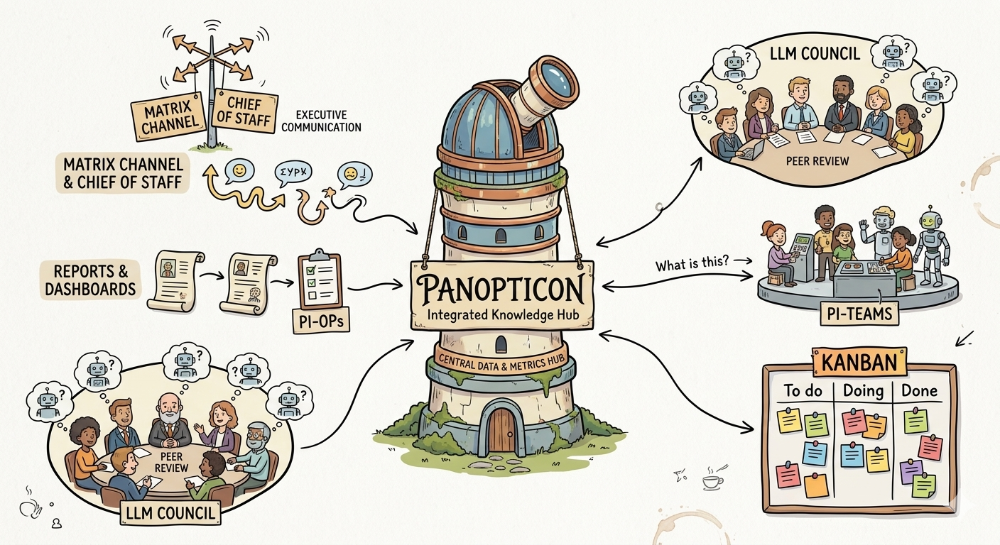

# pi-tools-and-skills



Reusable extensions, skills, prompts, and shared libraries for [pi](https://github.com/mariozechner/pi-coding-agent) — a local-first coding agent.

Tools for a personal Chief of Staff setup.

Usual vibe coded warning!

## Getting started

### Prerequisites

- [pi](https://github.com/mariozechner/pi-coding-agent) installed and working
- Node.js 22+
- Python 3

### 1. Install

For local development:

```bash
git clone https://github.com/tS7hKamAYL84j91/pi-tools-and-skills.git
cd pi-tools-and-skills
npm install
```

For pi package installation:

```bash
pi install git:github.com/tS7hKamAYL84j91/pi-tools-and-skills
# or from a local checkout:
pi install /absolute/path/to/pi-tools-and-skills
```

The package manifest exposes `extensions/`, `skills/`, and `prompts/` to pi. `make setup` registers this checkout as a local pi package with a global extension filter for `pi-panopticon` and `pi-teams`. It does not alter runtime/project settings.

### 2. Set up

```bash
make help   # show targets
make setup  # register extensions, skills, prompts
```

### 3. Run pi

After setup, run pi normally in any workspace:

```bash
pi
```

Add project extensions such as `pi-kanban`, `pi-matrix`, or `pi-coas` per workspace via that workspace's `.pi/settings.json`.

---

## What's included

### Extensions

`make setup` globally enables only reusable operator extensions. Project/runtime extensions stay opt-in per workspace.

| Extension         | Type    | What it does                                                                                            |
| ----------------- | ------- | ------------------------------------------------------------------------------------------------------- |
| **pi-panopticon** | Global  | Multi-agent messaging (`agent_send`), spawning (`spawn_agent`), health monitoring, lifecycle management |
| **pi-teams**      | Global  | Heterogeneous multi-model debate using the runtime model registry and visible config                    |
| **pi-kanban**     | Project | Event-sourced task board — tools, TUI overlay (`/kanban`), auto-compaction, snapshot renderer           |
| **pi-matrix**     | Project | Phone ↔ agent bridge via Matrix — notification + inbox pattern, `message_read` / `message_send` tools   |
| **pi-gmail**      | Project | Read-only Gmail metadata/snippet search and fetch tools                                                 |
| **pi-coas**       | Project | CoAS status, doctor, workspace, and schedule control surface                                            |

### Skills

Reusable skills for pi-platform tooling and compact reference guidance. Extension-specific skills are bundled with their extension package so independent `pi install ./extensions/<name>` installs include the matching guidance. Operator and methodology skills (clean-room, code-forensics, deep-research, planning, problem-crystalliser, red-team, six-thinking-hats, notebooklm, jules-delegation) live in [CoAS](https://github.com/tS7hKamAYL84j91/coas).

| Skill                      | Bundle          | Purpose                                                                           |
| -------------------------- | --------------- | --------------------------------------------------------------------------------- |
| **node-esm-gotchas**       | shared          | Avoid common Node.js ESM and TypeScript module-resolution mistakes                |
| **pi-agent-orchestration** | pi-panopticon   | Spawn, brief, monitor, message, and shut down pi worker agents                    |
| **pi-extension-dev**       | shared          | Build or modify pi extensions, tools, commands, hooks, and TUI widgets            |
| **pi-kanban**              | pi-kanban       | Use the project kanban board: create, claim, update, snapshot, and complete tasks |
| **pi-model-selection**     | shared          | Verify pi-visible models and route work to the right provider/model               |
| **pi-session-management**  | shared          | Implement session-aware behavior, persistence, compaction, and reload-safe flows  |
| **pi-team-consultation**   | pi-teams        | Route review and decisions through `navigator` or `llm-council` teams             |
| **skill-creator**          | shared          | Meta-skill for creating and improving skills                                      |

---

## Commands

Everything goes through `make`:

| Command                                                             | What                                                 |
| ------------------------------------------------------------------- | ---------------------------------------------------- |
| `make` / `make help`                                                | Show available targets                               |
| `make setup`                                                        | Install this checkout as a local pi package          |
| `make setup-clean`                                                  | Remove this checkout's pi package registration       |
| `make doctor`                                                       | Run checks, tests, and gitleaks secret scans         |
| `make check`                                                        | Typecheck + Biome lint + knip + type-coverage (≥95%) |
| `make typecheck` / `make lint` / `make knip` / `make type-coverage` | Run one quality gate                                 |
| `make secret-scan`                                                  | Scan git history and working tree with gitleaks      |
| `make test`                                                         | Run tests                                            |
| `make test-watch`                                                   | Run tests in watch mode                              |
| `make clean-mailboxes`                                              | Clean stale agent mailboxes                          |
| `make clean-mailboxes DRY_RUN=1`                                    | Preview stale mailbox cleanup                        |

---

## Structure

```text
extensions/           Extensions:
  pi-panopticon/        Global — multi-agent messaging, spawning, health
  pi-teams/            Global — multi-model deliberation from runtime model registry
  pi-kanban/           Project — event-sourced task board + TUI overlay
  pi-matrix/           Project — phone ↔ agent bridge via Matrix
  pi-gmail/            Project — read-only Gmail metadata/snippet tools
  pi-coas/              Project — CoAS status, doctor, workspaces, schedules
lib/                  Shared: agent-api, maildir transport, tool-result helpers
skills/               Agent skills and compact reference guidance
prompts/              Prompt templates (refactor, commit-and-push)
scripts/              Setup and utility scripts
tests/                Tests (vitest + archunit fitness functions)
```

Global extensions (`pi-panopticon`, `pi-teams`) are installed by `make setup` through this repo's local pi package entry. Project extensions (`pi-kanban`, `pi-matrix`, `pi-gmail`, `pi-coas`) are added per-workspace in `.pi/settings.json`.

## Development

```bash
make help         # list all targets
make doctor       # check + test + gitleaks secret scans
make check        # typecheck → biome lint → knip → type-coverage (≥95%)
make lint         # run one quality gate
make test         # run tests
make test-watch   # run tests in watch mode
make secret-scan  # scan git history and working tree with gitleaks
make setup        # register pi package
make setup-clean  # remove pi package registration
```

Quality gates: strict TypeScript, Biome lint, zero unused exports (knip), 95%+ type coverage, architecture fitness functions (dependency direction, file size limits, isolation). See [AGENTS.md](AGENTS.md) for coding standards.

## Security

The design assumes a **trusted host**. External input (Matrix messages, Gmail snippets, agent-to-agent messages) is treated as untrusted and wrapped in structured tags before entering the LLM context. User-facing fields (task titles, agent names, tool names) are validated or sanitised at system boundaries. Matrix and Gmail credential deployment assumptions belong in the workspace or infrastructure repo, not here.

## License

[MIT](LICENSE)
