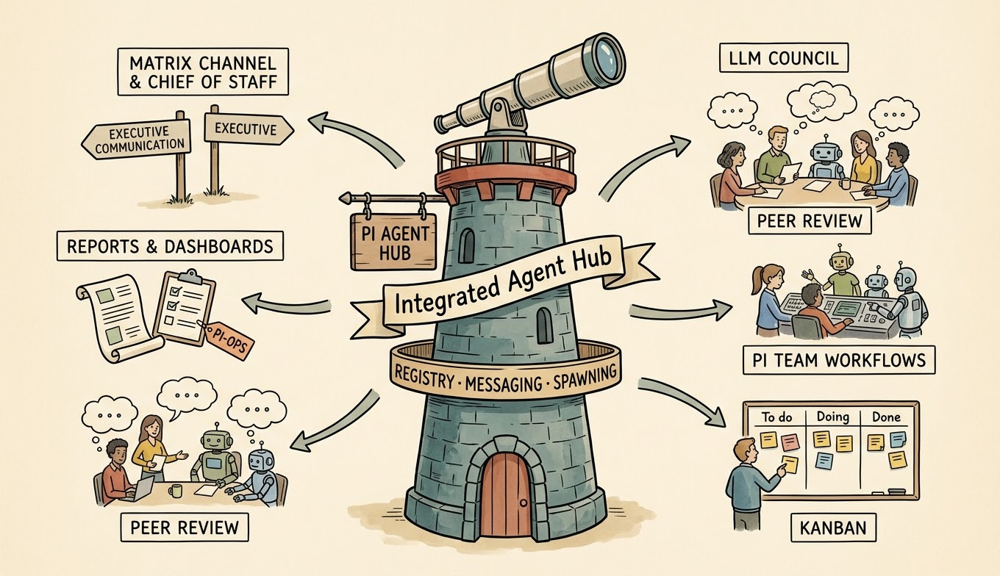

# pi-tools-and-skills



Local-first extensions, skills, prompts, and shared libraries for
[Pi](https://github.com/earendil-works/pi).

## Install

Tested with Pi 1.0.1; requires Node.js 22.19 or newer. Local development also needs Python 3.10+ for the
offline Goal benchmark tests; security scanning uses gitleaks and Semgrep.

```sh
git clone https://github.com/tS7hKamAYL84j91/pi-tools-and-skills.git
cd pi-tools-and-skills
npm ci
```

Install from source with `pi install /absolute/path/to/pi-tools-and-skills`,
`pi install git:github.com/tS7hKamAYL84j91/pi-tools-and-skills`, or
`make setup-package PACKAGE=<name>`.
`make setup` registers this checkout globally with Agent Hub and Goal enabled.
Project-only extensions remain opt-in through the owning workspace's Pi settings.
Setup changes package registration, not runtime/project settings.
Run `make help` for setup, removal, checks, and utility commands.

## Packages and usage

Each package README owns its commands, settings, supported installation scope,
and operating limits. This index deliberately does not repeat those contracts.

| Package                                                  | Responsibility                                 |
| -------------------------------------------------------- | ---------------------------------------------- |
| [Agent Hub](extensions/pi-agent-hub/README.md)           | Agent registry, transport, spawning and health |
| [Goal](extensions/pi-goal/README.md)                     | Owned goal execution and local completion hook |
| [Team Workflows](extensions/pi-team-workflows/README.md) | Bounded consult, debate and research           |
| [Boost](extensions/pi-boost/README.md)                   | Prompt-scoped model switching and restoration  |
| [Automations](extensions/pi-automations/README.md)       | Pi-hosted scheduling and workspace context     |
| [Kanban](extensions/pi-kanban/README.md)                 | Optional human task overview                   |
| [Matrix](extensions/pi-matrix/README.md)                 | Human-facing Matrix transport                  |
| [File Watch](extensions/pi-file-watch/README.md)         | Explicit, bounded file notifications           |
| [Ollama Models](extensions/pi-ollama-models/README.md)   | Local Ollama model discovery                   |
| [Fleet MCP](fleet-mcp/README.md)                         | Standalone MCP adapter                         |

## Where things belong

This is a Pi package repository, not an npm workspace. `extensions/*` are
loaded by path and installed individually; there is no root `workspaces` field
and no cross-package build graph. The root `package.json` `files` allowlist
defines what the umbrella package ships.

- `extensions/` — independently owned Pi features and their usage docs.
- [`lib/`](lib/README.md) — shared contracts and infrastructure; consumer inventory.
- `fleet-mcp/` — standalone application, not another registry.
- `skills/`, `prompts/` — reusable agent guidance; extension-specific skills stay
  with their extension.
- `scripts/` — installation, maintenance and build/check commands.
- [`benchmarks/`](benchmarks/README.md) — evaluation runners, not shipping runtime.
- `tests/` — offline checks, including benchmark fixture/fake-provider coverage.
- [`docs/`](docs/README.md) — cross-repo architecture boundaries and decision history.
- [`TODO.md`](TODO.md) — current work only; completed work remains in Git history.

## Development and security

```sh
npm run check          # namespace, template safety, types, lint, knip, coverage
npm test               # offline unit, contract, architecture and evaluation tests
make secret-scan      # history and working-tree secret checks
```

Use focused tests while editing; use full checks before finishing. Architecture
checks protect dependencies, state ownership and safety contracts—not file-size
or co-change quotas. See [AGENTS.md](AGENTS.md) for contribution boundaries and
[architecture](docs/architecture.md) for state/trust ownership.

The design assumes a trusted host. Messages, repository text and model output
are untrusted input, never permission to bypass a safety gate. Credentials and
live deployment configuration remain outside this repository.

[MIT license](LICENSE)
