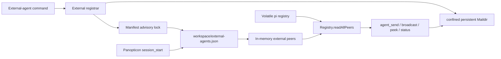

# ADR-043 External Agent Review and Refactor

## Goal

Make commit `b1b4b44` implement ADR-043 end to end without regressing existing pi-agent Maildir behavior.

## Review verdict

BLOCKED until the external manifest is loaded into peer resolution, one workspace manifest path is used, fresh pi inboxes are created before watching, registration is race-safe, mailbox paths are confined and symlink-safe, and names cannot spoof live pi agents.

## Target shape

## Constraints

- Preserve ADR-043 workspace-scoped manifest semantics: startup and commands use `ctx.cwd`.
- Do not rewrite accepted ADR-043; record implementation corrections here and update `docs/architecture.md` only.
- Preserve the `MessageTransport` public contract unless a smaller internal change is clearly necessary.
- No dependency additions and no architecture fitness-test exemptions.
- Custom mailbox paths must remain inside an explicitly configured mailbox root; default to `~/.pi/persist/external-agents`.
- External mailbox removal is registration-only in v1; mailbox contents remain durable.
- Keep unrelated T-810/T-812/T-817/T-822/T-823 files unchanged.

## Acceptance criteria

1. Startup loads `<ctx.cwd>/external-agents.json` before pi name selection and exposes loaded records through `Registry.readAllPeers()`.
2. Register/remove commands refresh external peers immediately in the current session.
3. Registration rejects names colliding with pi or external peers.
4. Manifest read/modify/write is serialized with `withAdvisoryLock`.
5. Manifest entries validate status, safe ids/names, absolute mailbox paths, root confinement, and symlink-safe directory creation.
6. Mailbox creation has one final-path semantic; no double nesting.
7. `MaildirTransport.init(id)` restores pi inbox creation and watcher readiness.
8. Tests cover peer visibility, workspace persistence, concurrency, path confinement, duplicate pi names, correct Maildir tree, and init regression.
9. `npm run check`, `npm test`, and `git diff --check` pass.

## Review plan

- Inspect the delegated patch for scope and architecture boundaries.
- Run targeted Panopticon/Maildir tests, then the complete gate suite.
- Run a second focused Navigator review of the final diff.
