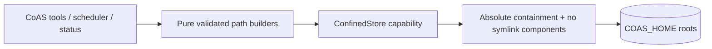

# CoAS Confined Store Adoption

## Goal

Complete accepted ADR-038: production CoAS filesystem consumers must use symlink-safe confined capabilities rather than duplicate unguarded IO helpers.

## Target shape

## Constraints

- Preserve CoAS file formats, paths, commands/tools, schedule behavior, and workspace behavior.
- Bootstrap `COAS_HOME` and managed roots without following symlink components.
- Production reads, writes, removes, directory enumeration, and log appends under CoAS-owned roots must pass through a confined capability or an equally narrow safe wrapper requiring `CoasConfig`/authorized root.
- Delete duplicate unguarded filesystem helper exports after migration; keep pure path/format/ID helpers.
- External workspace access remains explicitly authorized by `.pi/coas/workspace.env` and confined to its real root.
- No dependency additions, fitness exceptions, or broad redesign.

## Acceptance criteria

1. Schedule env/prompt/list/remove/run/log operations reject symlinked roots, entries, and prompt targets.
2. Status/workspace/approval consumers cannot read or write through symlink components outside authorized roots.
3. `docs/architecture.md` accurately depicts the actual runtime boundary.
4. Existing CoAS tests pass, with consumer-level symlink regressions proving production routes—not only the class in isolation.
5. Knip finds no duplicate/dead helpers; `npm run check`, `npm test`, and `git diff --check` pass.
