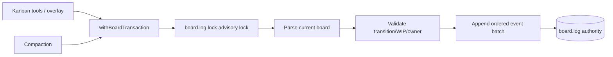

# Kanban Cross-Process Transaction Refactor

## Problem

`board.log` is authoritative and shared across processes, but appends and compaction do not share a cross-process lock. Compaction can replace the log after another process appended, losing events. Claim conflict recovery can append unconditional `UNCLAIM` and clear the winner.

## Target shape

## Constraints

- No fitness exceptions or budget increases.
- Preserve event syntax and public tool response shapes unless conflict semantics must be corrected.
- All ordinary appends participate in the same board lock used by compaction.
- Multi-event claim/reassign operations hold one lock from read through validated append batch.
- Do not use compensating `UNCLAIM` after an observed conflict.
- Board log remains authority; task Markdown/snapshot remain derived.
- No dependency additions.

## Acceptance criteria

1. A shared helper serializes ordinary log appends, multi-event transactions, and compaction on one cross-process lock path.
2. Claim/reassign reads and validates under the lock and writes one ordered event batch; concurrent claim attempts cannot clear a winner.
3. Compaction reads, backs up, and replaces the log while holding the shared lock; an ordinary append cannot be lost.
4. Tests deterministically exercise concurrent claims and append-vs-compaction serialization.
5. Focused Kanban tests, Knip, architecture tests, `npm run check`, `npm test`, and `git diff --check` pass.

## Implementation status

- Implemented one `board.log.lock` boundary in `board-transactions.ts` for ordinary appends and locked read-validation-event batches.
- Claim/pick/reassign no longer performs post-append verification or compensating `UNCLAIM`; concurrent picks serialize and the loser observes no available task.
- Compaction holds the same board lock across read, backup, and atomic replacement.
- Task Markdown and snapshots remain derived; `board.log` remains authoritative.
- Focused validation: 82 Kanban/transaction tests, strict typecheck, scoped Biome, Knip, and scoped `git diff --check` pass; all changed Kanban modules remain within existing line budgets.
- Full `npm run check` passes at 99.18% type coverage, and full `git diff --check` passes.
- Full `npm test` is currently blocked by concurrent out-of-scope work: 11 CoAS scheduler/approval failures plus Panopticon registry 422/420 lines and 9/8 active reports in architecture fitness. No exception or budget was changed; rerun after integration settles.
