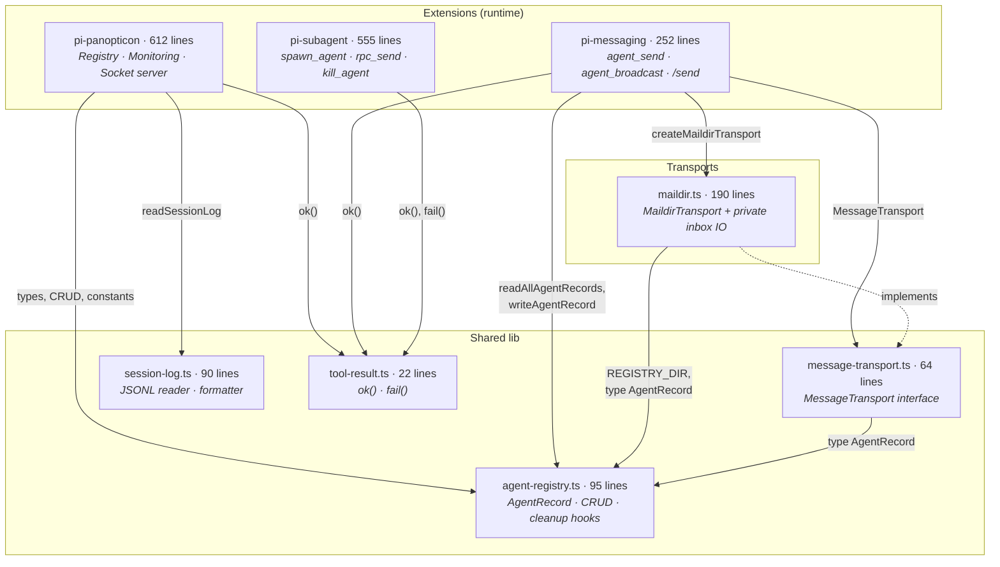
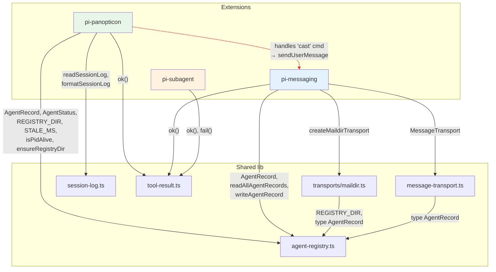
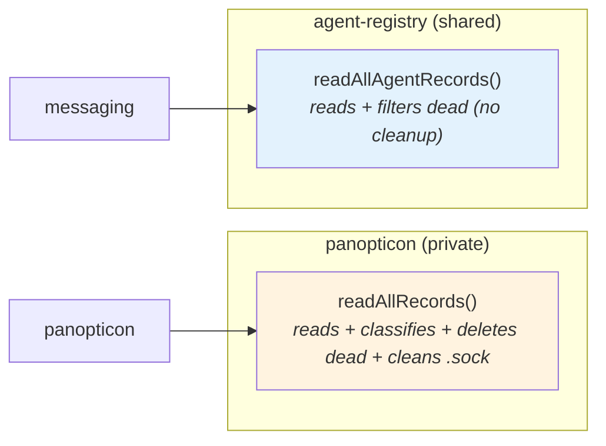
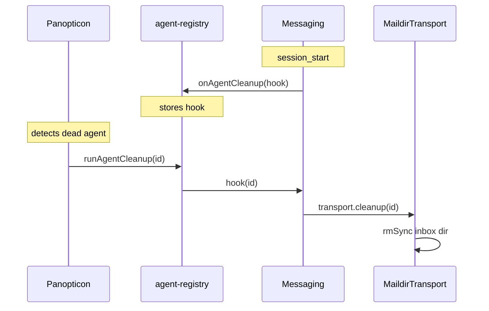
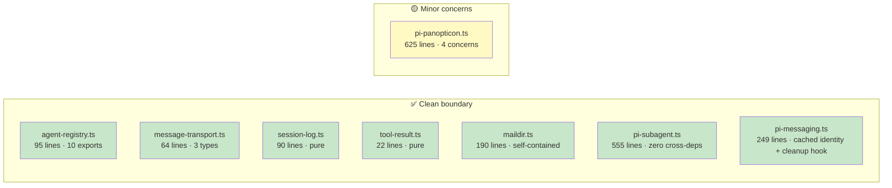

# Architecture Review: Extension Abstraction Boundaries

_2026-04-03 - Post-parallel-refactor audit of pi-panopticon, pi-messaging, pi-subagent_

---

## 1. Current Architecture

Three extensions with distinct responsibilities, sharing types through a lean lib layer:



### Ownership after refactor

| Concern | Owner | Storage |
|---------|-------|---------|
| Agent record CRUD | panopticon (writes), messaging (updates `pendingMessages`) | `~/.pi/agents/{id}.json` |
| Activity log | pi core | `~/.pi/agent/sessions/.../*.jsonl` |
| Socket server | panopticon | `~/.pi/agents/{id}.sock` |
| Message delivery (durable) | messaging → MaildirTransport | `~/.pi/agents/{id}/inbox/` |
| Message delivery (socket) | removed (YAGNI) — future: SocketTransport | — |
| Spawning child agents | subagent | stdin/stdout RPC |

---

## 2. Actual Dependency Graph



All solid lines are clean dependencies. The single dashed red line is the one remaining abstraction bleed.

---

## 3. Bleeds Resolved (this session)

### ✅ BLEED-2 (was 🔴): Maildir IO extracted from agent-registry

**Fix applied (T-120):** `ensureInbox`, `inboxReadNew`, `inboxAcknowledge`, `inboxPruneCur` and the `InboxMessage` interface moved from `lib/agent-registry.ts` into `lib/transports/maildir.ts` as **private** functions. The transport is now fully self-contained.

**Before:** agent-registry (139 lines, 14 exports) included Maildir plumbing.
**After:** agent-registry (95 lines, 10 exports) is purely about the agent record.

### ✅ BLEED-3 (was 🔴): Panopticon no longer manages messaging infrastructure

**Fix applied (T-121):**
- Removed `ensureInbox(selfId)` from panopticon's `session_start`.
- `cleanupAgentFiles` now only deletes `.json` and `.sock` - no longer `rmSync`s the inbox directory.
- New pure function `agentCleanupPaths(id)` returns exactly the two paths panopticon owns, pinned by tests.

### ✅ BLEED-4 (was 🟡): Socket types are local to panopticon

**Fix applied (T-121):** `SocketCommand` interface and `SOCKET_TIMEOUT_MS` constant moved from agent-registry to local definitions in `pi-panopticon.ts`.

### ✅ BLEED-5 (was 🟡): Messaging caches self-identity

**Fix applied (T-122):** `cachedSelf: AgentRecord | undefined` is populated eagerly on `session_start`. `getSelfRecord()` returns the cached record on subsequent calls. `updatePendingCount()` keeps the cache in sync after writes. Eliminates repeated PID scans.

---

## 4. Remaining Bleeds

### ✅ BLEED-1 (was 🔴): Socket `cast` handler removed

**Fix applied:** The `cast` case was removed from `handleSocketCommand`. `SocketCommand` type trimmed to `{ type: "peek"; lines?: number }`. The dual delivery path no longer exists - message delivery is exclusively via messaging's transport layer.

If socket-speed delivery is needed in the future, the correct approach is to implement a `SocketTransport` that satisfies `MessageTransport` and wire it into `MessagingConfig`.

---

### 🟡 BLEED-6: `pendingMessages` on AgentRecord

**Location:** `lib/agent-registry.ts:43`

```typescript
export interface AgentRecord {
    // ...registry fields...
    pendingMessages?: number;  // ← messaging concept in registry schema
}
```

**Status:** Unchanged. Messaging writes it; panopticon reads and displays it. This is a pragmatic trade-off: it avoids cross-extension function calls by using the shared record as a message bus. Well-documented, accepted.

**Risk:** If more extensions want to stash domain data in `AgentRecord`, it becomes a god-type. Mitigate by keeping it to `pendingMessages` only and documenting the pattern.

---

### 🟡 BLEED-7 (new): Duplicate `readAllRecords` implementations

**Location:** Panopticon has a private `readAllRecords()` (lines 108-122) that reads + classifies + cleans up dead agents. Agent-registry exports `readAllAgentRecords()` (lines 62-76) that reads + filters dead (without deleting).



**Why it exists:** Panopticon is the registry owner - it's the only extension that should delete stale `.json` records and `.sock` files. The shared function is a read-only snapshot for consumers. The separation is intentional but creates two divergent code paths that read the same directory.

**Risk:** Bug fixes to record parsing must be applied to both. A consumer calling `readAllAgentRecords()` may see dead records that panopticon hasn't cleaned up yet.

**Severity:** Low - intentional separation, but warrants a comment or a shared inner reader.

---

## 5. Ownership Matrix (Current)

| Concern | Intended Owner | Actual Owner | Status |
|---------|---------------|--------------|--------|
| Agent record schema | shared (agent-registry) | agent-registry ✅ | clean |
| Agent record write | panopticon | panopticon ✅ | clean |
| Agent record update (`pendingMessages`) | messaging | messaging → `writeAgentRecord` | 🟡 accepted |
| Dead agent cleanup | panopticon | panopticon (`.json` + `.sock` only) ✅ | clean |
| Socket server | panopticon | panopticon ✅ | clean |
| Socket server commands | panopticon | panopticon (`peek` only - `cast` removed) ✅ | clean |
| Maildir inbox IO | transport | `transports/maildir.ts` (private) ✅ | clean |
| Inbox storage lifecycle | transport | transport creates + `cleanup()` via hook ✅ | clean |
| Inbox draining | messaging | messaging ✅ | clean |
| Session JSONL reading | shared (session-log) | `lib/session-log.ts` ✅ | clean |
| Self-identity | panopticon creates, messaging caches | messaging caches on session_start ✅ | clean |
| Agent spawning | subagent | subagent ✅ | clean |
| RPC protocol | subagent | subagent ✅ | clean |
| Tool result types | shared (tool-result) | `lib/tool-result.ts` ✅ | clean |

---

## 6. Open Design Questions

### ✅ Q1: Orphaned inbox cleanup - RESOLVED

Implemented Option A from v2: `cleanup(agentId): void` added to `MessageTransport` interface. MaildirTransport implementation does `rmSync` on the inbox dir. Wired via a cleanup hook registry in `agent-registry.ts`:



### ✅ Q2: Socket `cast` handler - RESOLVED

Implemented Option A: `cast` case removed from `handleSocketCommand`. `SocketCommand` type trimmed to `{ type: "peek"; lines?: number }`. If socket-speed delivery is needed later, implement a `SocketTransport`.

### Q3: Should `readAllRecords` share a common inner reader?

Both `readAllRecords` (panopticon) and `readAllAgentRecords` (agent-registry) parse the same `.json` files. They could share a private `readRawRecords()` that returns all records unparsed/unfiltered, with each consumer applying its own classification/cleanup.

**Recommendation:** Not now - the implementations are short (15 lines each) and their purposes differ enough that forcing a shared inner reader would couple classification logic. Revisit if a bug fix needs to be applied to both.

---

## 7. Module Health Summary



| Module | Lines | Exports | Purity | Concern count | Verdict |
|--------|-------|---------|--------|---------------|---------|
| `agent-registry.ts` | 95 | 10 | mixed (IO) | 1 (registry) | ✅ clean |
| `message-transport.ts` | 64 | 3 types | pure (interface) | 1 (contract) | ✅ clean |
| `session-log.ts` | 90 | 3 | pure | 1 (JSONL parsing) | ✅ clean |
| `tool-result.ts` | 22 | 3 | pure | 1 (helpers) | ✅ clean |
| `maildir.ts` | 190 | 1 factory | mixed (IO) | 1 (transport) | ✅ clean |
| `pi-subagent.ts` | 555 | 1 default | mixed (spawn) | 1 (lifecycle) | ✅ clean |
| `pi-messaging.ts` | 252 | 1 factory + default | mixed (IO) | 1 (delivery) | ✅ clean |
| `pi-panopticon.ts` | 612 | 1 default + test helpers | mixed (IO + UI) | 4 (registry, socket, widget, overlay) | 🟡 large |

### Panopticon concern count

Panopticon has 4 internal concerns in one file:
1. **Registry IO** - write/read/classify/cleanup agent records
2. **Socket server** - Unix socket for `cast` + `peek`
3. **Powerline widget** - status bar rendering
4. **Agent overlay** - interactive detail UI

This isn't a bleed (all relate to monitoring), but at 625 lines it's the largest file. If it grows further, splitting into `panopticon-registry.ts`, `panopticon-socket.ts`, and `panopticon-ui.ts` would improve navigability.

---

## 8. Proposed Next Steps

| Priority | Action | Fixes | Effort |
|----------|--------|-------|--------|
| 1 | Consider splitting panopticon if it exceeds ~700 lines (registry, socket, UI) | M |
| 2 | Add `SocketTransport` if real-time message delivery is needed again | M |
| 3 | Monitor `AgentRecord` for god-type creep (`pendingMessages` is the only extension field) | — |

All critical bleeds are resolved. Remaining work is preventive.

---

## 9. Changelog

| Date | Change |
|------|--------|
| 2026-04-03 (v1) | Initial review: identified BLEED-1 through BLEED-6 |
| 2026-04-03 (v2) | Post-refactor update: BLEED-2,3,4,5 resolved. Added BLEED-7 (duplicate readers). Added §6 (open questions), §7 (module health), §8 (next steps) |
| 2026-04-03 (v3) | BLEED-1 resolved (cast removed). Q1 resolved (cleanup hook via `onAgentCleanup`/`runAgentCleanup` + `transport.cleanup`). Q2 resolved (cast removed). 91 tests, all green |
