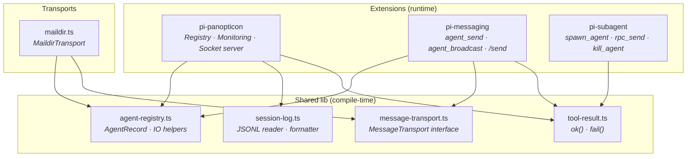
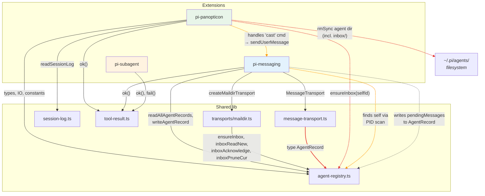
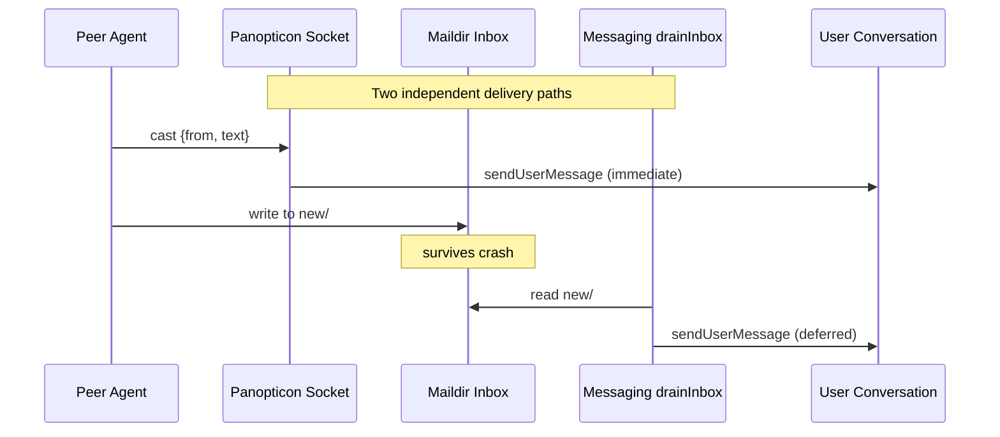
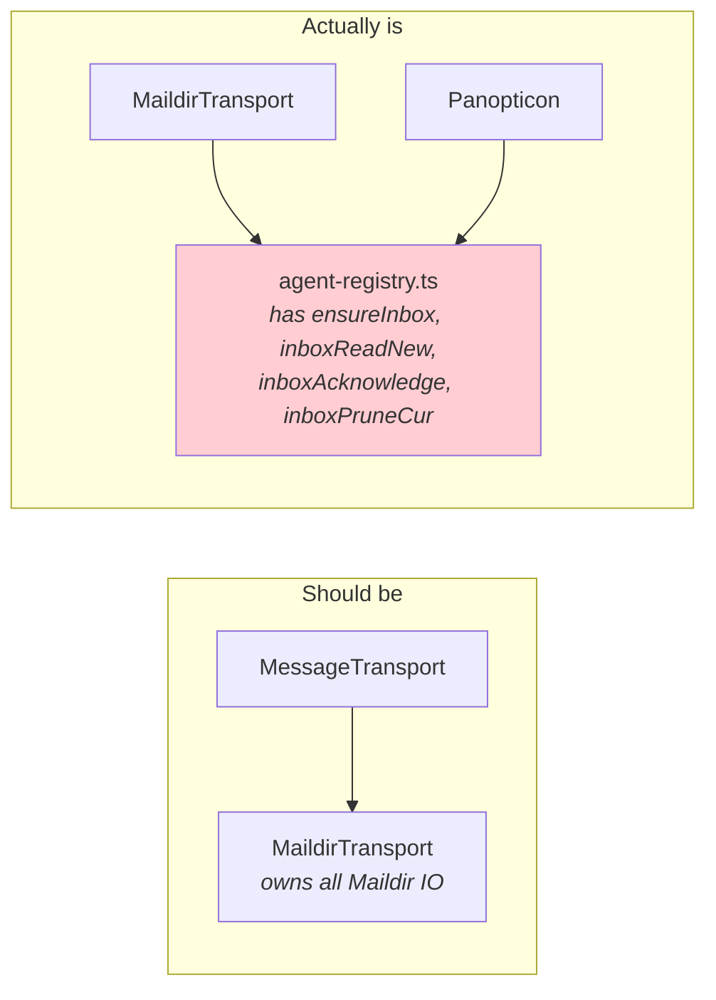
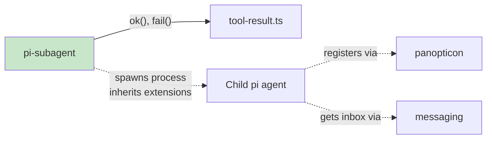
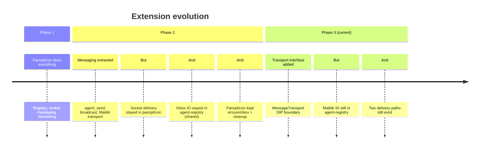

# Architecture Review: Extension Abstraction Boundaries

_2026-04-03 — Post-refactor audit of pi-panopticon, pi-messaging, pi-subagent_

## 1. Intended Architecture

Three extensions with distinct responsibilities, sharing types through a common lib layer:



**Intended ownership:**

| Concern | Owner |
|---------|-------|
| Who's alive (registry) | panopticon |
| What happened (activity) | pi core session JSONL |
| Message delivery | messaging → transport |
| Spawning child agents | subagent |

---

## 2. Actual Dependency Graph

When we trace every `import` and runtime coupling:



Dashed red/orange lines = abstraction bleeds.

---

## 3. Abstraction Bleeds Found

### 🔴 BLEED-1: Panopticon's socket server handles message delivery

**Location:** `pi-panopticon.ts:402–416` (`handleSocketCommand` → `case "cast"`)

```typescript
// In panopticon — a MONITORING extension
case "cast": {
    pi.sendUserMessage(`[from ${from}]: ${text}`, { deliverAs: "followUp" });
    reply({ ok: true });
}
```

**Problem:** Panopticon receives messages from peers via its Unix socket and injects them into the user's conversation using `sendUserMessage`. This is **message delivery** — a messaging concern — living inside the monitoring extension. The messaging extension (`pi-messaging.ts`) has its own `drainInbox()` that does the same thing for Maildir messages.

**Consequence:** Two independent message delivery paths exist:
1. **Socket path** → panopticon's `handleSocketCommand("cast")` → immediate
2. **Maildir path** → messaging's `drainInbox()` → deferred

Neither knows about the other. Message ordering is undefined across the two paths.



**Severity:** High — message delivery has two owners.

---

### 🔴 BLEED-2: Inbox Maildir IO lives in agent-registry

**Location:** `lib/agent-registry.ts:95–139`

```
agent-registry.ts exports:
  ├── ensureInbox()       ← Maildir concern
  ├── inboxReadNew()      ← Maildir concern
  ├── inboxAcknowledge()  ← Maildir concern
  └── inboxPruneCur()     ← Maildir concern
```

**Problem:** The shared registry module contains four Maildir-specific functions. These are transport implementation details — they belong in the Maildir transport, not in the registry that's supposed to be transport-agnostic.

**Consequence:** The `MessageTransport` interface was designed as a DIP boundary, but the actual Maildir IO bypasses it by living in the shared layer. Both `MaildirTransport` (correctly) and `panopticon` (incorrectly) import from here.



**Severity:** High — violates the transport abstraction the team explicitly designed.

---

### 🔴 BLEED-3: Panopticon creates inboxes and cleans up messaging infrastructure

**Location:** `pi-panopticon.ts:447` and `pi-panopticon.ts:118–120`

```typescript
// session_start — panopticon creates a messaging inbox
ensureInbox(selfId);

// cleanupAgentFiles — panopticon deletes messaging infrastructure
function cleanupAgentFiles(id: string): void {
    unlinkSync(join(REGISTRY_DIR, `${id}.sock`));
    rmSync(join(REGISTRY_DIR, id), { recursive: true, force: true });
    // ↑ This recursively deletes the inbox/ directory tree
}
```

**Problem:** Panopticon creates the Maildir inbox on startup and destroys it when cleaning up dead agents. This means the monitoring extension manages the messaging extension's storage lifecycle.

**Consequence:** If the transport changes from Maildir to Redis, panopticon would still be creating empty Maildir directories and recursively deleting them — operating on infrastructure that no longer exists.

**Severity:** High — ownership of storage lifecycle is split across extensions.

---

### 🟡 BLEED-4: SocketCommand and SOCKET_TIMEOUT_MS in agent-registry

**Location:** `lib/agent-registry.ts:26,48`

```typescript
export const SOCKET_TIMEOUT_MS = 3_000;

export interface SocketCommand {
    type: "cast" | "call" | "peek";
    from?: string;
    text?: string;
    lines?: number;
}
```

**Problem:** These are exclusively consumed by panopticon's socket server. The `SocketCommand` type (with `cast`, `call`, `peek` variants) describes panopticon's wire protocol, not a shared registry concept. The constant `SOCKET_TIMEOUT_MS` is a socket server tuning parameter.

**Severity:** Medium — misplaced types, no functional consequence.

---

### 🟡 BLEED-5: Messaging discovers itself via PID scan

**Location:** `pi-messaging.ts:51–53`

```typescript
function getSelfRecord(): AgentRecord | undefined {
    return readAllAgentRecords().find((r) => r.pid === process.pid);
}
```

**Problem:** Messaging reads the entire `~/.pi/agents/` directory and scans every JSON file to find its own record, matching by PID. This is called on every `agent_send`, `agent_broadcast`, `drainInbox`, and `updatePendingCount` — at least 9 call sites.

Panopticon knows its own `selfId` from the moment it creates it (`${process.pid}-${Date.now().toString(36)}`), but there's no mechanism to share this with messaging.

**Consequence:** O(n) filesystem reads per tool call. Fragile if two extensions in the same process somehow register different records (unlikely but architecturally unsound).

**Severity:** Medium — performance cost, implicit coupling on PID uniqueness.

---

### 🟡 BLEED-6: `pendingMessages` on AgentRecord

**Location:** `lib/agent-registry.ts:43`

```typescript
export interface AgentRecord {
    // ...registry fields...
    pendingMessages?: number;  // ← messaging concept
}
```

**Problem:** The registry schema includes a messaging-specific field. Messaging writes it; panopticon reads and displays it. This was an intentional design decision (agreed in the planning docs) but it does mean the registry type is aware of messaging.

**Severity:** Low — pragmatic trade-off, well-documented. Would become a problem if more extensions want to stash data in AgentRecord (leads to a god-type).

---

### 🟢 CLEAN: pi-subagent is fully decoupled

Subagent has zero imports from panopticon or messaging. Its only shared dependency is `lib/tool-result.ts`. It communicates with spawned agents via stdin/stdout RPC — a protocol that's entirely internal. Spawned agents inherit panopticon and messaging via pi's global extension loading, not via code coupling.



---

## 4. Ownership Matrix (Actual vs Intended)

| Concern | Intended Owner | Actual Owner(s) | Bleed? |
|---------|---------------|-----------------|--------|
| Agent record CRUD | panopticon | panopticon + messaging (writes `pendingMessages`) | 🟡 minor |
| Socket server | panopticon | panopticon ✅ | — |
| Socket message delivery (`cast`) | messaging | **panopticon** | 🔴 |
| Maildir inbox creation | messaging/transport | **panopticon** + transport | 🔴 |
| Maildir inbox cleanup | messaging/transport | **panopticon** (`cleanupAgentFiles`) | 🔴 |
| Maildir IO functions | transport | **agent-registry.ts** | 🔴 |
| Inbox draining (deferred msgs) | messaging | messaging ✅ | — |
| `SocketCommand` type | panopticon | **agent-registry.ts** | 🟡 |
| Self-identity | panopticon (creates ID) | messaging discovers via PID scan | 🟡 |
| Session JSONL reading | lib/session-log | lib/session-log ✅ | — |
| Agent spawning | subagent | subagent ✅ | — |
| RPC protocol | subagent | subagent ✅ | — |

---

## 5. Root Cause

The bleeds share a common root: **panopticon was the first extension and accumulated responsibilities before messaging was extracted.**



---

## 6. Recommended Fixes

### Fix A: Move Maildir IO into the transport (BLEED-2)

Move `ensureInbox`, `inboxReadNew`, `inboxAcknowledge`, `inboxPruneCur` from `agent-registry.ts` into `transports/maildir.ts`. They're implementation details of the Maildir transport.

**Impact:** `agent-registry.ts` becomes purely about the agent record. Maildir transport becomes self-contained.

### Fix B: Panopticon delegates `cast` to messaging (BLEED-1)

The socket server should not call `sendUserMessage` directly. Instead:

Option 1 — **Panopticon writes to Maildir inbox** when it receives a `cast`, then messaging drains it. Single delivery path.

Option 2 — **Socket becomes a transport** (`SocketTransport`), wired into `MessagingConfig`. The socket server moves to the transport layer.

Option 3 (minimal) — **Panopticon emits an event** that messaging subscribes to. Socket stays in panopticon but delivery moves to messaging.

### Fix C: Panopticon stops managing inboxes (BLEED-3)

- Remove `ensureInbox(selfId)` from panopticon's `session_start`.
- Make `cleanupAgentFiles` only clean up registry artifacts (`.json`, `.sock`). Add a transport-level cleanup hook or let messaging handle its own cleanup on detection of dead agents.

### Fix D: Move `SocketCommand` and `SOCKET_TIMEOUT_MS` to panopticon (BLEED-4)

These are panopticon's wire protocol types. Define them locally or in a `lib/panopticon-types.ts` if other extensions need them.

### Fix E: Share self-identity across extensions (BLEED-5)

Options:
- pi's `ExtensionContext` could carry an `agentId` field set during panopticon registration.
- Simpler: messaging caches `selfId` after first successful lookup instead of scanning every time.

### Priority order:

```
Fix A (Maildir IO → transport)     — clean, low risk, unblocks Fix C
Fix C (panopticon stops inbox mgmt) — removes ownership split
Fix D (move socket types)           — trivial cleanup
Fix E (cache self-identity)         — performance win
Fix B (unify delivery path)         — highest impact but needs design decision
```

---

## 7. What's Clean

Despite the bleeds, significant architectural progress has been made:

- **`MessageTransport` DIP boundary** is well-designed. The interface is minimal and transport-agnostic.
- **`pi-subagent` is fully decoupled** — zero knowledge of how registry or messaging work.
- **Session JSONL reading is properly extracted** — `lib/session-log.ts` has no extension dependencies.
- **`lib/tool-result.ts`** — unified, no duplication.
- **`AgentRecord` is the single schema** — both extensions read/write the same format.
- **Factory pattern** (`createMessagingExtension`) allows transport injection at configuration time.

The codebase is in a strong position. The remaining bleeds are all traceable to the original monolithic panopticon and can be resolved incrementally without API changes.
