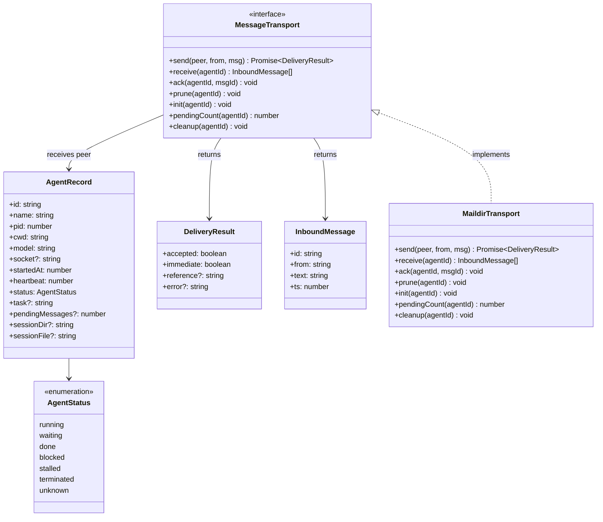
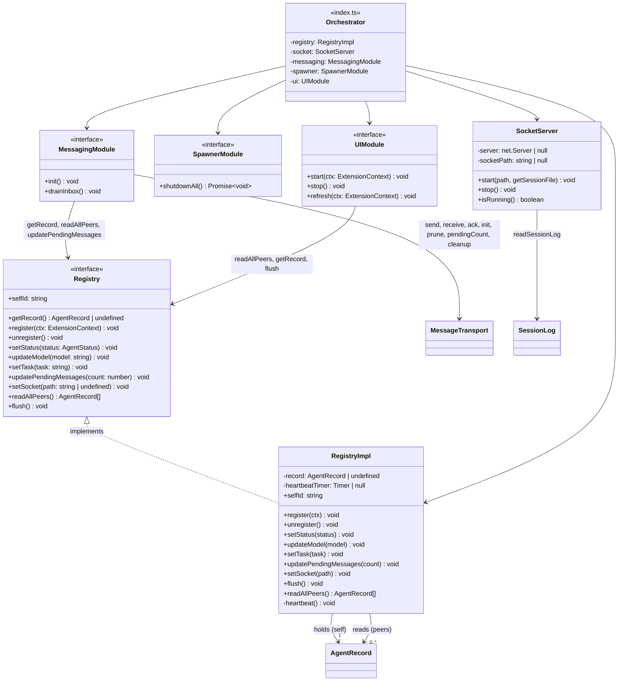
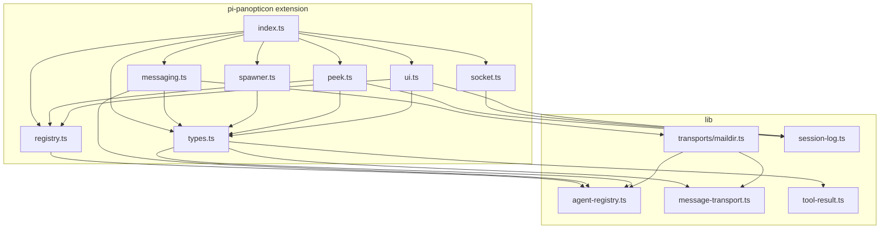

# Level 4: Code (key interfaces)

### Core types (lib/)

```mermaid
classDiagram
    class AgentStatus {
        <<enumeration>>
        running
        waiting
        done
        blocked
        stalled
        terminated
        unknown
    }

    class AgentRecord {
        +id: string
        +name: string
        +pid: number
        +cwd: string
        +model: string
        +socket?: string
        +startedAt: number
        +heartbeat: number
        +status: AgentStatus
        +task?: string
        +pendingMessages?: number
        +sessionDir?: string
        +sessionFile?: string
    }

    class DeliveryResult {
        +accepted: boolean
        +immediate: boolean
        +reference?: string
        +error?: string
    }

    class InboundMessage {
        +id: string
        +from: string
        +text: string
        +ts: number
    }

    class MessageTransport {
        <<interface>>
        +send(peer, from, msg) Promise~DeliveryResult~
        +receive(agentId) InboundMessage[]
        +ack(agentId, msgId) void
        +prune(agentId) void
        +init(agentId) void
        +pendingCount(agentId) number
        +cleanup(agentId) void
    }

    class MaildirTransport {
        +send(peer, from, msg) Promise~DeliveryResult~
        +receive(agentId) InboundMessage[]
        +ack(agentId, msgId) void
        +prune(agentId) void
        +init(agentId) void
        +pendingCount(agentId) number
        +cleanup(agentId) void
    }

    AgentRecord --> AgentStatus
    MessageTransport --> DeliveryResult : returns
    MessageTransport --> InboundMessage : returns
    MessageTransport --> AgentRecord : receives peer
    MessageTransport <|.. MaildirTransport : implements
```

### Extension modules (pi-panopticon/)

```mermaid
classDiagram
    class Registry {
        <<interface>>
        +selfId: string
        +getRecord() AgentRecord | undefined
        +register(ctx: ExtensionContext) void
        +unregister() void
        +setStatus(status: AgentStatus) void
        +updateModel(model: string) void
        +setTask(task: string) void
        +updatePendingMessages(count: number) void
        +setSocket(path: string | undefined) void
        +readAllPeers() AgentRecord[]
        +flush() void
    }

    class RegistryImpl {
        -record: AgentRecord | undefined
        -heartbeatTimer: Timer | null
        +selfId: string
        +register(ctx) void
        +unregister() void
        +setStatus(status) void
        +updateModel(model) void
        +setTask(task) void
        +updatePendingMessages(count) void
        +setSocket(path) void
        +flush() void
        +readAllPeers() AgentRecord[]
        -heartbeat() void
    }

    class MessagingModule {
        <<interface>>
        +init() void
        +drainInbox() void
    }

    class SpawnerModule {
        <<interface>>
        +shutdownAll() Promise~void~
    }

    class UIModule {
        <<interface>>
        +start(ctx: ExtensionContext) void
        +stop() void
        +refresh(ctx: ExtensionContext) void
    }

    class SocketServer {
        -server: net.Server | null
        -socketPath: string | null
        +start(path, getSessionFile) void
        +stop() void
        +isRunning() boolean
    }

    class Orchestrator {
        <<index.ts>>
        -registry: RegistryImpl
        -socket: SocketServer
        -messaging: MessagingModule
        -spawner: SpawnerModule
        -ui: UIModule
    }

    Registry <|.. RegistryImpl : implements
    RegistryImpl --> "1" AgentRecord : holds (self)
    RegistryImpl --> "0..*" AgentRecord : reads (peers)

    Orchestrator --> RegistryImpl
    Orchestrator --> SocketServer
    Orchestrator --> MessagingModule
    Orchestrator --> SpawnerModule
    Orchestrator --> UIModule

    MessagingModule --> Registry : getRecord, readAllPeers, updatePendingMessages
    MessagingModule --> MessageTransport : send, receive, ack, init, prune, pendingCount, cleanup
    UIModule --> Registry : readAllPeers, getRecord, flush
    SocketServer --> SessionLog : readSessionLog
```

### Dependency direction

```mermaid
graph TD
    subgraph "pi-panopticon extension"
        index[index.ts]
        registry[registry.ts]
        messaging[messaging.ts]
        spawner[spawner.ts]
        peek[peek.ts]
        socket[socket.ts]
        ui[ui.ts]
        types[types.ts]
    end

    subgraph "lib"
        agentReg[agent-registry.ts]
        transport[message-transport.ts]
        maildir[transports/maildir.ts]
        sessionLog[session-log.ts]
        toolResult[tool-result.ts]
    end

    index --> registry
    index --> messaging
    index --> spawner
    index --> peek
    index --> socket
    index --> ui
    index --> types

    registry --> agentReg
    messaging --> types
    messaging --> agentReg
    messaging --> maildir
    spawner --> types
    peek --> types
    peek --> registry
    peek --> sessionLog
    socket --> sessionLog
    ui --> types
    ui --> registry
    ui --> sessionLog
    types --> agentReg
    types --> transport
    types --> toolResult
    maildir --> agentReg
    maildir --> transport
```
