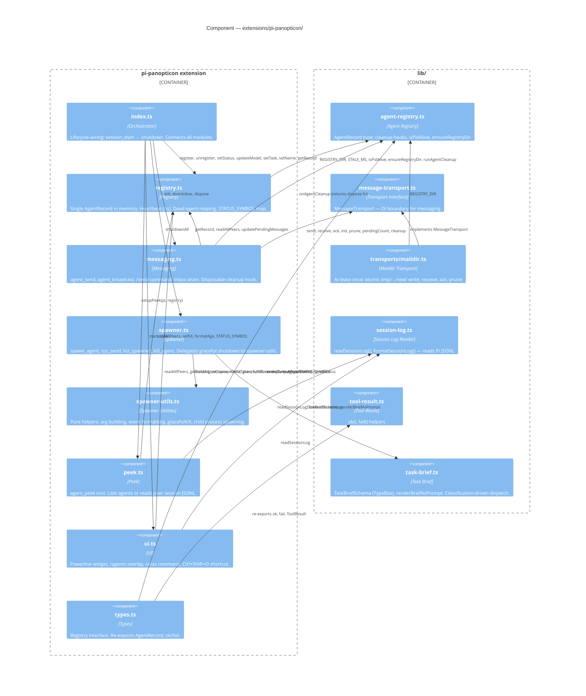

# Level 3: Component (pi-panopticon)

<!-- c4-auto-start: component -->

```mermaid
C4Component
    title Component — extensions/pi-panopticon/

    Container_Boundary(ext, "pi-panopticon extension") {
        Component(id_10, "index.ts", "Orchestrator", "Lifecycle wiring: session_start → shutdown. Connects all modules.")
        Component(id_11, "registry.ts", "Registry", "Single AgentRecord in memory. Heartbeat (5s). Dead-agent reaping. STATUS_SYMBOL map.")
        Component(id_12, "messaging.ts", "Messaging", "agent_send, agent_broadcast, /send command. Inbox drain. Disposable cleanup hook.")
        Component(id_13, "spawner.ts", "Spawner", "spawn_agent, rpc_send, list_spawned, kill_agent. Delegates graceful shutdown to spawner-utils.")
        Component(id_22, "spawner-utils.ts", "Spawner Utilities", "Pure helpers: arg building, event formatting, gracefulKill, child process spawning.")
        Component(id_14, "peek.ts", "Peek", "agent_peek tool. Lists agents or reads peer session JSONL.")
        Component(id_15, "ui.ts", "UI", "Powerline widget, /agents overlay, /alias command, Ctrl+Shift+O shortcut.")
        Component(id_16, "types.ts", "Types", "Registry interface. Re-exports AgentRecord, ok/fail.")
    }

    Container_Boundary(lib, "lib/") {
        Component(id_17, "agent-registry.ts", "Agent Registry", "AgentRecord type, cleanup hooks, isPidAlive, ensureRegistryDir")
        Component(id_18, "message-transport.ts", "Transport Interface", "MessageTransport — DI boundary for messaging")
        Component(id_19, "transports/maildir.ts", "Maildir Transport", "At-least-once: atomic tmp/→new/ write, receive, ack, prune")
        Component(id_20, "session-log.ts", "Session Log Reader", "readSessionLog(), formatSessionLog() — reads Pi JSONL")
        Component(id_21, "tool-result.ts", "Tool Result", "ok(), fail() helpers")
        Component(id_23, "task-brief.ts", "Task Brief", "TaskBriefSchema (TypeBox), renderBriefAsPrompt. Classification-driven dispatch.")
    }

    Rel(id_10, id_11, "register, unregister, setStatus, updateModel, setTask, setName, getRecord")
    Rel(id_10, id_12, "init, drainInbox, dispose")
    Rel(id_10, id_13, "shutdownAll")
    Rel(id_10, id_14, "setupPeek(pi, registry)")
    Rel(id_10, id_15, "start, stop")
    Rel(id_12, id_11, "getRecord, readAllPeers, updatePendingMessages")
    Rel(id_12, id_18, "send, receive, ack, init, prune, pendingCount, cleanup")
    Rel(id_12, id_17, "onAgentCleanup (returns dispose fn)")
    Rel(id_14, id_11, "readAllPeers, selfId, formatAge, STATUS_SYMBOL")
    Rel(id_14, id_20, "readSessionLog, formatSessionLog")
    Rel(id_15, id_11, "readAllPeers, getRecord, setName, nameTaken, sortRecords, formatAge, STATUS_SYMBOL")
    Rel(id_15, id_20, "readSessionLog")
    Rel(id_11, id_17, "REGISTRY_DIR, STALE_MS, isPidAlive, ensureRegistryDir, runAgentCleanup")
    Rel(id_19, id_18, "implements MessageTransport")
    Rel(id_19, id_17, "REGISTRY_DIR")
    Rel(id_16, id_17, "re-exports AgentRecord, AgentStatus")
    Rel(id_13, id_22, "buildArgList, spawnChild, gracefulKill, recentOutputFromEvents")
    Rel(id_13, id_23, "TaskBriefSchema, renderBriefAsPrompt")
    Rel(id_16, id_21, "re-exports ok, fail, ToolResult")
```
<!-- c4-auto-end: component -->
