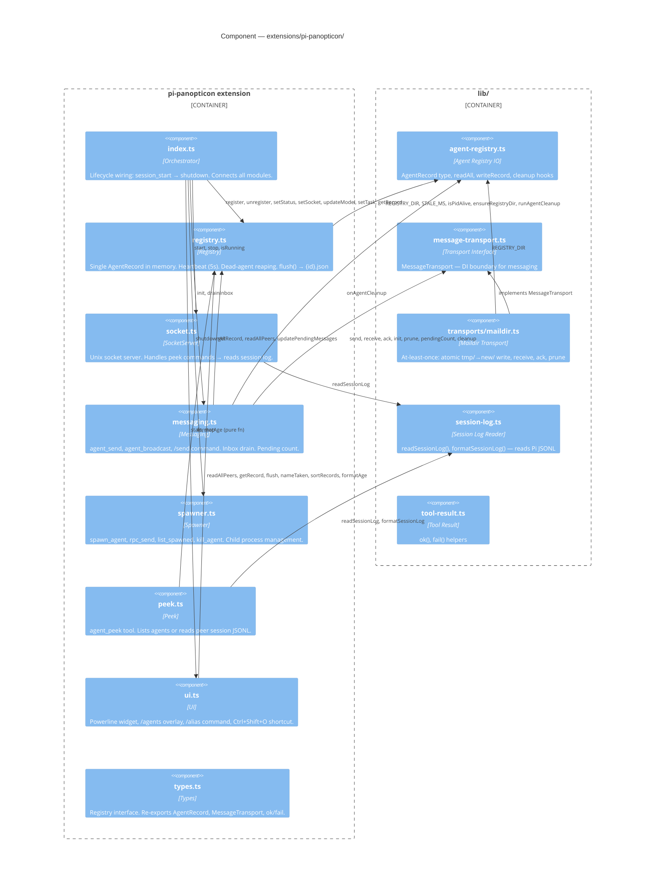

# Level 3: Component (pi-panopticon)

```mermaid
C4Component
    title Component — extensions/pi-panopticon/

    Container_Boundary(ext, "pi-panopticon extension") {
        Component(index, "index.ts", "Orchestrator", "Lifecycle wiring: session_start → shutdown. Connects all modules.")
        Component(registry, "registry.ts", "Registry", "Single AgentRecord in memory. Heartbeat (5s). Dead-agent reaping. flush() → {id}.json")
        Component(socket, "socket.ts", "SocketServer", "Unix socket server. Handles peek commands → reads session log.")
        Component(messaging, "messaging.ts", "Messaging", "agent_send, agent_broadcast, /send command. Inbox drain. Pending count.")
        Component(spawner, "spawner.ts", "Spawner", "spawn_agent, rpc_send, list_spawned, kill_agent. Child process management.")
        Component(peek, "peek.ts", "Peek", "agent_peek tool. Lists agents or reads peer session JSONL.")
        Component(ui, "ui.ts", "UI", "Powerline widget, /agents overlay, /alias command, Ctrl+Shift+O shortcut.")
        Component(types, "types.ts", "Types", "Registry interface. Re-exports AgentRecord, MessageTransport, ok/fail.")
    }

    Container_Boundary(lib, "lib/") {
        Component(agentReg, "agent-registry.ts", "Agent Registry IO", "AgentRecord type, readAll, writeRecord, cleanup hooks")
        Component(transport, "message-transport.ts", "Transport Interface", "MessageTransport — DI boundary for messaging")
        Component(maildir, "transports/maildir.ts", "Maildir Transport", "At-least-once: atomic tmp/→new/ write, receive, ack, prune")
        Component(sessionLog, "session-log.ts", "Session Log Reader", "readSessionLog(), formatSessionLog() — reads Pi JSONL")
        Component(toolResult, "tool-result.ts", "Tool Result", "ok(), fail() helpers")
    }

    Rel(index, registry, "register, unregister, setStatus, setSocket, updateModel, setTask, getRecord")
    Rel(index, socket, "start, stop, isRunning")
    Rel(index, messaging, "init, drainInbox")
    Rel(index, spawner, "shutdownAll")
    Rel(index, ui, "start, stop")

    Rel(messaging, registry, "getRecord, readAllPeers, updatePendingMessages")
    Rel(messaging, transport, "send, receive, ack, init, prune, pendingCount, cleanup")
    Rel(messaging, agentReg, "onAgentCleanup")
    Rel(peek, registry, "readAllPeers, selfId")
    Rel(peek, sessionLog, "readSessionLog, formatSessionLog")
    Rel(peek, registry, "formatAge (pure fn)")
    Rel(socket, sessionLog, "readSessionLog")
    Rel(ui, registry, "readAllPeers, getRecord, flush, nameTaken, sortRecords, formatAge")
    Rel(registry, agentReg, "REGISTRY_DIR, STALE_MS, isPidAlive, ensureRegistryDir, runAgentCleanup")
    Rel(maildir, transport, "implements MessageTransport")
    Rel(maildir, agentReg, "REGISTRY_DIR")
```
