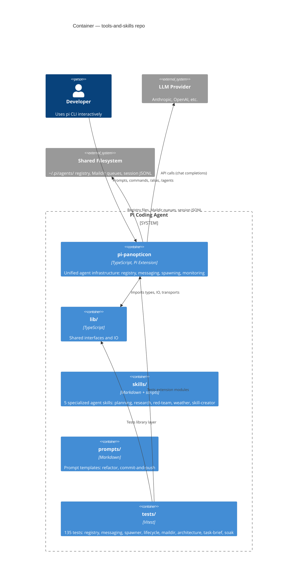

# Level 2: Container

<!-- c4-auto-start: container -->

```mermaid
C4Container
    title Container — tools-and-skills repo

    Person(id_1, "Developer", "Uses pi CLI interactively")

    System_Boundary(repo, "Pi Coding Agent") {
        Container(id_5, "pi-panopticon", "TypeScript, Pi Extension", "Unified agent infrastructure: registry, messaging, spawning, monitoring")
        Container(id_6, "lib/", "TypeScript", "Shared interfaces and IO")
        Container(id_7, "skills/", "Markdown + scripts", "5 specialized agent skills: planning, research, red-team, weather, skill-creator")
        Container(id_8, "prompts/", "Markdown", "Prompt templates: refactor, commit-and-push")
        Container(id_9, "tests/", "Vitest", "135 tests: registry, messaging, spawner, lifecycle, maildir, architecture, task-brief, soak")
    }

    System_Ext(id_3, "LLM Provider", "Anthropic, OpenAI, etc.")
    System_Ext(id_4, "Shared Filesystem", "~/.pi/agents/ registry, Maildir queues, session JSONL")

    Rel(id_5, id_6, "Imports types, IO, transports")
    Rel(id_5, id_4, "Registry files, Maildir queues, session JSONL")
    Rel(id_9, id_5, "Tests extension modules")
    Rel(id_9, id_6, "Tests library layer")
    Rel(id_1, id_5, "Prompts, commands, /alias, /agents")
    Rel(id_5, id_3, "API calls (chat completions)")
```
<!-- c4-auto-end: container -->
