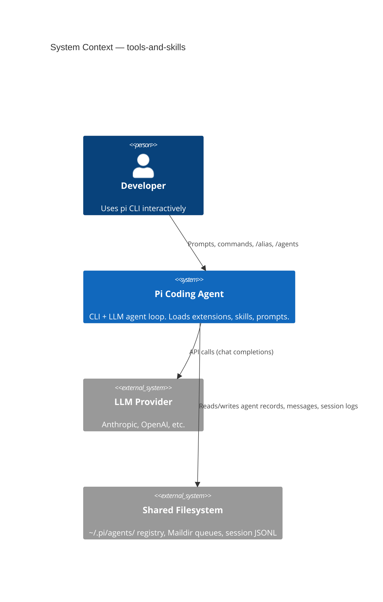
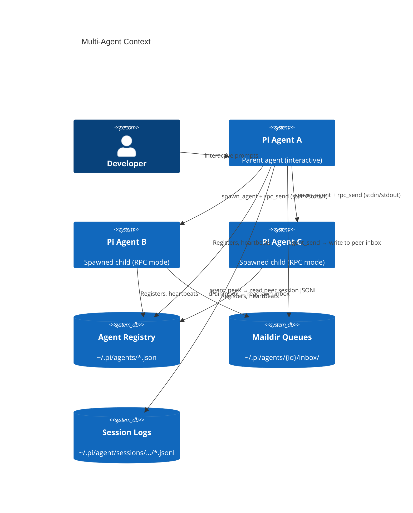

# Level 1: System Context

<!-- c4-auto-start: context -->

<!-- c4-auto-end: context -->

Multiple pi instances run concurrently — each loads pi-panopticon, registers in the shared filesystem registry, and communicates with peers via Maildir queues.

