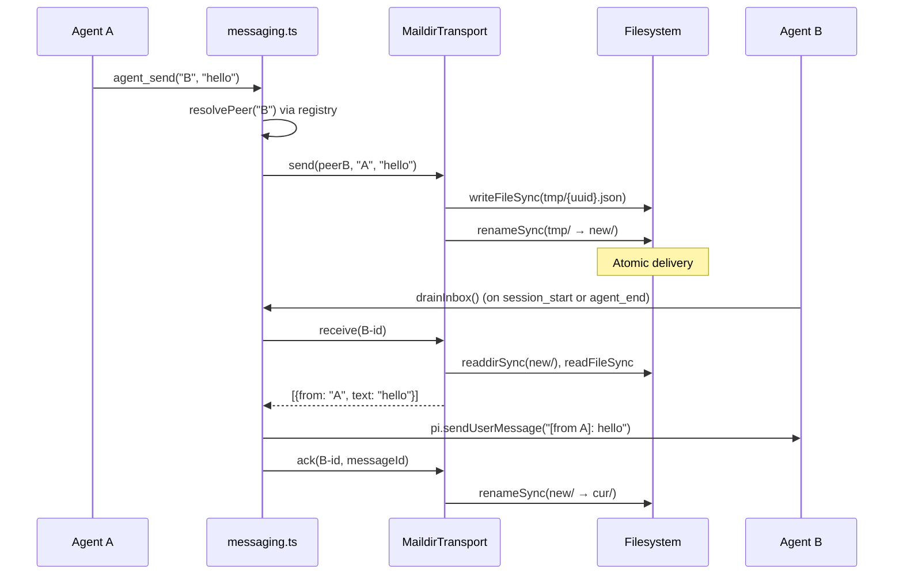
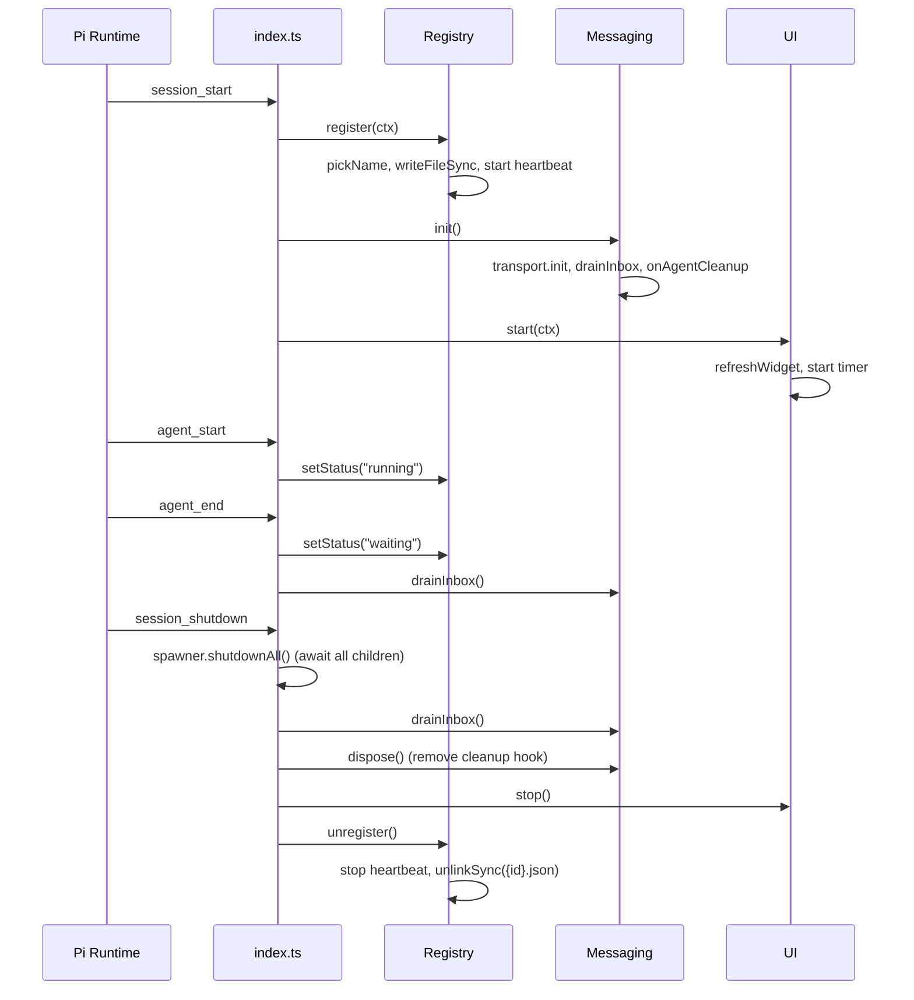
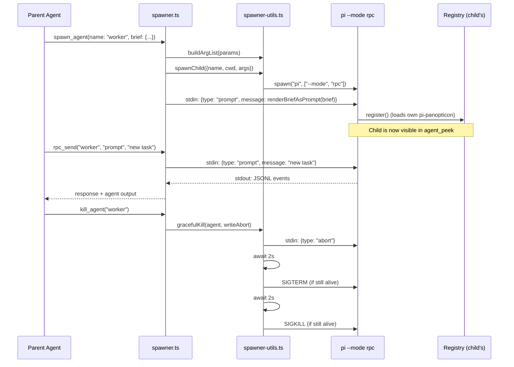

# Level 3b: Data Flow

### Sending a message

```mermaid
sequenceDiagram
    participant A as Agent A
    participant M as messaging.ts
    participant T as MaildirTransport
    participant FS as Filesystem
    participant B as Agent B

    A->>M: agent_send("B", "hello")
    M->>M: resolvePeer("B") via registry
    M->>T: send(peerB, "A", "hello")
    T->>FS: writeFileSync(tmp/{uuid}.json)
    T->>FS: renameSync(tmp/ → new/)
    Note over FS: Atomic delivery

    B->>M: drainInbox() (on session_start or agent_end)
    M->>T: receive(B-id)
    T->>FS: readdirSync(new/), readFileSync
    T-->>M: [{from: "A", text: "hello"}]
    M->>B: pi.sendUserMessage("[from A]: hello")
    M->>T: ack(B-id, messageId)
    T->>FS: renameSync(new/ → cur/)
```

### Agent lifecycle

```mermaid
sequenceDiagram
    participant Pi as Pi Runtime
    participant I as index.ts
    participant R as Registry
    participant M as Messaging
    participant U as UI

    Pi->>I: session_start
    I->>R: register(ctx)
    R->>R: pickName, writeFileSync, start heartbeat
    I->>M: init()
    M->>M: transport.init, drainInbox, onAgentCleanup
    I->>U: start(ctx)
    U->>U: refreshWidget, start timer

    Pi->>I: agent_start
    I->>R: setStatus("running")

    Pi->>I: agent_end
    I->>R: setStatus("waiting")
    I->>M: drainInbox()

    Pi->>I: session_shutdown
    I->>I: spawner.shutdownAll() (await all children)
    I->>M: drainInbox()
    I->>M: dispose() (remove cleanup hook)
    I->>U: stop()
    I->>R: unregister()
    R->>R: stop heartbeat, unlinkSync({id}.json)
```

### Spawning a child agent

```mermaid
sequenceDiagram
    participant A as Parent Agent
    participant SP as spawner.ts
    participant SU as spawner-utils.ts
    participant Child as pi --mode rpc
    participant Reg as Registry (child's)

    A->>SP: spawn_agent(name: "worker", brief: {...})
    SP->>SU: buildArgList(params)
    SP->>SU: spawnChild({name, cwd, args})
    SU->>Child: spawn("pi", ["--mode", "rpc"])
    SP->>Child: stdin: {type: "prompt", message: renderBriefAsPrompt(brief)}
    Child->>Reg: register() (loads own pi-panopticon)
    Note over Child,Reg: Child is now visible in agent_peek

    A->>SP: rpc_send("worker", "prompt", "new task")
    SP->>Child: stdin: {type: "prompt", message: "new task"}
    Child-->>SP: stdout: JSONL events
    SP-->>A: response + agent output

    A->>SP: kill_agent("worker")
    SP->>SU: gracefulKill(agent, writeAbort)
    SU->>Child: stdin: {type: "abort"}
    SU->>SU: await 2s
    SU->>Child: SIGTERM (if still alive)
    SU->>SU: await 2s
    SU->>Child: SIGKILL (if still alive)
```
