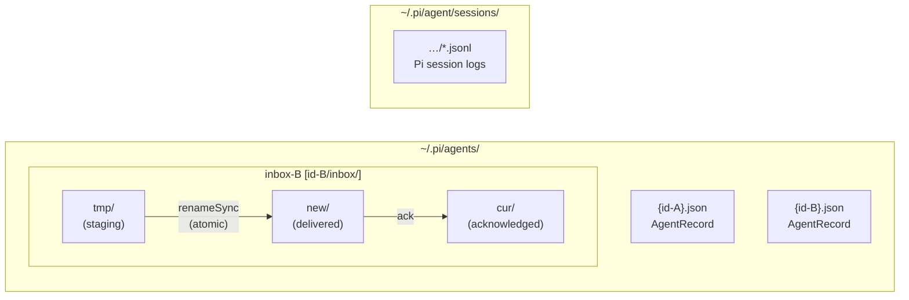

# Filesystem Layout

```mermaid
graph LR
    subgraph "~/.pi/agents/"
        A1["{id-A}.json<br/>AgentRecord"]
        A2["{id-B}.json<br/>AgentRecord"]
        subgraph "inbox-B [id-B/inbox/]"
            tmp["tmp/<br/>(staging)"]
            new["new/<br/>(delivered)"]
            cur["cur/<br/>(acknowledged)"]
        end
    end

    subgraph "~/.pi/agent/sessions/"
        sess["…/*.jsonl<br/>Pi session logs"]
    end

    tmp -->|"renameSync<br/>(atomic)"| new
    new -->|"ack"| cur
```
