# C4 Architecture — tools-and-skills

## Level 1: System Context

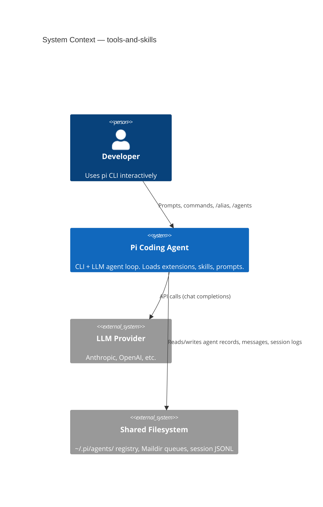

Multiple pi instances run concurrently — each loads pi-panopticon, registers in the shared filesystem registry, and communicates with peers via Maildir queues.

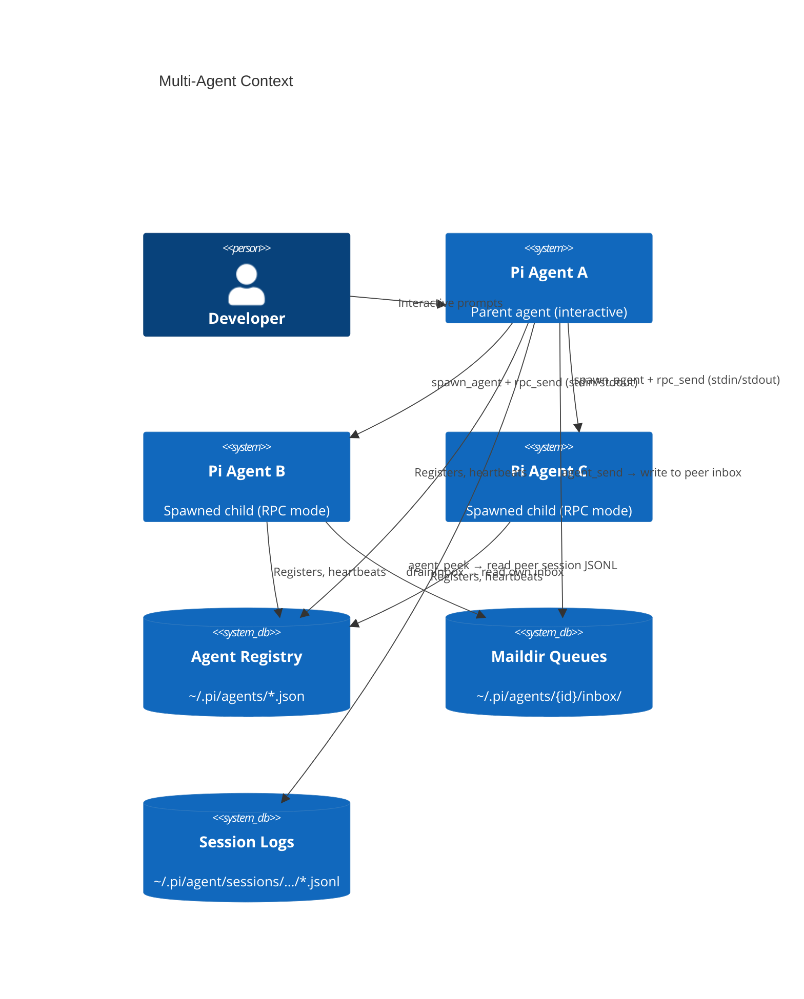

---

## Level 2: Container

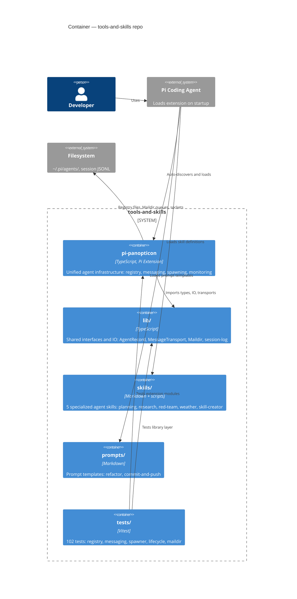

---

## Level 3: Component (pi-panopticon)

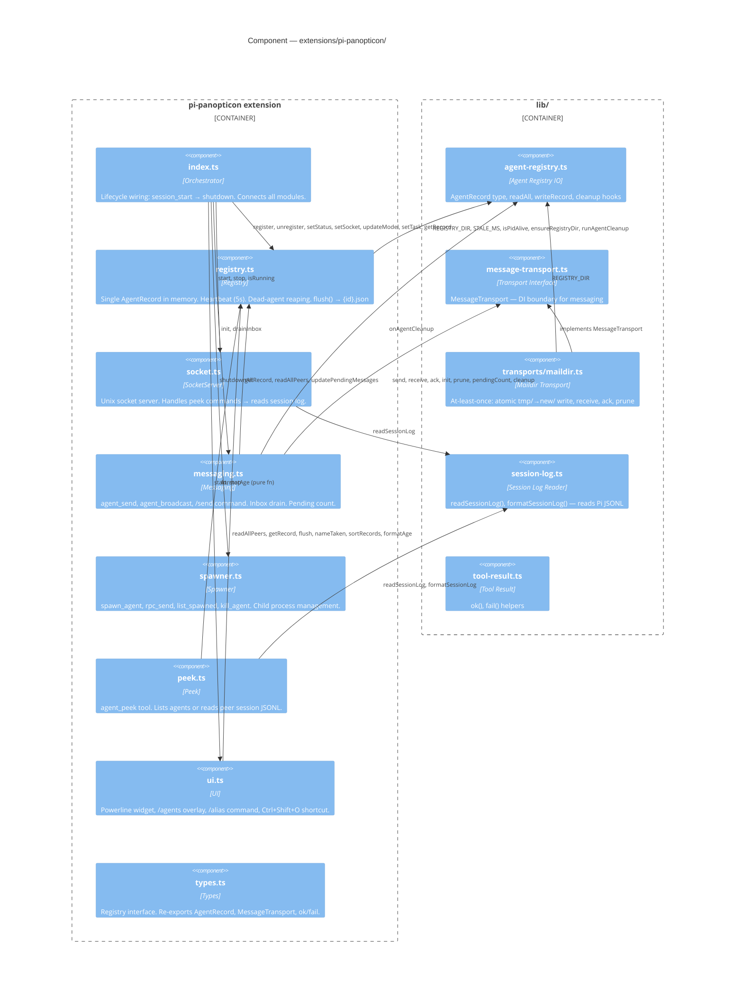

---

## Level 3b: Data Flow

### Sending a message

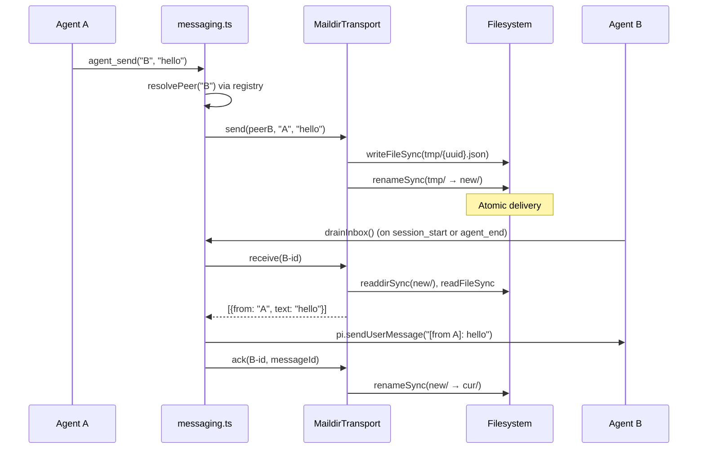

### Agent lifecycle

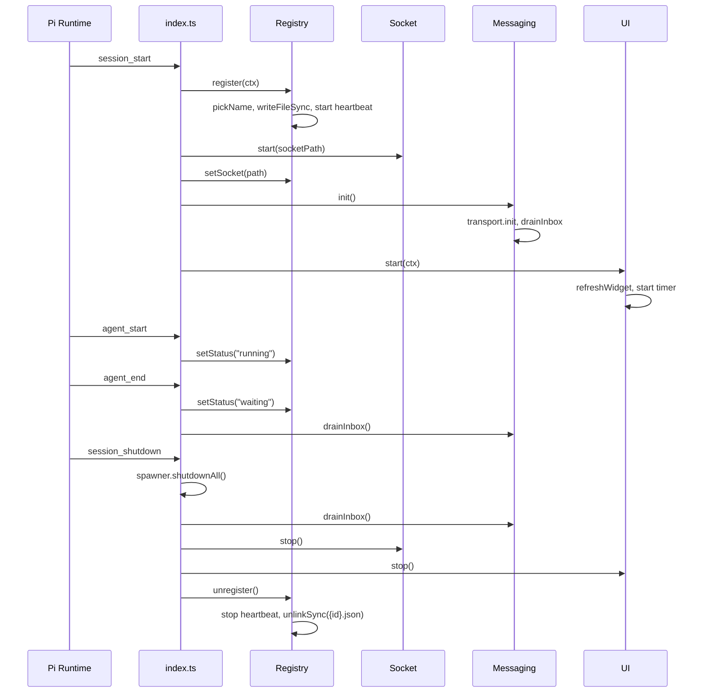

### Spawning a child agent

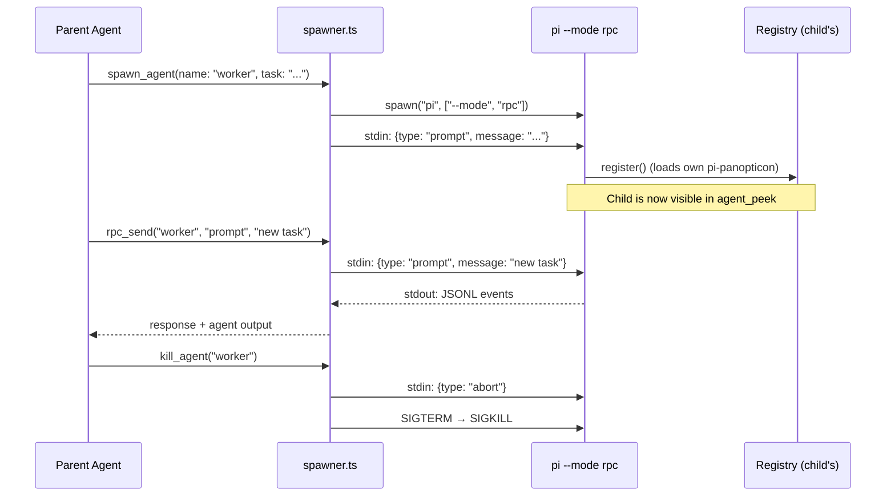

---

## Level 4: Code (key interfaces)

### Core types (lib/)

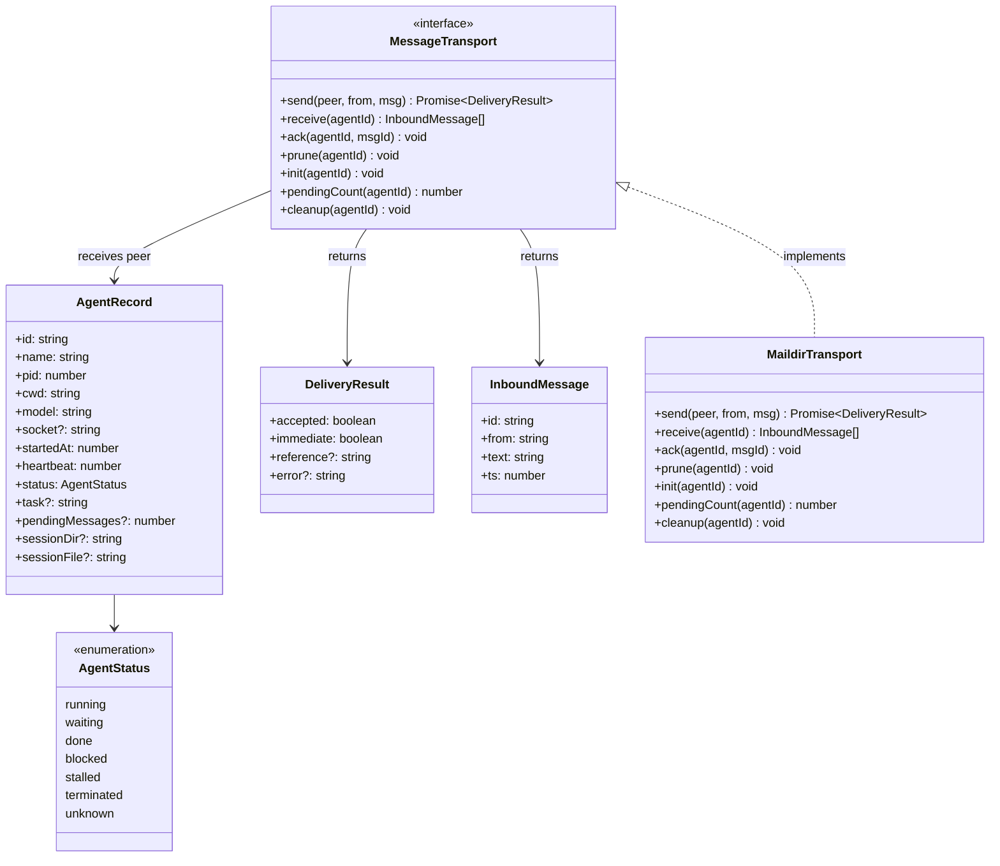

### Extension modules (pi-panopticon/)

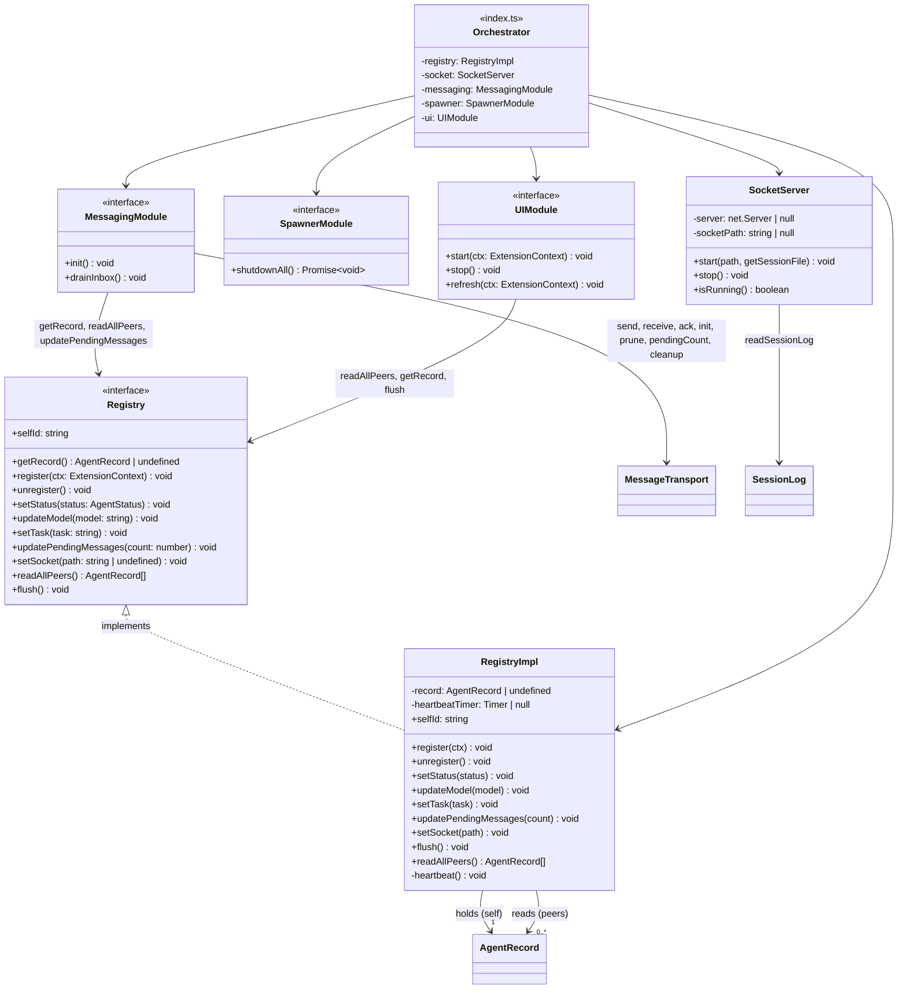

### Dependency direction

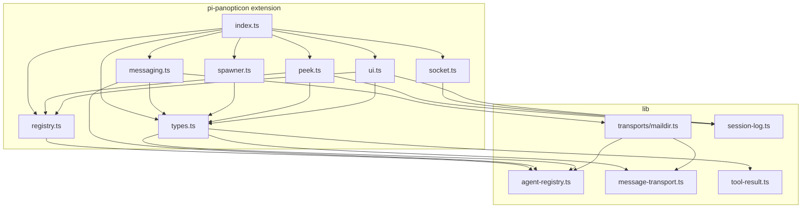

---

## Filesystem Layout

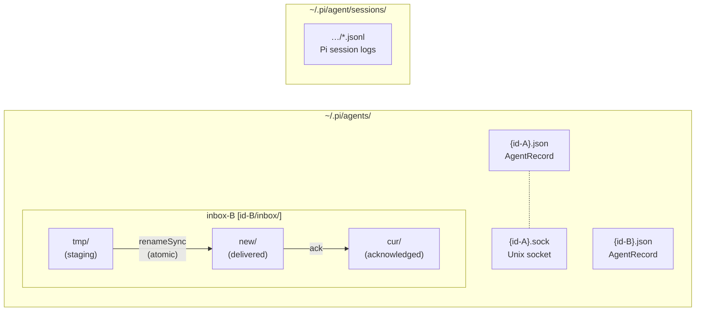
