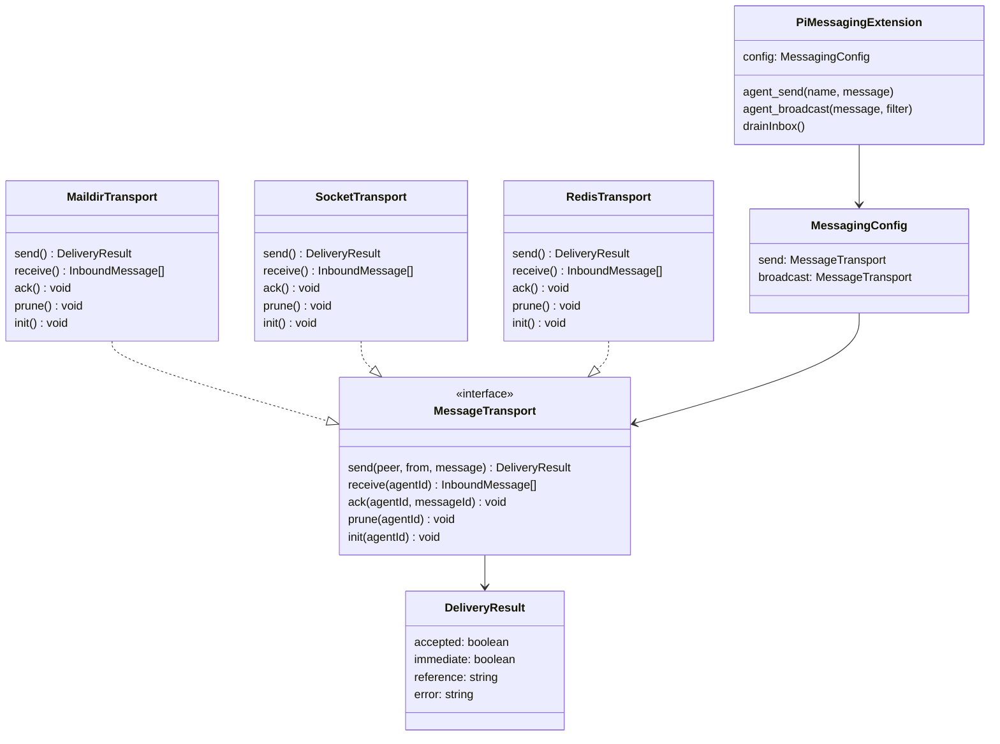

# Pi Messaging Architecture

## Principle

The extension has two operations: **send** and **broadcast**.
Each is backed by a `MessageTransport` — an interface with five methods and no parameters that describe implementation.
The transport determines the delivery semantics.
The extension doesn't know or care.

## Interface

```typescript
interface MessageTransport {
  send(peer, from, message): Promise<DeliveryResult>
  receive(agentId): InboundMessage[]
  ack(agentId, messageId): void
  prune(agentId): void
  init(agentId): void
}

interface DeliveryResult {
  accepted: boolean    // transport took the message
  immediate: boolean   // recipient got it right now
  reference?: string   // tracking id
  error?: string       // why not accepted
}
```

No modes. No guarantee parameters. The guarantee is a property of **which transport you chose**, not a flag you pass at call time.

## Wiring

```typescript
export interface MessagingConfig {
  send: MessageTransport       // for agent_send, /send
  broadcast: MessageTransport  // for agent_broadcast
}
```

Default:

```typescript
const maildir = createMaildirTransport();
export default createMessagingExtension({ send: maildir, broadcast: maildir });
```

That gives at-least-once for everything. Want fast lossy broadcasts?

```typescript
createMessagingExtension({
  send: createMaildirTransport(),
  broadcast: createSocketTransport(),
})
```

Want Redis everywhere?

```typescript
const redis = createRedisTransport(client);
createMessagingExtension({ send: redis, broadcast: redis });
```

The extension code never changes.

## Files

```
lib/
├── message-transport.ts           Interface (58 lines)
├── agent-registry.ts              Shared IO helpers (unchanged)
└── transports/
    └── maildir.ts                 At-least-once via Maildir (78 lines)

extensions/
└── pi-messaging.ts                Tools + UI (230 lines)

tests/
├── maildir-transport.test.ts      Transport tests (8 tests)
└── pi-messaging.test.ts           Extension tests (22 tests)
```

## Tools

| Tool | Config key | What it does |
|------|-----------|--------------|
| `agent_send` | `config.send` | Send to one peer |
| `agent_broadcast` | `config.broadcast` | Send to all/filtered peers |
| `/send` command | `config.send` | CLI send to one peer |

There is no `agent_send_durable`. That was an implementation detail leaking into the tool surface. If you want durable sends, wire a durable transport. If you want durable broadcasts, wire a durable transport to broadcast.

## MaildirTransport

At-least-once delivery. Messages survive crashes, sleep, restarts.

```
send()    → atomic write: tmp/file.json → rename to new/file.json
receive() → read all .json in new/, sorted oldest first
ack()     → move new/file.json → cur/file.json
prune()   → keep last 50 in cur/, delete rest
init()    → create tmp/, new/, cur/ dirs
```

Always `accepted: true, immediate: false` (unless disk fails).

## Receive side

The extension drains the inbox on `session_start` and `agent_end`:

```
transport.init(selfId)
pending = transport.receive(selfId)
for each msg:
  deliver to user
  transport.ack(selfId, msg.id)
transport.prune(selfId)
```

## Adding a transport

Implement `MessageTransport`. That's it.

```typescript
class SocketTransport implements MessageTransport {
  async send(peer, from, message) {
    // try unix socket
    // return { accepted: true/false, immediate: true/false }
  }
  receive(agentId) { return []; }  // sockets don't queue
  ack() {}
  prune() {}
  init() {}
}
```

Plug it in:

```typescript
createMessagingExtension({
  send: createMaildirTransport(),
  broadcast: new SocketTransport(),
})
```

## What we removed

| Removed | Why |
|---------|-----|
| `DeliveryMode` enum | Implementation leaked into interface |
| `Guarantee` parameter | Same — the transport IS the guarantee |
| `agent_send_durable` tool | Was an implementation detail as a tool |
| `SocketMaildirTransport` | Composite that mixed two concerns |
| `delivered` / `persisted` in result | Named after socket/maildir internals |

## What remains

- `MessageTransport` — 5 methods, no implementation knowledge
- `DeliveryResult` — `accepted` + `immediate`, transport-agnostic
- `MessagingConfig` — `{send, broadcast}`, two transports
- `MaildirTransport` — one clean implementation
- 2 tools, 1 command — `agent_send`, `agent_broadcast`, `/send`

71 total tests passing (8 transport + 22 extension + 41 other). 0 type errors.

## Class diagram


