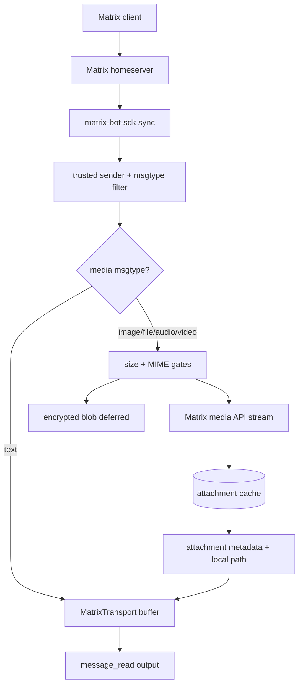

# ADR 015: Matrix Attachment Ingestion

## Status
Accepted

## Context
`pi-matrix` previously forwarded only `m.text` Matrix events. Matrix clients send images, PDFs, audio, video, and generic files as `m.room.message` events with `msgtype` values such as `m.image` and `m.file`, so those events were silently dropped before `message_read`.

## Decision
`pi-matrix` ingests media message events, downloads allowed `mxc://` media into a local cache, and carries attachment metadata through the shared message transport to `message_read`.

## Consequences
- `message_read` remains backwards compatible for text-only messages and adds compact attachment lines when files are present.
- Attachments are never executed or parsed automatically; workers must explicitly read local paths.
- Encrypted media blobs are deferred until a bounded decrypt path exists; `message_read` surfaces an attachment error instead of dropping the event.
- Cache size is controlled per attachment by `maxAttachmentBytes`; lifecycle cleanup is left to operators for now.
