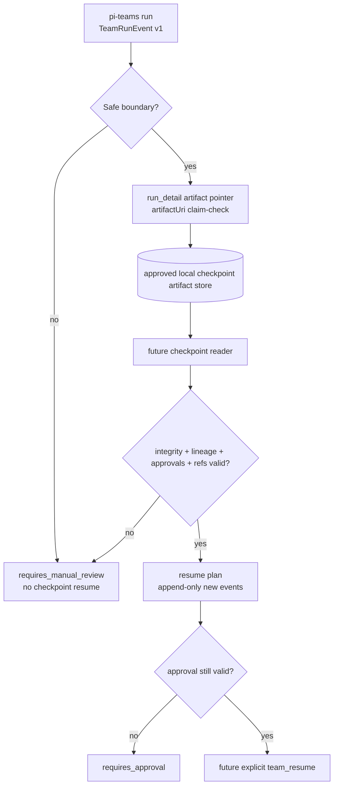

# ADR 021: pi-teams Durable Checkpoint and Resume Design

Status: Proposed — implementation requires approval
Date: 2026-05-29
Ticket: T-312

## Context

`pi-teams` currently records run progress as session custom events with `customType: "pi-teams:run"` and `schemaVersion: 1`. `TeamStateManager` appends `run_started`, `phase_started`, `node_completed`, `run_detail`, stop, terminal, and tombstone events, then rehydrates current-session `TeamRunRecord` objects for `team_runs` and overlays.

Relevant existing boundaries:

- ADR 018 explicitly treats run state/details as internal session-scoped diagnostics, not durable resume/replay state.
- T-308 approval gates are provisional/default-disabled and emit approval request/result information as `run_detail` trace data.
- T-309 observability maps current run events into provisional local observability records, but is not a durable external API or resume source.
- ADR 017 allows local session spooling only under explicit opt-in boundaries and forbids default external export or unredacted cross-agent sharing.
- T-576 keeps provider-backed behavior, credentials, network, and artifact persistence behind explicit gates.

The existing primitives are useful for checkpoint design, but they are not sufficient to safely resume a team run without a new approved contract. Runtime resume changes would affect persistence semantics, approval interpretation, idempotency, and private payload retention.

## Decision

Define a future checkpoint/resume model, but do not implement runtime resume, new tools, CI gates, external persistence, provider calls, or production state changes in T-312.

A future approved implementation should use claim-check checkpoint artifacts referenced from existing run details rather than storing large checkpoint payloads directly in session events. The current `run_detail`/`artifactUri` shape can advertise that a checkpoint exists, while the checkpoint payload itself must live in an explicitly approved local artifact location with retention and redaction rules.

## Checkpoint flow



## Checkpoint model

A checkpoint captures enough bounded state for a reviewer or future runtime to decide whether a run can continue safely. It is not a transcript dump.

Required checkpoint fields:

- `schemaVersion` — checkpoint payload schema, independent from `TeamRunEvent` schema.
- `checkpointId` — stable id for this checkpoint.
- `runId`, `teamId`, `protocol` — source run identity.
- `createdAt`, `createdBy` — timestamp and local orchestrator identity if available.
- `source` — session/run event claim-check reference and last consumed event sequence.
- `lineage` — parent run id, parent checkpoint id, parent session id/path claim-check, and spawned child/orchestrator identity when available.
- `boundary` — safe boundary where the checkpoint was taken: before phase, after node, awaiting approval, stopped, failed, or completed.
- `completed` — completed phases/nodes with `phaseId`, `nodeId`, model, status, output hash, duration, and artifact refs.
- `pending` — the next phase/node/action if known, with prompt/template/model refs and bounded input summary.
- `handoff` — compact handoff context, assumptions, open questions, verifier gaps, fallback decisions, and unresolved risks.
- `approvals` — approval requests/results known at checkpoint time, including gate id, owner, risk, status, expiry, decision metadata, and artifact refs.
- `artifacts` — claim-check URIs plus hashes/sizes/types, never embedded large reports or raw logs.
- `idempotency` — deterministic resume keys for completed and pending work.
- `integrity` — payload hash, writer version, and validation status.

Large model outputs, transcripts, private logs, and provider payloads must be referenced by claim-check only and must obey the artifact/redaction policy approved for the storage location. Credentials, secrets, keychain material, authorization headers, and raw session logs must never be embedded in checkpoint payloads.

## Handoff context

Checkpoint handoff should be concise and model-consumable, but durable enough for operator review:

- original user prompt summary and goal, not necessarily the full prompt;
- protocol-specific progress summary;
- current assumptions and open questions;
- last `handoff`, `fallback`, `artifact`, and `error` details relevant to the next step;
- bounded verifier/gap-detector output for research runs;
- explicit unresolved approvals or stop reasons;
- caveats about omitted or redacted private details.

If the next step cannot be described without replaying raw private context, resume must be blocked and converted into a manual restart from a redacted summary.

## Parent run and session lineage

Lineage must distinguish several relationships:

- **Parent session lineage:** the pi session or branch that started the team run.
- **Parent run lineage:** a team run that spawned, delegated to, or resumed this run.
- **Child execution lineage:** one-shot model subprocesses or live-agent bindings used by nodes.
- **Checkpoint lineage:** the checkpoint from which a resumed run starts.

Current code records `orchestratorPid` and passes a Panopticon parent id to child model invocations, but it does not persist a durable session id or parent checkpoint id. Future resume work must add explicit lineage fields before claiming durable resume support.

## Approval state

Approval state is fail-closed:

- Missing, malformed, expired, rejected, or mismatched approval data blocks automatic resume.
- Approved gates can be reused only if the approval explicitly covers the resumed action, checkpoint id or idempotency key, risk level, and artifact refs.
- A resumed run must not infer authorization from diagnostic `run_detail` text alone.
- Any change that makes approval data policy-driving requires ADR/reviewer approval, because T-308 approval gates remain provisional.

## Artifact references

Checkpoint artifacts should use claim-check paths such as:

```text
session://team-runs/<runId>/checkpoints/<checkpointId>
```

or another approved local URI scheme. The URI must resolve only in the local approved artifact store; external URLs, remote object stores, provider payloads, and working-notes paths are out of scope.

Artifact metadata should include content hash, size, media/type, redaction posture, and retention policy. Checkpoint readers must tolerate missing artifacts and return a blocked/manual-review result instead of retrying blindly.

## Idempotency and resume behavior

Resume must be deterministic and conservative:

- Completed node keys are `(runId, phaseId, nodeId, attempt)` plus output hash.
- Pending action keys include team id, protocol, phase id, node id, prompt/template refs, model id, approval gate id if any, and artifact refs.
- Replaying a completed node is forbidden unless the operator explicitly starts a new run or selects a re-run mode.
- Retrying a failed/cancelled node requires a new attempt id and must preserve the previous failure record.
- Resume must append new events; it must not rewrite prior session events or checkpoint artifacts.
- Terminal runs (`completed`, `failed`, `stopped`) are not auto-resumed. They may be used only as inputs for a new run with explicit operator intent.

## Corrupt or missing checkpoints

Readers must fail closed when:

- the checkpoint payload is missing, malformed, unsupported, or hash-mismatched;
- the referenced run events are missing or conflict with the checkpoint cursor;
- the artifact store is unavailable;
- approval state is incomplete or ambiguous;
- required prompt/model/template refs cannot be resolved;
- the checkpoint was taken mid-node rather than at a safe boundary.

The safe outcome is `requires_manual_review` with a concise reason and claim-check refs. It is not automatic replay, cleanup, deletion, or best-effort mutation.

## Compatibility with existing trace/event format

T-312 should not change the existing `TeamRunEvent` v1 contract. A future implementation has two compatible options:

1. **v1-compatible checkpoint pointer:** append a `run_detail` with `detailKind: "artifact"`, a concise message such as `checkpoint created`, and `artifactUri` pointing to the checkpoint payload. Existing readers already tolerate artifact details and can ignore the URI.
2. **schema-versioned checkpoint events:** add a new event kind or custom type only after an ADR defines reader compatibility, migration, retention, and rollback.

The first option is preferred for an initial local POC because it uses the existing claim-check shape and avoids embedding new durable payloads in session events.

Unknown or malformed checkpoint references must not poison current `team_runs` reduction. Existing `TeamStateManager` behavior of ignoring unknown/malformed details should be preserved and tested before promotion.

## Implementation disposition for T-312

No implementation POC is included in T-312. Even a small runtime checkpoint writer would begin to define durable persistence and resume behavior, which ADR 018 explicitly gates. A test-only parser would be safe only after the checkpoint payload shape is approved, because tests would otherwise create a de facto schema contract.

## Follow-up implementation tickets

1. **T-312A — approve checkpoint payload schema and storage boundary**
   - Decide local artifact root/URI scheme, retention, redaction, deletion, and compatibility rules.
   - Acceptance: ADR/reviewer approval and synthetic fixtures only.

2. **T-312B — pure checkpoint readiness classifier**
   - Add a pure function that inspects a `TeamRunRecord` plus synthetic checkpoint fixture and returns `resumable`, `requires_approval`, `requires_manual_review`, or `not_resumable`.
   - No file writes, no tools, no runtime resume.

3. **T-312C — v1-compatible checkpoint pointer POC**
   - Emit or parse `run_detail` artifact pointers for synthetic checkpoints only.
   - Preserve current `team_runs` reduction and observability compatibility.

4. **T-312D — explicit `team_resume` design**
   - Design command/tool UX, approval semantics, idempotency, and rollback before implementation.
   - Requires ADR approval before any runtime continuation behavior.

## Approval triggers

Require ADR or explicit reviewer approval before any change that:

- adds durable checkpoint artifact writes;
- changes `TeamRunEvent` schema, event kinds, or public persistence contract;
- adds `team_resume` or automatic continuation behavior;
- treats approvals as runtime authorization policy;
- scans or reads broader session logs, working-notes, kanban state, credentials, or provider artifacts;
- introduces external storage, remote sync, provider calls, or live network;
- mutates, redacts, deletes, rewrites, or migrates existing run/session artifacts;
- exposes checkpoints to other agents or users beyond the current local session boundary.

## Out of scope

No runtime resume, no checkpoint writer, no linter/CI gate, no external persistence, no provider calls, no live network, no session/working-notes/kanban mutation, no credential/keychain access, and no production state migration.
