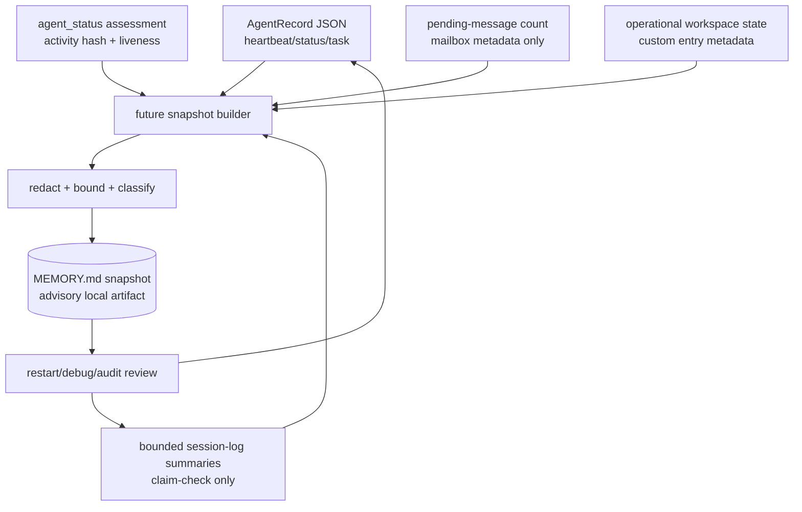

# ADR 022: Panopticon MEMORY.md Snapshot Boundary

Status: Proposed — design only
Date: 2026-05-29
Ticket: T-217

## Context

Panopticon currently persists short-lived agent control-plane state through the local registry under `~/.pi/agents`: one JSON `AgentRecord` per visible agent, optional agent mailbox directories, heartbeats, pending-message counts, session file claim-checks, and status/task fields. `agent_peek` and `agent_status` combine registry data with bounded session-log reads for activity and health. ADR 014 keeps reconciliation alerts sparse, and ADR 017/T-274/T-492/T-493/T-507 define explicit, local, redacted session-spooling boundaries.

Related boundaries that constrain this design:

- Registry heartbeat/activity data is operational routing and liveness state, not long-term memory.
- Session spooling is explicit/local and redacted at Panopticon-visible output boundaries.
- ADR 018 and ADR 021 keep team run diagnostics/checkpoint work from becoming broad durable replay or memory state.
- T-485 journals are read-only/redacted artifacts and do not introduce runtime memory.
- No repo-local T-213/T-217 background artifact was found during inspection; this ADR records the current T-217 decision point.

Operators still need a compact restart/debug/audit snapshot that says what an agent was doing, what state was safe to remember, and where to look next without reopening raw transcripts. Recent role-scoped `MEMORY.md` SOP work points toward a human-readable file, but Panopticon must not turn that into a raw prompt/session dump or an authoritative scheduler.

## Decision

Define a future Panopticon `MEMORY.md` snapshot as a local, bounded, advisory claim-check artifact. Do not implement a writer, reader, CLI, tool, hook, daemon, or runtime enforcement in T-217.

A future implementation may write one latest snapshot per agent, plus optional bounded terminal snapshots, only after approval of the storage location and retention policy. The snapshot complements registry heartbeat/activity data; it does not replace registry JSON, session logs, mailboxes, or task boards.

## Snapshot flow

## Proposed snapshot fields

`MEMORY.md` should be Markdown with small YAML front matter followed by bounded sections. It must stay human-readable and diff-friendly.

Front matter fields:

- `schemaVersion`: snapshot schema version, independent from `AgentRecord`.
- `agentId`, `registryName`, `spawnName`, `nameSource`.
- `pid`, `cwd`, `model`, `status`, `visibility`, `parentId`.
- `startedAt`, `heartbeatAt`, `snapshotAt`.
- `sessionFileRef`, `sessionDirRef`: claim-checks only; no embedded transcript.
- `activityWindow`: count/hash/timestamp range for the bounded source window.
- `redaction`: policy label and redaction count if known.
- `sourceRegistryMtime` or `sourceRegistryHash` if available.

Markdown sections:

1. **Current state** — one short paragraph describing status, task, and whether the agent appears active/waiting/blocked/stalled/terminated.
2. **Last safe activity summary** — bounded summaries of recent activity; no raw tool payloads or long model output.
3. **Known blockers / pending input** — pending messages count, self-reported blocked reason if available, and clear next operator action.
4. **Assumptions and open questions** — explicit uncertainty that should survive restart.
5. **Artifacts and claim-checks** — local refs to session file, reports, task ids, or checkpoint artifacts; no copied private data.
6. **Recovery guidance** — how to resume safely, including whether to inspect `agent_peek`, `agent_status`, a task board, or a session claim-check.
7. **Warnings** — corruption, omitted data, stale heartbeat, unavailable source files, or redaction caveats.

The file should be size-capped. A proposed initial cap is 16 KiB per latest snapshot and at most 20 recent activity bullets.

## Sources

Allowed sources for a future builder:

- current agent's `AgentRecord` fields from the registry;
- `agent_status`/health assessment fields derived from existing registry and bounded session activity;
- bounded session summaries from `lib/session-log.ts` or `lib/session-journal.ts` style adapters;
- pending-message counts and aggregate local queue facts only, not sender identities, room/thread identifiers, subjects, message bodies, or private mailbox paths;
- Panopticon operational workspace state custom entries limited to safe metadata fields such as source channel, last-active timestamp, and claim-check paths; no workspace content scans;
- explicit local artifact refs already produced by approved docs/report/checkpoint flows.

Disallowed sources without a follow-up ADR/approval:

- raw long transcripts, raw prompts with credentials, chain-of-thought/private reasoning, keychain data, credentials, cookies, authorization headers, or secret manager output;
- working-notes, `STATE.md`, pi-kanban board state, Matrix payloads, or private mailboxes beyond approved metadata;
- provider responses, live network data, or external service state;
- arbitrary filesystem scans to discover private context.

## Trigger points

Future snapshot writes should be sparse and event-driven, not daemon-style polling:

- on registration/session start after the registry record exists;
- after task/status/model/name changes that are already flushed to the registry;
- after a bounded activity checkpoint when the session source is explicit and approved;
- after receiving or draining pending messages, recording only counts/metadata unless approved summaries exist;
- before graceful shutdown/unregister to preserve a terminal advisory snapshot;
- via an explicit future diagnostic command/tool, if approved.

Heartbeat-only updates should not rewrite `MEMORY.md` unless meaningful state changed or a minimum interval elapsed. This prevents noisy churn and avoids turning snapshots into metrics logs.

## Retention

Default retention should be minimal:

- one latest `MEMORY.md` per active agent;
- optional terminal snapshots only after approval, capped by both count and TTL;
- no indefinite archive, metrics history, or database;
- no retention of raw transcript excerpts;
- cleanup/reaping policy must be specified before implementation because current Panopticon unregister/reap behavior removes registry/mailbox artifacts but has no MEMORY-specific lifecycle.

A safe first implementation should use synthetic fixtures and an explicit temp registry root. Promotion to the real `~/.pi/agents` tree requires review of cleanup, retention, and cross-agent visibility.

## Redaction and no-secret policy

Snapshot output must be safe for local Panopticon inspection and accidental copy/paste into reports:

- redact common token/password/API-key/authorization/cookie patterns;
- omit private/reasoning-like keys such as `reasoning`, `thinking`, `chain_of_thought`, `hidden`, `private`, `raw`, `rawMessage`, and `rawPayload`;
- bound all text summaries;
- replace personal or private endpoints with placeholders when not needed for recovery;
- prefer claim-check refs over embedded content;
- include a `redaction` label so readers know whether the snapshot is synthetic, redacted-local, or local-private.

Unredacted snapshots are not approved. Any proposal for unredacted local-only snapshots requires a separate ADR that explains readers, labels, deletion, commit/push protection, and external-provider isolation.

## Advisory vs authoritative status

`MEMORY.md` is advisory. Authoritative state remains:

- registry JSON for current liveness/routing/name/status metadata;
- maildir/transport state for actual pending messages;
- session files for the raw local session record;
- task boards or CoAS state for project work ownership;
- pi-teams run events for team diagnostic state.

Readers must not use `MEMORY.md` to route messages, decide process liveness, authorize actions, resume team runs, or mutate task boards. If the snapshot disagrees with registry/health state, registry/health wins and the snapshot should be treated as stale.

## Concurrency and write atomicity

A future writer should follow existing local atomic-write patterns:

- one owning writer per agent id;
- write to a temp file in the same directory, then rename over `MEMORY.md`;
- keep snapshot and registry writes individually atomic but not transactionally coupled;
- include source hashes/timestamps so readers can detect mismatches;
- never rewrite session logs, registry JSON owned by another agent, mailboxes, or task files as part of snapshot generation;
- tolerate interruption between registry flush and snapshot flush.

If a separate process writes snapshots for another agent, it must use an explicit manifest/approval boundary and must not infer authority from filesystem access alone.

## Corruption handling

Readers should fail soft and writers should avoid destructive repair:

- malformed front matter or oversized snapshots are ignored with a warning;
- missing source refs make the snapshot stale, not fatal;
- hash/timestamp mismatches mark the snapshot as possibly stale;
- future writers may replace the latest snapshot on the next successful write;
- no automatic deletion, quarantine, or migration of corrupt snapshots without a reviewed cleanup policy.

## Relationship to registry heartbeat and activity logs

Registry heartbeat answers: "Is this agent currently alive and routable?"

Session/activity logs answer: "What happened recently?"

`MEMORY.md` answers: "What compact, redacted state is useful for a human or future agent to understand restart/debug/audit context?"

Therefore snapshots should cite registry/session claim-checks, not duplicate them. They should be stale-tolerant and explicitly timestamped. A fresh heartbeat can coexist with an old snapshot; an old heartbeat can coexist with a useful terminal snapshot.

## Implementation disposition for T-217

No local POC is included in T-217. Existing primitives provide registry records, session summaries, and atomic-write examples, but there is no existing `MEMORY.md` writer/loader boundary. Adding even a test-only renderer now would begin to define a public snapshot schema and retention behavior before storage and visibility are approved.

## Follow-up tickets

1. **T-217A — approve MEMORY.md storage/retention boundary**
   - Decide concrete path, cleanup/reap behavior, visibility, TTL/count caps, and whether snapshots live under the real registry tree or an explicit manifest-gated output root.

2. **T-217B — pure synthetic renderer POC**
   - Add a pure `AgentRecord` + synthetic health/activity summary to Markdown renderer with redaction and size caps. No real filesystem reads or runtime writes.

3. **T-217C — explicit local writer POC**
   - Add temp-file + rename writer behind an explicit test/temp registry root or manifest. No daemon, no default enablement, no unredacted output.

4. **T-217D — reader integration design**
   - Decide if `agent_peek` or `/agents` should surface a snapshot claim-check or summary. Do not use snapshots for routing or authorization.

## Approval triggers

Require ADR/reviewer approval before any future change that:

- writes `MEMORY.md` under the real Panopticon registry tree;
- installs hooks, daemons, timers, or automatic background snapshotting;
- exposes snapshots across agents beyond current registry visibility;
- stores unredacted local-private content;
- reads raw session logs, Matrix payloads, working-notes, keychain, credentials, or task-board state;
- changes registry JSON schema or cleanup semantics;
- uses snapshots as authoritative state for routing, resume, approval, scheduling, or task mutation;
- sends snapshot content to external services or model providers.

## Out of scope

No code, no writer/loader, no tests, no CLI/tool/command, no hook/daemon/runtime change, no external persistence, no live services/network/provider calls, no working-notes/STATE/pi-kanban/.workers mutation, and no raw private data in fixtures or docs.
