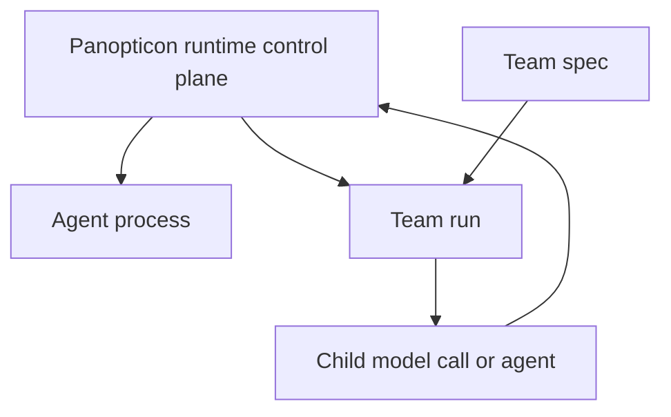

# ADR 025: Panopticon Runtime Control Plane

Status: Proposed
Date: 2026-05-30
Source: historical Panopticon runtime-consolidation report retained in git history.

## Context

`pi-panopticon` already owns the live-agent registry, peer visibility, spawning, messaging, health checks, stall detection, stop/kill behavior, and agent runtime UI. `pi-teams` owns declarative team specs and protocol execution, but it also contains runtime-adjacent behavior for child `pi --print` processes, cancellation, live-agent lookup, message routing, run status, and stop semantics.

This creates a misleading middle ground: teams look like an independent orchestration subsystem while relying on Panopticon concepts such as registered agents, scoped visibility, parent ids, and message transports.

## Decision

Adopt Panopticon as the intentional runtime control plane for agents and teams.

Panopticon owns the shared runtime substrate:

- process and child-agent spawning;
- registry and visibility;
- lifecycle stop/kill/cancellation primitives;
- health and stall detection;
- runtime event emission;
- messaging/routing substrate;
- unified runtime UX for inspect/status/stop surfaces.

Teams remain a modular Panopticon runtime module, not a merged code blob. `pi-teams` continues to own:

- team specs and model-role binding;
- navigator, council/debate, and research protocol semantics;
- team run state-machine decisions;
- protocol-specific result/detail shaping;
- approval and worktree policies that remain explicitly gated by their own ADRs.

Existing public `team_*` tools stay compatibility-first. New unified runtime names may be added later as aliases or cross-links, but no public `team_*` removal is approved by this ADR.

## Runtime entity model

Entity meanings:

- **Agent process** — a registered live pi process with health, messaging, and optional parent metadata.
- **Team spec** — a declarative configuration artifact; it is not a running entity.
- **Team run** — an orchestration instance that can own child model calls or child agents and should be inspectable/stoppable through runtime semantics.

A team must not be modeled as “just an agent.” A team run may own children that are agents or one-shot model calls.

## Adapter boundary

Panopticon should expose a narrow runtime adapter before broad refactors:

- spawn a child process/agent under a parent runtime entity;
- stop a runtime entity with explicit propagation semantics;
- inspect a runtime entity and its parent/child links;
- emit runtime events for lifecycle and status changes;
- link child entities to a parent team run.

`pi-teams` should depend on that adapter for runtime lifecycle behavior, while keeping protocol logic inside team modules.

## Guardrails

- No big-bang physical merge of team files into Panopticon internals.
- No public `team_*` command/tool removal without a separate compatibility decision.
- No promotion of quarantined approval/worktree behavior by implication.
- No durable/public observability contract change from this ADR alone.
- Architecture tests should prevent `pi-teams` from adding new raw process/lifecycle bypasses except through approved adapter files.

## Consequences

Positive:

- Users get one mental model for runtime status, stop, inspect, and parent/child lineage.
- Team protocols remain testable and modular.
- Runtime-sensitive code has one owner and one review surface.

Trade-offs:

- Initial work requires adapter design before implementation cleanup.
- Compatibility aliases must remain until migration is explicitly approved.
- Some existing team internals will stay temporarily runtime-adjacent while the adapter lands.
