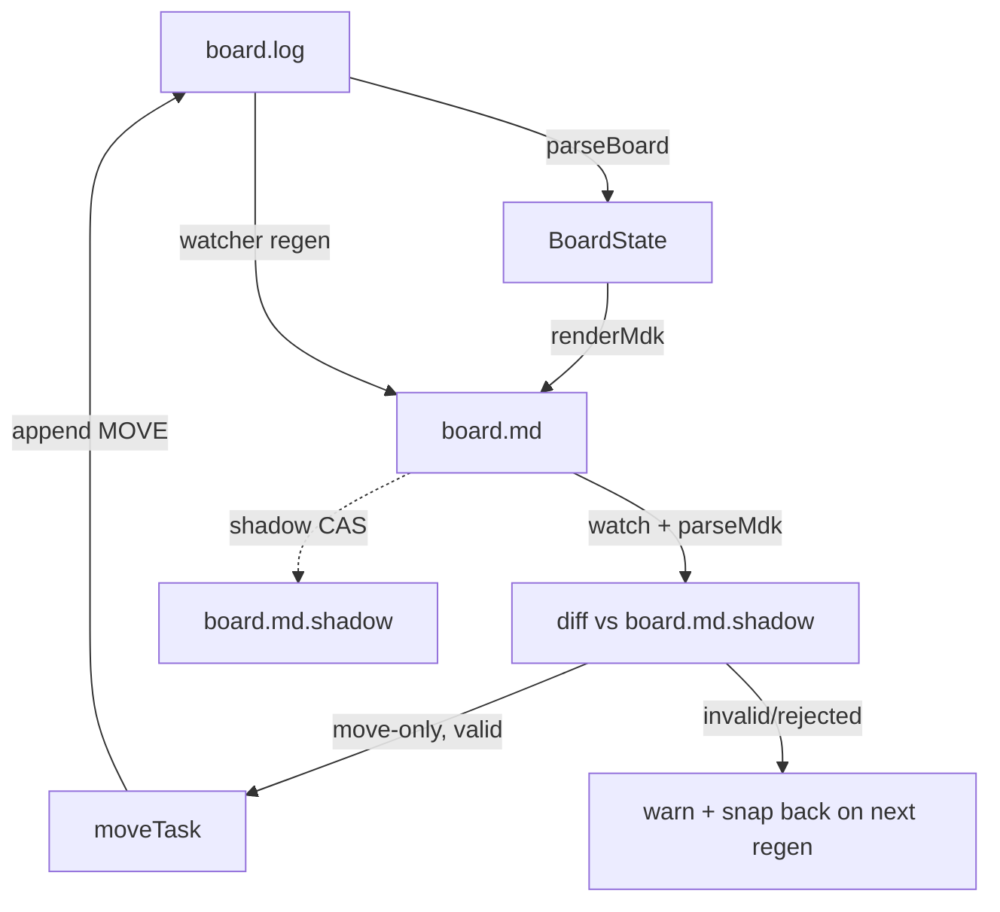

# ADR 031: Kanban Markdown Sync (board.log ⇄ board.md)

## Status

Accepted (council-reviewed, APPROVE-WITH-CHANGES)

## Context

working-notes issue #9 requests a visual drag-and-drop Kanban for the event-sourced `board.log`. GitHub Projects v2 was rejected (scoped PAT, GraphQL daemon, separate mutator). Markdown Kanban (VS Code extension `cursor.cursor-markdown-kanban`) needs no token/API/daemon: it is local markdown ⇄ UI, and we own the upstream `extensions/pi-kanban` extension, so the sync can live inside it and reuse `parseBoard`, `moveTask`, and the existing board.log watcher.

The full proposed design bidirectionally syncs a `board.md` file: regen (board.log → board.md) and ingest (board.md → board.log) through the existing validated mutators, with a `board.md.shadow` file for echo suppression.

## Council verdict

**APPROVE-WITH-CHANGES.** The architecture (route ingest through existing mutators; pure `mdk.ts` render/parse/diff) is sound, but the full design has blocking gaps. The v1 scope below is deliberately narrowed until the core loop is proven.

## Code findings grounding the decision

- `moveTask(taskId, agent, to: "backlog" | "todo")` validates the **from** column: it rejects `in-progress`/`blocked`/`done` as a source (`Cannot move task T-X from '<col>' column. Can only move from backlog or todo.`) and rejects same-column moves. Generic VS Code Kanban drags from `done`/`blocked`/`in-progress` will therefore be rejected by the existing mutator.
- `selfAppendedLines` (`board.ts`) only suppresses the watcher's **inject/external-event handling** (`watcher.ts#hasExternalEvents`); it does not gate a regen-on-board.log-change path. Regen must fire on any board.log change, including self-appended lines, or agent-side moves will not propagate to `board.md`.
- There is **no canonical `T-NNN` auto-allocator**: `kanban_create` requires the caller to supply a unique `task_id`. UI-side CREATE therefore needs a new scan-and-max+1 allocator with collision handling — deferred out of v1.
- `KANBAN_DIR` locates the board directory; workspace-specific mutable state belongs there, not under the extension source directory.

## Decision

### v1 scope (ship)

- **Regen only** for board.log → `board.md` (full board state render).
- **Move-only ingest**, restricted to transitions the existing `moveTask` intentionally supports (source `backlog`/`todo` → target `backlog`/`todo`). Drops to/`from` other columns are **rejected, not silently accepted**.
- Files live under `KANBAN_DIR`:
  - `$KANBAN_DIR/board.md`
  - `$KANBAN_DIR/board.md.shadow` (gitignored)
- New `extensions/pi-kanban/mdk.ts`: pure `renderMdk(board)` and `parseMdk(text, shadow): Diff[]`. No file watching, CAS, logging, or mutator calls inside it. Sibling to `snapshot.ts`.
- `watcher.ts`: add regen on board.log change (fires for self-appended lines too); add `board.md` watch + move-only ingest.
- Strict parsing: only known `T-NNN` IDs; ignore card body for ingest; do not parse agent identity from Markdown; use a fixed UI agent (`mdk`) for generated events; reject malformed IDs and control chars in log-bound fields.
- Failed ingest: append nothing partial, do **not** advance shadow, emit a clear warning (notify/log) so the user sees the rejection.
- Successful ingest: append via existing mutators, advance shadow to the exact ingested Markdown content, ensure regen runs afterward.

### CAS / write ordering

Two files cannot be updated atomically. Use this ordering so a crash leaves `board.md` newer than shadow (reconcilable forward):

1. Regen proceeds only if current `board.md` equals `board.md.shadow`.
2. Write rendered `board.md` via temp-file + rename.
3. Then write `board.md.shadow` to match.
4. On ingest success, write `board.md.shadow` to the exact ingested `board.md` content.

Shadow diff is the primary echo-suppression mechanism. An in-process "regen-in-progress" flag may reduce noise but must not be the correctness mechanism.

### Startup reconciliation

On startup, render current `board.log`; if rendered content equals current `board.md`, heal `board.md.shadow`. If not, treat `board.md` as dirty and either ingest (move-only) or warn. This matters because `selfAppendedLines` is in-memory and does not survive restart.

### Deferred (post-v1)

CREATE, title/priority/tag EDIT ingest, NOTE/description/agent/claimer ingest, and any extension of `moveTask` to support `in-progress`/`blocked`/`done` columns. Extending `moveTask` is a deliberate mutator change with its own tests and is not bundled into the sync feature.

## Risks (ranked)

1. **Shadow lifecycle bug** — failing to update shadow after ingest deadlocks sync.
2. **Column semantics mismatch** — generic Kanban UI produces moves the mutator rejects (mitigated: reject + warn, do not silently accept).
3. **Watcher race/order** — board.md and board.log watchers fire in surprising order (mitigated: shadow CAS + startup reconciliation).
4. **CREATE ID collision / undefined UI agent** — deferred out of v1.
5. **Markdown identity preservation** — task IDs must survive MDK round-trips (embed `T-NNN` in card text; verify against the targeted MDK dialect).
6. **Malformed Markdown / log injection** — strict parse + `escapeLogValue` for title/tags.
7. **Location/config** — files under `KANBAN_DIR`, not extension source.

## Open questions for implementation

- Exact Markdown Kanban dialect and how `T-NNN` IDs are embedded so VS Code drag/drop preserves them across column moves.
- Invalid user edits: explicit notify warning + snap-back on next regen (recommended) vs silent snap-back.
- `board.md` gitignore policy: ignore both `board.md` and `board.md.shadow`, or commit `board.md` as a rendered view and ignore only the shadow.