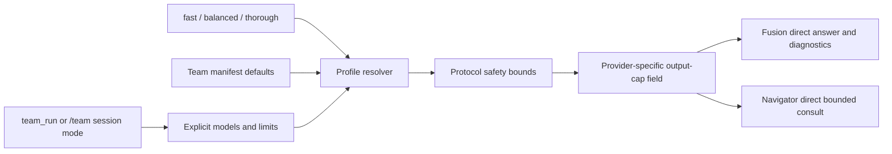

# ADR 034: Team speed profiles

- Status: Accepted
- Date: 2026-07-12

## Context

Fusion and Navigator need predictable latency/cost choices without duplicating tuning flags across tool and session-mode callers. Existing Fusion callers use `limits.maxLoops` as the panel-size override and must remain compatible.

## Decision

Add one shared `fast | balanced | thorough` team profile contract. `balanced` is the default.

Precedence is:

1. explicit `team_run` model and limit fields;
2. selected profile defaults;
3. team manifest and existing settings defaults.

Protocol safety bounds apply after resolution. In particular, Fast Navigator always has zero retries and a bounded timeout, and Fusion keeps its hard panel cap. Explicit Fusion `limits.maxLoops` remains the legacy panel-size override and takes precedence over the profile panel default.

Fast Fusion selects a bounded, provider-diverse panel where configured models permit it. Panel and judge generation/output are bounded, and the judge receives bounded panel excerpts. The judge JSON contract requires a self-contained `answer` plus all analysis fields. Deterministic session mode displays a non-empty `answer` directly; structured diagnostics remain in the run record, and invalid or empty-answer output preserves the degraded fallback instead of hiding it.

Fast Navigator uses a compact prompt, bounded output, no retries, a bounded timeout, and no automatic session history. Its deterministic result remains the Navigator's direct response. Balanced session mode retains the existing five-turn/4,000-character bounded history. Thorough allows a larger bounded history.

Profile output caps use canonical `maxTokens` internally, then map only at recognized provider payload boundaries: `maxOutputTokens` for Google GenerateContent and Cloud Code Assist, `max_output_tokens` for OpenAI Responses, and `max_tokens` for message-based OpenAI-compatible payloads. Unknown payload shapes remain unchanged.

## Consequences

- Callers get one typed latency/cost control instead of protocol-specific tuning.
- Existing Fusion `maxLoops` calls retain behavior.
- Fast mode intentionally trades context and output depth for latency.
- Deterministic Fusion callers no longer need an outer synthesis call to display the judge answer.
- Unknown provider payloads are not mutated with an unrecognized generation-cap field.
- No provider benchmark, dependency, scheduler, or new persistence surface is introduced.
