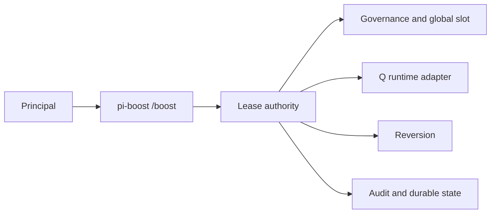
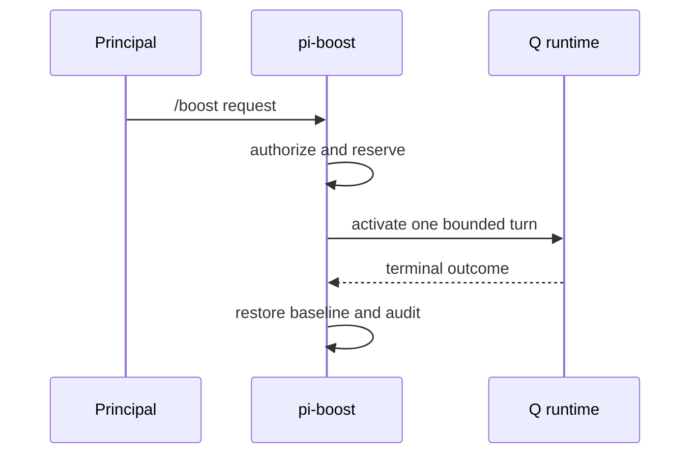

# ADR-046: Standalone pi-boost extension

## Status

Proposed

## Decision

Extract the mutable `/boost` authority from pi-panopticon into `extensions/pi-boost`. The standalone extension owns registration, Principal authorization, lease lifecycle, bounded persistence and audit, Q runtime adaptation, reversion, and shutdown. Panopticon remains an observation and swarm extension and does not register boost behavior.

## Consequences

Boost can be enabled, tested, and shut down independently. Panopticon cannot mint or mutate leases; all existing Principal authority and fail-closed reversion rules remain in the extracted domain.
