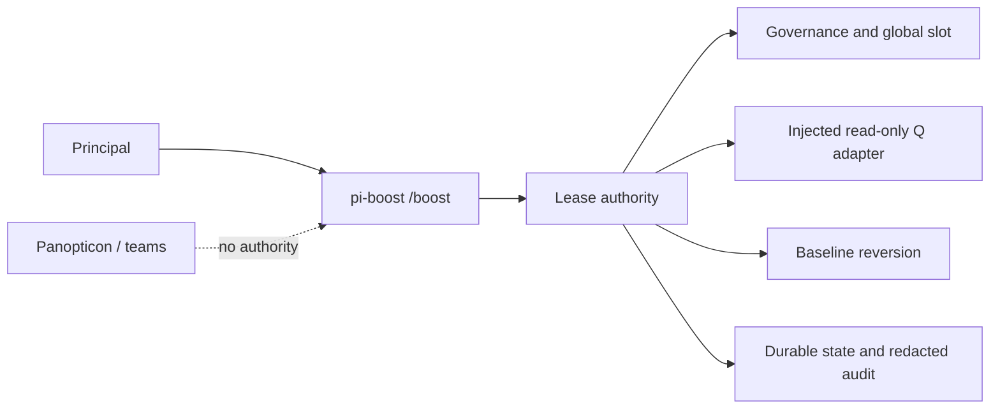

# ADR-046: Standalone pi-boost extension

## Status

Accepted — Principal-delegated decision, 2026-08-20. The LLM council was invoked twice but produced empty result artifacts; independent fallback review and repository fitness gates are retained as evidence.

## Context

ADR-045 introduced a privileged, bounded `/boost` lease under Panopticon. Boost controls model/runtime authority, durable recovery state, and Q dispatch; those responsibilities are not agent observability and are not a bounded multi-agent workflow.

## Decision

Extract Boost into `extensions/pi-boost`. This supersedes ADR-045's component placement while retaining its authority, cap, reversion, and audit invariants.

`pi-boost` exclusively owns:

- `/boost` registration and Principal authorization;
- lease caps, TTL, global slot, persistence, and redacted audit;
- host-injected Q runtime adaptation and dispatch;
- baseline reversion, recovery blocking, and shutdown cleanup.

Panopticon owns none of those capabilities. A team cannot mint or mutate a Boost lease.

Normal extension loading is fail-closed. Live behavior requires an explicitly reviewed host injection. The default identity source requires `PI_PRINCIPAL=1` and rejects sessions carrying the shared parent-agent marker. That read-only marker prevents delegated workers inheriting Principal authority; it does not create a Panopticon implementation dependency. The reviewed host copies and freezes the logical Q control reference before retaining it.

## Alternatives considered

- **Keep Boost in Panopticon:** rejected because it couples observability to privileged runtime mutation.
- **Implement Boost as a team:** rejected because teams coordinate workflows and must not own model-control authority.

## Consequences

Boost can be enabled, tested, and shut down independently. Panopticon remains an observability/orchestration extension. Live Q/provider deployment and credentials remain external injected capabilities.

## Predicted impact

- Panopticon no longer registers `/boost` or participates in lease lifecycle.
- Boost tests and package discovery move under `pi-boost`.
- Default and delegated sessions fail closed; only an authenticated root Principal with reviewed host injection can dispatch.

## Validation

- Extension registration tests assert `/boost` belongs only to `pi-boost`.
- Authority, parser, lifecycle, persistence, Q adapter, shutdown, and property tests live under `tests/boost/`.
- `npm run check`, `npm test`, and `git diff --check` must pass before delivery.
