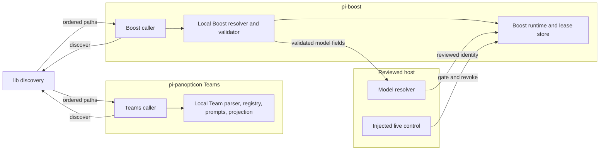
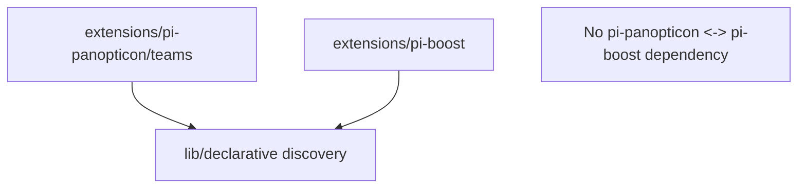

# ADR-047: Shared declarative configuration discovery

## Status

Accepted — 2026-08-21, council-reviewed T-851 correction.

## Context

Teams already has layered descriptor paths in `extensions/pi-panopticon/teams/team-paths.ts`. Only path discovery is shared: caller-supplied configuration location, root selection, lexical paths, source order, and direct Markdown enumeration. Team schema, parsing, registry, prompts, projection, and execution remain local to Teams.

Boost needs declarative input without becoming a Team, importing Panopticon, or adding `pi-boost/config.json`. Discovery is an additional gate; the reviewed injected live control remains the lease and revocation authority from ADR-045/046. This ADR does not change the normal default model.

## Decision

Add one narrow, extension-neutral `lib/` primitive. Each extension calls it and parses/validates its own files.





`lib/` imports neither extension, and extensions import neither each other. No exception is permitted.

## Neutral discovery contract

The primitive accepts: a caller-supplied `configPath`; an injected settings key path; user/project settings paths and fallback roots; `cwd`; direct relative Markdown directories and/or fixed relative targets; and optional explicit roots.

The packaged root is `dirname(configPath)`. The primitive uses only lexical `resolve` and `join`: it does not call `realpath`, canonicalize/deduplicate paths, rewrite symlinks, enforce containment, or parse file contents.

A settings key path selects a `roots` string array. Blank/non-string entries are discarded and remaining entries are trimmed. `~`/`~/...` expand from the user home; absolute paths remain lexical; relative user paths resolve from `cwd`; relative project paths resolve from the project root. Project-root search starts at `cwd`, walks upward to the first `package.json` or `.git`, and returns the original `cwd` when neither exists.

Normal root order is built-in, then user roots in settings order, then project roots in settings order. A direct directory enumeration includes only immediate `*.md` entries, never recurses, and orders them by ECMAScript lexical sort. Fixed targets are inspected only at their supplied relative path. Duplicate roots and paths are retained. Symlinks remain lexical paths and normal consumer reads follow them.

Missing roots/directories/targets yield no discovered file. Unreadable directory/file behavior is not normalized or swallowed: the primitive exposes the filesystem failure so each caller preserves its current contract. Explicit roots preserve current semantics: built-in remains first; supplied roots are appended unchanged as `user`; settings and project discovery are skipped; `roots: []` returns built-in only.

This is a path primitive, not a general configuration framework: it has no document identity, merge, schema, provider, model, authority, or runtime API.

## Exact Teams preservation

Teams passes its existing `configPath` unchanged. `dirname(DEFAULT_CONFIG_JSON)` remains its packaged root, with `agents`, `prompts`, and `teams` child directories. The injected settings key is `teams.roots`; user settings/fallback remain `PI_SETTINGS_PATH` and `~/.pi/agent/teams`; project settings/fallback remain `<project>/.pi/settings.json` and `<project>/.pi/teams`.

`teamDirectories()` retains its current builtin → user → project order, source tags, duplicate behavior, `options.roots` behavior, and lexical path results. `dirsForTeamScope()` still selects the first configured scope root; `resolveTeamResultRoot()` still selects the first user root and appends `results`.

All existing Team consumers retain their current missing/unreadable/throw behavior: `team-registry.ts` and its lexical `readMarkdownDescriptors()` use; `settings.ts` prompt/default loading; `team-projection.ts` seed/prune/force paths; `team-form.ts` and `team-form-files.ts` writable roots; and async/completion/result-artifact result paths. The extraction changes no Team parsing, warnings, source attribution, precedence, projection, or persistence behavior.

## Boost discovery, identity, and precedence

Boost passes `extensions/pi-boost/config/boost.md` as its packaged `configPath`, so its packaged root is exactly `extensions/pi-boost/config`. Its injected settings key is `boost.roots`; its fallbacks are `~/.pi/agent/boost` and `<project>/.pi/boost`. Its sole fixed relative target is `boost.md`. There is no `pi-boost/config.json` fallback.

Identity is physical and selected before parsing. In each configured root, a present `boost.md` target counts once, including a target reached through a repeated root. Missing roots and missing targets do not count. Filesystem failure while checking or reading a present target denies Boost; it must not be converted to a lower-layer fallback.

The effective-layer algorithm is:

1. Consider built-in, user, then project layers; skip layers with no present targets.
2. The highest remaining layer is effective.
3. More than one present target in that layer is ambiguous and denies.
4. Exactly one target is read and validated. A read failure, non-file target, malformed descriptor, or validation failure denies.
5. There is no lower-layer fallback after any denial. No target in any layer denies.

```mermaid
sequenceDiagram
  participant B as pi-boost
  participant D as lib discovery
  participant V as Local Boost validator
  participant H as Reviewed host
  participant L as Boost lease store

  B->>D: discover fixed boost.md
  D-->>B: paths grouped by layer
  B->>B: choose highest present layer before parse
  alt zero or multiple present targets
    B-->>L: deny; do not fall back
  else exactly one target
    B->>V: read and validate
    alt unreadable, non-file, malformed, or invalid
      V-->>L: deny; do not fall back
    else valid
      V->>H: resolve reviewed model and live control
      H-->>L: gate reservation or activation
    end
  end
```

## Exact Boost descriptor and reviewed mapping

The descriptor permits exactly these normalized fields and no others:

| Field | Required value |
|---|---|
| `schemaVersion` | integer `1` |
| `enablementId` | opaque `[A-Za-z0-9_-]{1,64}` |
| `principalIssuerId` | trimmed nonempty string of at most 256 UTF-8 bytes |
| `enabled` | boolean `true` |
| `maximumYields` | integer from `1` through `3` |
| `expiresAt` | finite timestamp strictly later than validation time |
| `revision` | nonnegative safe integer |
| `model.key` | exactly `principalBoostLease` |
| `model.provider`, `model.id` | trimmed nonempty strings of at most 128 UTF-8 bytes each |
| `model.family` | exactly `sol-ultra` |

The descriptor may not contain Team fields, credentials, endpoints, raw routing controls, or default-model mutation. The reviewed host model resolver must resolve `principalBoostLease` and return a registered identity whose provider, id, and family exactly match the descriptor. The existing baseline remains host-resolved `principalBoostBaseline` with family `glm-5.2`; the descriptor cannot select or alter it.

The validated fingerprint is SHA-256 of the UTF-8, no-whitespace JSON serialization of normalized fields in this fixed order: `schemaVersion`, `enablementId`, `principalIssuerId`, `enabled`, `maximumYields`, `expiresAt`, `revision`, then `model` with `key`, `provider`, `id`, `family`. It is recorded with the selected source and lexical path.

## Live control, lease ownership, and invalidation

Boost runtime/store owns lease state, global slot, budget, audit, recovery, and reversion. The descriptor adapter and live-control adapter only gate or revoke; neither owns or mints leases.

Discovery and injected live control are both required at reservation and immediately before every activation/reactivation, along with existing Principal, governance, slot, and budget checks. At both boundaries, the normalized descriptor `principalIssuerId` must equal the authenticated requesting Principal and lease issuer; any mismatch denies fail-closed. Effective bounds are the intersection of hard limits, live-control limits, and descriptor limits. There is no filesystem watcher. In-flight revocation remains the existing live-control responsibility.

At reservation and each activation boundary, Boost re-resolves the effective descriptor and requires the same valid fingerprint, reviewed mapping, and live control. A changed layer/fingerprint, new ambiguity, malformed higher target, mapping mismatch, or live-control denial invalidates the lease without lower-layer fallback.

For a reserved lease, invalidation cancels it, writes bounded redacted audit, and durably releases slot/budget without provider dispatch or model selection. For an active lease, mark revoking; abort provider work; await terminal acknowledgement for at most 30 seconds; restore the captured baseline; invoke an injected idempotent isolation-disposal dependency; append redacted audit; then durably release slot/budget. Timeout or any abort, acknowledgement, restoration, disposal, audit, or release failure enters durable `RevertFailed`, blocks all model dispatch for that subject, and requires the existing Principal reset. The sequence is idempotent and never replays a prompt.

## Atomic removal of Teams-shaped compatibility

In one compatibility-breaking cutover, remove `EXTERNAL_BOOST_TEAM_ID`, `teamId`, protocol discriminator compatibility, Team-shaped control record/reference names, and all Team-manifest interpretation. Update together the control contract/adapter, reviewed-host identity/hash, reviewed and production host construction, injected bridge/runtime/finalizer, tests, and documentation. There is no dual reader, alias, migration shim, or fallback; no WAL redesign is required.

At startup, fence new reservations. Recover and drain every nonterminal lease using existing shutdown recovery: cancel/finalize reserved leases and revoke/finalize active leases. Enable new reservations only after each recovered lease is terminal or durably `RevertFailed`. An old host/control source stays unavailable and fail-closed.

## Alternatives considered

- **Boost as a Team or a Team descriptor:** rejected; Teams cannot own privileged model control.
- **Cross-extension imports or a `lib/` extension dependency:** rejected; violates independent loading and testing.
- **Duplicate Boost discovery or `pi-boost/config.json`:** rejected; creates drift and a second fallback path.
- **Raw descriptor routing or Team-identity compatibility:** rejected; bypasses reviewed authority or weakens the semantic boundary.

## Consequences

- Teams retain exact observable path and consumer behavior while sharing only lexical discovery mechanics.
- Boost has deterministic fixed-target layering and fails closed on ambiguity or a bad higher layer.
- Host mappings remain the sole provider/model authority; live control remains the lease/revocation authority.
- Cutover can temporarily deny Boost, intentionally favoring safe recovery over compatibility.

## Fitness tests and acceptance evidence

Implementation must add/retain executable tests without exemptions:

1. Architecture tests: `lib/` imports neither extension; extensions do not import each other; shared exports have no domain schema/policy.
2. Discovery property tests with recorded seeds: caller `configPath`; injected keys; path expansion; lexical join/resolve; no realpath/dedupe/rewrite; project markers; root order; direct lexical `.md` enumeration; symlinks; duplicates; missing roots/targets; unreadable/throw propagation; and explicit roots including `[]`.
3. Team characterization: every preservation rule and consumer above, including registry source/override/warnings, settings output, projection seed/prune/force, writable forms, and result paths.
4. Boost precedence tests: each layer, missing root/target, repeated roots, duplicate effective targets, unreadable/non-file target, valid lower plus malformed/unreadable higher, valid higher replacement, and no fallback/no provider call/no model selection/no lease activation on denial.
5. Descriptor tests: every required field/type/boundary, unknown/Team fields, normalization, exact fingerprint bytes/order/hash, and provider/id/family/key matching against registered reviewed host resolution; verify baseline remains `principalBoostBaseline`/`glm-5.2`.
6. Composition tests: descriptor and live control are independently insufficient; reservation/activation require both plus existing checks; descriptor `principalIssuerId` must equal the authenticated Principal/lease issuer at both boundaries, with mismatch causing no provider call, model selection, or lease activation; bounds only narrow; default model is unchanged.
7. Cutover tests: no Team-shaped value or dual reader is accepted; reservations fence at startup; recovered reserved/active leases finalize before enablement; `RevertFailed` remains blocked; WAL format is unchanged.
8. Rollback tests: reserved and active invalidation at reservation/activation boundaries; 30-second terminal-ack timeout; idempotent isolation disposal; and every rollback-stage failure produces durable `RevertFailed` and all-dispatch blocking.
9. Run `npm run check`, `npm test`, and `git diff --check`.

## Rollback

This ADR changes no production code. A failed rollout disables Boost and denies new requests; it must not restore a bespoke file, Team identity, dual reader, arbitrary routing, or extension dependency.

If the Team extraction regresses, restore the local Team path helper with the characterized behavior and repair the neutral primitive. After Boost cutover, keep the Boost-only contract: fence reservations, cancel/finalize reserved leases, revoke/finalize active leases, preserve `RevertFailed`, then disable the new consumer if necessary. Never downgrade an active lease to the removed Team-shaped representation.

## Predicted impact

- **Expected fixes:** preserves Teams exactly; makes Boost selection pre-parse and deterministic; prevents unreviewed model routing; and makes recovery/cutover safe.
- **At-risk regressions:** extraction can alter a Team consumer; strict higher-layer denial can reject a former request; cutover can temporarily deny Boost. Characterization, properties, fencing, and fail-closed recovery bound these risks.
- **Non-goals:** no provider discovery, Team protocol change, lease-limit relaxation, live-control replacement, default-model mutation, or general configuration framework.

## Related

- ADR-045: Principal-approved `/boost` frontier-model lease
- ADR-046: Standalone `pi-boost` extension
- `extensions/pi-panopticon/teams/team-paths.ts`
- `extensions/pi-panopticon/teams/team-registry.ts`
- `extensions/pi-boost/`
- `lib/`
- `TODO.md`
