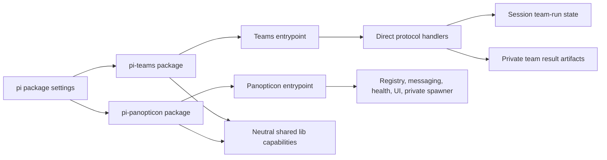

# ADR-048: Standalone pi-teams public ownership boundary

## Status

Accepted — 2026-08-21, milestone 3 extraction follow-up.

## Context

Teams and swarm compatibility were previously registered from the
`pi-panopticon` extension even though their protocol execution, manifests,
configuration, skills, run state, result artifacts, and user-facing tools form
a separate capability. That coupling made the ownership boundary unclear and
prevented Teams from being installed without the Panopticon extension.

Milestone 2 moved the implementation to `extensions/pi-teams` while preserving
the direct protocol handler registry, existing tool/command names, session event
formats, and bounded subprocess behavior. The package and setup surfaces now
need to describe and enable that ownership explicitly.

## Decision

`pi-teams` is an independently installable pi extension. Its public package
entrypoint owns registration of:

- `team_*` tools and `/team` and `/teams` commands;
- `runtime_status` and `runtime_stop` for team-run entities;
- `swarm_*` compatibility tools and `/swarm`;
- the Teams session lifecycle hooks, team state rehydration, and provider payload hook.

`pi-teams` also owns its bundled team manifests, prompts, consultation skill,
protocol handlers, team-run state, result claim-check artifacts, and the small
pi-binary resolver used by its one-shot runner.

`pi-panopticon` owns only its agent registry, messaging, health/reconciliation,
UI, and private RPC spawner. It does not import or register Teams or swarm
modules. Its spawner's binary resolver is private to that extension; Teams does
not depend on the spawner.

Both extensions may use neutral shared `lib/` capabilities. Neither extension
imports the other's private implementation modules. Installing `pi-teams`
does not require installing `pi-panopticon`.

## Public boundary

The stable boundary is the package manifest and registered runtime surface,
not deep implementation paths. The following remain compatibility surfaces:

| Surface | Owner |
| --- | --- |
| `team_*`, `runtime_*`, `swarm_*` tools | `pi-teams` |
| `/team`, `/teams`, `/swarm` | `pi-teams` |
| `pi-teams:run` session custom events | `pi-teams` |
| Agent registry, peer messaging, spawning, and agent UI | `pi-panopticon` |
| Shared process, transport, persistence, and runtime helpers | `lib/` |

## Installation and setup

`pi-teams` is listed as a user-installable package by
`scripts/pi-package-settings.py`. `make setup-package PACKAGE=pi-teams` and
`scripts/setup-pi pi-teams` register its package source; the corresponding
clean commands remove only that package registration. The default repository
setup continues to enable `pi-panopticon` and `pi-goal`, while Teams remains an
explicit standalone package choice.

## Non-goals

This boundary change does not introduce a protocol SPI, generic DAG/workflow
engine, Boost integration, TTL policy, or changes to direct `TEAM_HANDLERS`
behavior. It does not alter team protocol semantics, persisted event schemas,
result permissions, or Panopticon agent lifecycle behavior.

## Consequences

- Teams can be installed, tested, and loaded without Panopticon.
- Panopticon's package and private spawner surface are smaller and clearer.
- Existing Teams and swarm compatibility names remain available when
  `pi-teams` is enabled.
- Shared-library imports remain neutral and architecture tests enforce the
  absence of cross-extension private imports.

## Validation

- `npx vitest run tests/architecture tests/shared/extension-registration.test.ts`
- `git diff --check`
