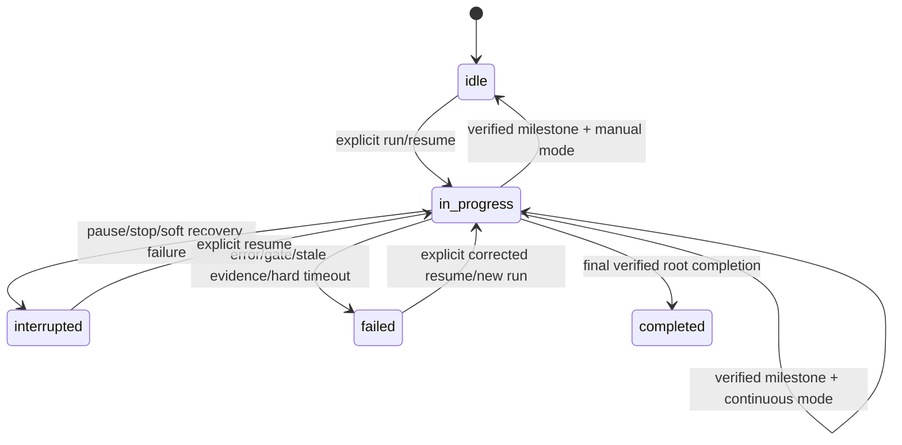

# ADR-049: pi-goal continuous execution and bounded liveness

## Status

Accepted — 2026-08-21 by Principal direction after root/peer design agreement. No council run required.

## Context

`pi-goal` currently advances a verified milestone with `runActive: false` and requires another `/goal run`. This makes a bounded multi-milestone goal repeatedly wait for manual continuation even when the operator explicitly requested completion-oriented execution. The current `status` plus `runActive` shape also permits ambiguous projections, evidence is not correlated to a run and milestone revision, `/goal resume` does not reliably resume work, and a lost continuation can leave a goal active without visible liveness recovery.

The extension must improve continuity without weakening its trust boundary: the model must never approve its own plan, execute a model-supplied gate, bypass milestone verification, reuse stale evidence, or auto-complete the final goal.

## Decision

### Execution modes

Persist `runMode: "manual" | "continuous"`; legacy state migrates to `manual`. `/goal <objective> --continuous` and `/goal <objective> --until-complete` explicitly select continuous mode and start the bounded run. Existing commands remain manual by default.

After a passing, current verification and root-owned `goal_complete`, continuous mode advances a non-final milestone with execution still active. The existing in-process continuation path queues the next turn. Manual mode continues to pause between milestones.

### Correlated evidence

Persist a `runId` and monotonic `milestoneRevision`. Verification records include both values. Replanning, objective editing, milestone transition, or a new bounded run invalidates stale evidence. `goal_complete` accepts only a passing record matching the current goal, run, milestone index, and revision.

### Execution state and controls

Expose normalized execution state: `idle | in_progress | interrupted | failed | completed`. Compatibility projections may retain legacy fields during migration, but one reducer owns their mapping.

`/goal steer <text>` supplies explicitly untrusted current-run guidance without changing the objective or invalidating the approved plan. `/goal resume` starts or continues eligible paused/interrupted work; it does not merely flip a label. Pause, stop, interruption, provider/agent error, failed verification, completion-gate failure, exhausted budget, stale evidence, or hard liveness timeout halt continuation.

### Lifecycle visibility

Persist bounded lifecycle events for run started, milestone/plan updated, progress, interruption, failure, and completion. Status projections show the current milestone checklist, turn budget/usage, and bounded changed-file/evidence summaries. Objective, source-file content, and steering context remain explicitly labeled untrusted.

### Bounded liveness

Persist `lastProgressAt`, a liveness epoch, and one-shot warning/nudge disposition. Meaningful state transitions update progress; polling alone does not.

Start one unref'd in-process watchdog only after `session_start`, and clear it on `session_shutdown`. Operator environment may configure soft/hard thresholds within safe documented caps; callers cannot choose cadence through tools or goal text.

At the soft threshold, emit one status warning. If no agent turn or queued continuation is active, queue at most one continuation nudge for the current epoch. Never inject into an active turn. At the hard threshold, pause with a bounded actionable error. Restart reconstructs deadlines from persisted timestamps. No CoAS schedule, external poller, or automatic completion is introduced.

## Trust and safety invariants

- Continuous mode never calls `goal_complete` automatically.
- Plan approval, `goal_verify`, the root completion audit, and `PI_GOAL_GATE_COMMAND` remain mandatory where configured.
- Public deprecated gate inputs remain ignored.
- A nudge is correlated to the current run and liveness epoch and is delivered at most once.
- Timers are session-scoped, unref'd, capped, restart-safe, and cleaned up on shutdown.
- Additional context is data, never shell or code.

## Migration

The parser accepts existing v1/v2 state and deterministically supplies manual mode, a normalized execution projection, current timestamps, and a fresh correlation revision without treating old verification as current. Persisted projections remain derived from authoritative `goal.json`.

## Required evidence

- Continuous start and automatic cross-milestone continuation.
- Manual default and manual milestone pause.
- Run/milestone-revision stale-evidence rejection after edit, replan, transition, and restart.
- Pause, stop, steer, real resume, error, verification/gate failure, and budget exhaustion.
- Structured lifecycle/status projections with bounded summaries and trust labels.
- Fake-timer tests for soft warning, one-shot idle nudge, active-turn non-interference, hard pause, restart reconstruction, and shutdown cleanup.
- State migration/projection authority tests.
- `npm run check` and `npm test`.

## Consequences

- Explicit continuous goals can progress without repeated `/goal run` commands.
- Manual execution remains the safe default.
- State and tests become more complex because run correlation, migration, and liveness are explicit.
- Background work remains local, bounded, session-scoped, and observable rather than becoming a scheduler.

## Predicted Impact

- **Expected fixes:** removes manual cross-milestone stalls, rejects stale completion evidence, makes resume/steer semantics explicit, and recovers visibly from lost continuations.
- **At-risk regressions:** migration can misclassify legacy state, continuation can duplicate turns, or a watchdog can interrupt active work. Correlation tokens, one-shot epochs, active-turn checks, fake-timer tests, and fail-closed pauses mitigate these risks.

## Non-goals

- No automatic final completion.
- No approval, verification, audit, or gate bypass.
- No persistent CoAS schedule or external daemon.
- No fixed two-minute cadence.
- No Teams, Boost, TTL, or T-850 work.
