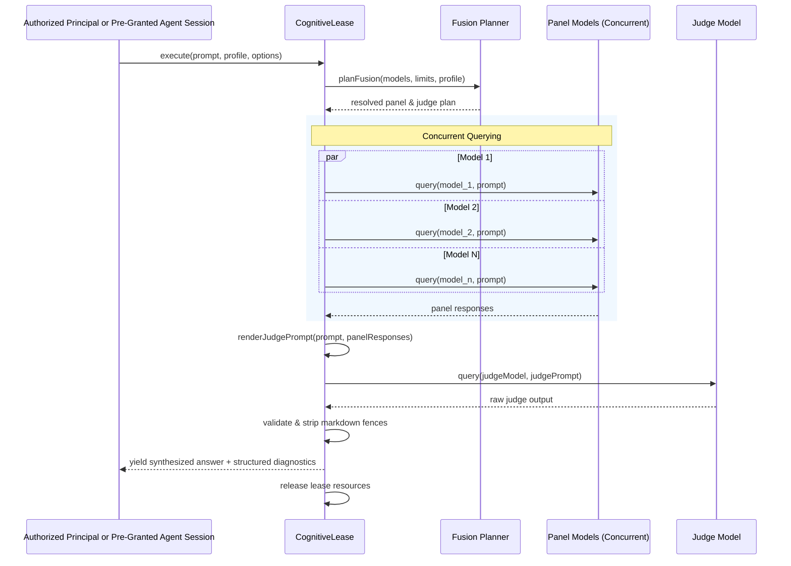

# ADR-050: Unified Environmental and Cognitive Boost Lease and Yield Lifecycle

## Status

Accepted — 2026-08-21, Principal-delegated decision and architecture alignment.

## Context

ADR-045 and ADR-046 established `pi-boost` as a standalone extension for Principal-approved, bounded frontier-model leases (Environmental Boosts). An Environmental Boost escalates runtime capabilities (e.g. Sol Ultra model access) for up to three human yields, ensuring strict baseline reversion, governance classification, and WAL-backed recovery without mutating default configurations.

Concurrently, multi-model deliberation (Fusion) was previously maintained as a direct protocol (`fusion-analysis`) within `pi-teams`. However, multi-model deliberation is inherently stateless and prompt-scoped: a panel of models is queried concurrently, their responses are synthesized by a judge model, and a single comprehensive answer is yielded to the caller. This deliberation does not represent an ongoing multi-agent collaborative workflow (such as `debate`, `consult`, `research`, or `hierarchical-swarm`). Instead, it is an inline cognitive capability escalation.

Coupling Fusion to `pi-teams` created unnecessary complexity in team state management, while `pi-boost` lacked a multi-model cognitive boost counterpart to its single-model environmental boost.

## Decision

Unify Environmental Boosts and Cognitive Boosts under `pi-boost` using a shared Lease/Yield paradigm.

```mermaid
flowchart TD
  subgraph pi-boost["pi-boost Extension"]
    Command["/boost Command & Tools"] --> Dispatcher{Boost Mode}

    subgraph EnvBoost["Environmental Boost (ADR-045/046)"]
      Authority[BoostLeaseAuthority] --> SolUltra[Sol Ultra Frontier Lease]
      SolUltra --> Turns[Multi-Turn Yields (1..3)]
      Turns --> BaselineRevert[Baseline Model Reversion]
    end

    subgraph CogBoost["Cognitive Boost (ADR-050)"]
      CogLease[CognitiveLease Pipeline] --> Planner[Panel Selection & Planning]
      Planner --> ParallelQuery[Concurrent Panel Execution]
      ParallelQuery --> JudgeSynth[Judge Synthesis & Validation]
      JudgeSynth --> SingleYield[Single Turn Yield & Instant Release]
    end

    Dispatcher -->|"/boost [options] <prompt>"| EnvBoost
    Dispatcher -->|"/boost fusion" or "boost_fusion"| CogBoost
  end
```

### 1. Unified Abstract Lease and Yield Model

Both boost types adhere to the Lease/Yield lifecycle:
- **Acquire/Reserve**: Allocate privileged resources under bounded policy and approval gates.
- **Execute**: Execute the bounded query with token, timeout, and cancellation guards.
- **Yield**: Emit the terminal human/agent outcome.
- **Release/Revert**: Automatically clean up and return the runtime to baseline state.

#### Configuration Precedence and Agent Capability Policy
- **Standard Pi Settings Precedence**:
  - Global configuration: `~/.pi/agent/settings.json` under the namespaced `"boost"` key.
  - Project configuration: `<project>/.pi/settings.json` under `"boost"`.
  - Project configuration is loaded and merged **only if `ctx.isProjectTrusted()`** returns true. If untrusted, project overrides are ignored and global defaults apply.
- **Operator/Principal-Controlled Opt-In Policy (Default Deny)**: Agent access to `/boost` and `boost_fusion` is disabled by default (`boost.agentSelfBoost.enabled = false`). It is enabled strictly through the operator-authored `settings.json` config boundary.
- **Self-Initiation Without Per-Call Prompting**: When pre-granted in configuration, agents may autonomously self-initiate `/boost` and `boost_fusion` for their current task without requiring per-invocation human interactive approval.
- **Fixed Caps and No Self-Escalation**: The pre-granted policy strictly fixes all caps (maximum yields, panel model bounds, token budgets, timeouts); authorization and caps are **never** sourced from tool arguments, objective text, or mutable agent names. Callers cannot grant, expand, or reconfigure authority. Leased subjects cannot mint sub-leases.
- **Audit and Isolation**: All activations are logged to the redacted audit sink, and resources are deterministically released upon yield.
- **SettingsList TUI Overlay**:
  - `/boost settings` (or `/boost` without args in interactive TUI mode) opens a `SettingsList` overlay displaying effective configuration, inheritance/override provenance (`[default]`, `[global]`, `[project]`), and allows saving updates to the selected standard scope (`global` or `project`).

| Dimension | Environmental Boost | Cognitive Boost (`CognitiveLease`) |
|---|---|---|
| **Escalation Type** | Single frontier model (e.g., Sol Ultra) | Multi-model heterogeneous panel + Judge |
| **Duration / Yields** | Up to 3 human conversational turns | Exactly 1 turn (inline query synthesis) |
| **Execution** | Sequential multi-turn session lease | Concurrent panel querying (`Promise.all`) + Judge |
| **Reversion Target** | Host-injected baseline model (`glm-5.2`) | Immediate ephemeral lease release |
| **Invocation Surface** | `/boost [options] <prompt>` | `/boost fusion <prompt>` & `boost_fusion` tool |
| **Authorization** | Principal or Policy-Enabled Agent | Principal or Policy-Enabled Agent (Operator pre-granted capability policy, default deny, self-initiate without per-call approval, fixed caps, no self-escalation) |

### 2. CognitiveLease Execution Architecture

`CognitiveLease` manages the end-to-end multi-model deliberation pipeline:



1. **Panel Selection & Planning**:
   - Profiles: `fast` (2 panel models, prefers provider diversity, strict token bounds), `balanced` (3 panel models, standard bounds), `thorough` (3 panel models, expanded token bounds).
   - Filters candidate models against visible text models and provider allow/deny policies.
   - Enforces a hard panel cap of 4 models and call-count approval gates.
2. **Concurrent Execution**:
   - Queries all selected panel models in parallel using `Promise.all`.
   - Propagates cancellation signals (`AbortSignal`) and per-node timeouts.
   - Restricts panel models to independent, concise reasoning without tool access or cross-panel contamination.
3. **Judge Synthesis & Validation**:
   - Synthesizes panel responses into a bounded judge prompt with semantic boundary truncation.
   - Directs the judge model to compare panel insights and produce a single self-contained `answer` alongside structured diagnostics (`consensus`, `contradictions`, `partialCoverage`, `uniqueInsights`, `blindSpots`, `confidence`, `missingEvidence`).
   - Parses output with markdown code fence stripping and strict JSON validation.
4. **Degraded & Resilient Fallback**:
   - If all panel queries fail, fails cleanly with `all_panels_failed`.
   - If the judge produces invalid JSON or fails, produces a valid degraded fallback payload containing raw panel excerpts and diagnostic notes rather than throwing.

### 3. Exposed Interfaces in `pi-boost`

#### Slash Command: `/boost fusion`
- Syntax: `/boost fusion [--profile fast|balanced|thorough] [-n 1..4] [--] <prompt>`
- Accessible to Principal sessions and agent sessions pre-granted by trusted operator policy; agent options are fixed by effective settings.
- Outputs the judge's synthesized `answer` directly to the user along with a concise status banner.

#### Tool: `boost_fusion`
- Tool Name: `boost_fusion`
- Description: "Perform multi-model cognitive boost deliberation (Fusion analysis) on a prompt, querying parallel panel models and synthesizing a consensus answer with structured diagnostics."
- Authorization: Governed by trusted capability policy (Principal session or pre-granted agent capability policy; default deny; no model-selected authority; no self-escalation).
- Parameters:
  - `prompt` (string, required): Problem statement or query to analyze.
  - `profile` (optional enum `"fast"` | `"balanced"` | `"thorough"`): Speed/depth trade-off.
  - `models` (optional string array): Principal-only panel override; agents use the operator-configured fixed list.
  - `judge` (optional string): Principal-only judge override; agents use the operator-configured fixed judge.
  - `panelSize` (optional integer 1..4): Principal-only call override; agent panel size is fixed/capped by policy.
  - `timeoutMs` (optional bounded integer): Principal-only timeout override; agents use the configured fixed timeout.
- Output: Returns `ok(resultText, details)` containing the direct `answer` in text and full structured diagnostic fields in `details`.

## Consequences

- Multi-model deliberation (Fusion) is completely unified under `pi-boost`, enabling both tool-based and slash-command cognitive escalation.
- `pi-teams` is relieved of prompt-scoped fusion analysis and can focus exclusively on multi-turn, stateful agent team workflows.
- Cognitive lease execution leaves no panel state or sticky model configurations; it appends one private redacted outcome record with no prompt or model identity.
- Both environmental and cognitive escalations follow uniform lifecycle, bounding, and safety patterns.

## Validation

- Comprehensive unit and integration tests covering:
  - `CognitiveLease` parallel execution, timeout handling, and cancellation propagation.
  - Fusion planner model selection, provider diversity, and approval gating.
  - Judge prompt bounding, markdown code fence stripping, JSON schema validation, and degraded fallback generation.
  - `boost_fusion` tool registration, execution, and structured result payload.
  - `/boost fusion` command parsing, options validation (`--profile`, `-n`, `--`), and execution.
- Verification that `npm run check` and `npm test` pass cleanly.

## Related

- ADR-045: Principal-approved `/boost` frontier-model lease
- ADR-046: Standalone `pi-boost` extension
- ADR-047: Shared declarative configuration discovery
- ADR-048: Standalone `pi-teams` public ownership boundary
