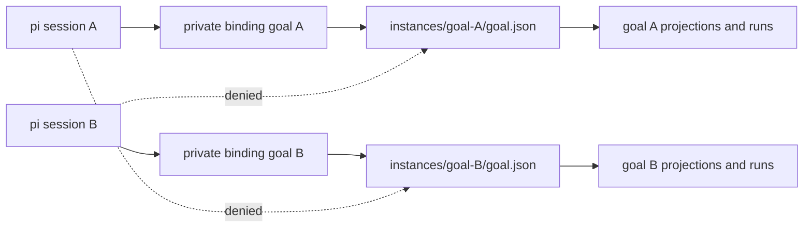

# ADR-051: pi-goal session-lineage isolation

## Status

Accepted — 2026-08-21 by Principal reprioritization. Root review required before merge.

## Context

`pi-goal` currently stores one authoritative `.pi/goal/goal.json` per workspace. Two pi sessions or agents using the same working directory therefore read and overwrite the same objective, plan, run correlation, watchdog state, projections, and completion evidence. Agent display names cannot safely own goals because they are mutable and may be reused.

ADR-049 added run correlation and continuous execution, but run IDs do not solve workspace-level state selection. Goal ownership must be resolved before any command, tool, lifecycle hook, watchdog, or projection reads state.

## Decision

Each goal is an independently stored **goal instance** under:

```text
.pi/goal/instances/<goalId>/
  goal.json
  GOAL.md
  TODO.md
  SPEC.md
  PLAN.md
  STATUS.md
  runs/...
```

A pi session binds to a goal through a private `pi-goal:binding` custom session entry containing the `goalId` or an explicit unbound marker. The latest binding on the active session branch is authoritative. Custom entries do not enter LLM context.

The binding represents a **session lineage**, not an agent name:

- creating a goal appends a binding in the current session;
- pi-goal replacement sessions created for bounded continuation receive the same binding during `newSession({ setup })` before any prompt is sent;
- resumed sessions recover their binding from session entries;
- forks inherit a binding only when the selected branch contains it;
- unrelated sessions in the same cwd remain unbound and cannot see, mutate, verify, complete, clear, steer, or watchdog another session lineage's goal.



## Runtime boundary

All pi-goal persistence APIs receive an explicit goal instance reference after resolving the current session binding. No production path falls back to "the only goal in the workspace" after migration. UI status and watchdogs are scoped to the bound instance.

`/goal clear` removes only the bound instance and appends an unbound marker. It does not remove sibling instances. A replacement-session continuation binds the target session before `sendUserMessage`; cancellation leaves no cross-session mutation.

The stable authorization key is the unguessable goal ID plus the private session binding. `goalId`, `runId`, and `milestoneRevision` correlation from ADR-049 remains mandatory.

## Legacy migration

A bounded, lock-protected migration handles the flat `.pi/goal/goal.json` layout:

1. The first bound-capable session that finds legacy state acquires the legacy migration lock.
2. It validates the legacy goal, creates `instances/<goalId>/`, moves/copies only known pi-goal state/projection/run paths, rewrites derived paths, and appends the session binding.
3. Migration records a durable marker before removing legacy authority.
4. Concurrent sessions re-read after the lock; they never duplicate or implicitly claim the migrated goal.
5. Symlinks or paths outside `.pi/goal` fail closed.

Legacy migration must preserve goal evidence and run history. Unknown files remain untouched and are reported; they are not recursively moved or deleted.

## Trust and safety invariants

- Agent names, model text, objective text, and tool parameters cannot select another goal ID.
- Tools and commands resolve binding from the host session context, not caller input.
- Goal instance paths validate IDs and remain confined under `.pi/goal/instances` without following symlink components.
- File mutation and migration use existing locks/atomic persistence helpers.
- Final completion remains root/session-lineage owned; no automatic completion is introduced.
- No CoAS schedule, external daemon, Teams, Boost, or T-850 behavior changes.

## Required evidence

- Two in-memory/session fixtures sharing one cwd create and mutate independent goals.
- `goal_get`, plan, verify, complete, steer, pause/resume, watchdog, and clear affect only the bound instance.
- Replacement session inherits the same binding before continuation.
- An unbound session cannot discover sibling goal IDs through normal tool/command output.
- Fork/resume binding reconstruction follows session branch entries.
- Legacy migration is atomic/idempotent and concurrent-claim safe.
- Clear preserves sibling instances and unknown legacy files.
- Path traversal, malformed IDs, and symlinked instance roots fail closed.
- ADR-049 continuous/manual, gate, correlation, liveness, and restart tests remain green.
- `npm run check` and `npm test` pass.

## Consequences

- Multiple agents may safely use independent goals in the same workspace.
- Persistence APIs become explicitly instance-scoped and tests require session binding fixtures.
- Existing flat state migrates once; operators can inspect distinct goal instance directories.
- Workspace-global convenience is intentionally removed because implicit selection is unsafe under concurrency.

## Predicted Impact

- **Expected fixes:** prevents cross-agent goal clobbering, evidence mix-ups, watchdog interference, and clearing another session's goal.
- **At-risk regressions:** legacy migration loss, replacement sessions becoming unbound, stale binding entries, and path-selection mistakes. Locking, explicit bindings, confinement checks, and two-session regression suites mitigate these risks.

## Non-goals

- No agent-name ownership.
- No shared multi-writer goal collaboration in this slice.
- No cross-workspace goal registry or network service.
- No changes to Teams, Boost, schedules, or T-850 properties.
