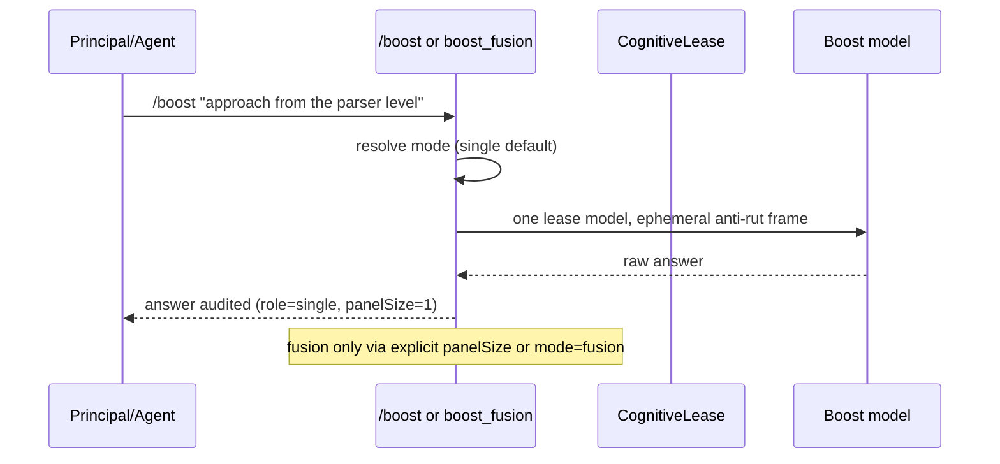

# ADR-052: Boost defaults to a single model with no judge

## Status

Accepted — Principal direction, 2026-08-31. Refines ADR-050; does not alter ADR-045 environmental lease invariants.

## Context

ADR-045 and the original approved brief define `/boost` as a rut-breaker primitive: a turn-bounded lease to exactly one frontier model with automatic baseline reversion. The operator's approved brief specifies a single frontier flip (Baseline → Frontier → Baseline), explicitly "one model to flip, no judge".

ADR-050 coupled cognitive fusion (panel + judge synthesis) to `/boost fusion` while keeping environmental single-model leasing on `/boost [options] <prompt>`. In practice the environmental lease is bridge-gated (T-843/T-844 remain blocked pending reviewed host injection), so the only live boost surface defaulted to the fusion panel: multiple concurrent panel models plus a judge synthesis. That made the default `/boost`/`boost_fusion` experience multi-model deliberation rather than the approved single-model rut-breaker, and it masked the environmental-lease unavailability.

## Decision

`pi-boost` cognitive leases default to **single-model, no-judge** execution.

- A new `boost.mode` setting (`"single" | "fusion"`) defaults to `"single"`. `fusion` restores the ADR-050 panel+judge protocol.
- In single mode, the cognitive lease plans exactly one panel model (`maxPanelModels: 1`), dispatches one query with an ephemeral anti-rut framing prompt, and returns the raw model output. No judge model is queried and no `analysis` is produced, regardless of `judge` settings; judge configuration is ignored in single mode.
- Explicit panel intent opts into fusion per call: `/boost fusion -n <1-4>` or the `panelSize` tool parameter (Principal). Operators may flip the persistent default with `boost.mode: "fusion"`.
- Single leases remain bounded: `maxPanelModels` is forced to 1 regardless of `panelSize`/`maxPanelModels` settings, governance/provider/visibility filtering still composes, audit records still append with `panelSize: 1` and outcome `completed|degraded|failed`.
- The ADR-045 environmental lease (baseline capture, yields, reversion, RevertFailed semantics) is unchanged; single cognitive mode is the prompt-scoped stopgap while the live bridge remains unavailable, and it does not switch the session model.

## Consequences

- `/boost <prompt>`-shaped usage that reaches the cognitive path now costs one model call instead of panel+judge, matching the approved rut-breaker economics.
- The `boost_fusion` tool description now advertises the single-model default; panel synthesis requires explicit opt-in.
- Multi-model fusion remains available and unchanged under explicit fusion selection (ADR-050 retained for that path).
- Judge/panel caps (`agentSelfBoost.maxPanelModels`) are irrelevant in single mode and remain enforced in fusion mode.
