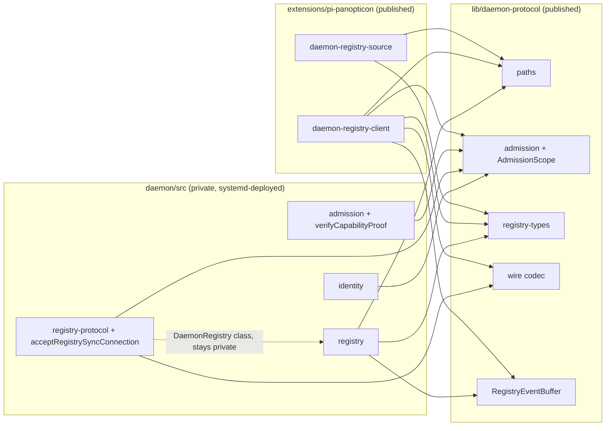

# ADR-053: Daemon protocol extraction into lib/daemon-protocol

## Status

Retired — Jim requested removal of the daemon, its client and protocol, with no
compatibility mode. The design below is historical, not current implementation
guidance. Panopticon now uses only its file-backed registry and Maildir transport.

Originally accepted on 2026-09-01; implemented T-876 Decision A.

## Context

`extensions/pi-panopticon` production code imports the private daemon implementation directly:

```text
daemon-client/daemon-registry-client.ts:
  import { capabilityProof } from "../../../daemon/src/admission.js"
  import { ... } from "../../../daemon/src/registry-protocol.js"
  import { ... } from "../../../daemon/src/registry.js"
registry/daemon-registry-source.ts:
  import type { RegistryEntry } from "../../../daemon/src/registry.js"
  import { socketPath, daemonRoots } from "../../../daemon/src/paths.js"
```

The root `package.json` `files` whitelist (`extensions`, `lib`, `skills`, `prompts`, `README.md`, `LICENSE`) excludes `daemon/`, so a published npm tarball ships pi-panopticon code whose imports resolve to nothing. Per-extension installs (`make setup-package`) have the same problem.

The daemon is the ADR-0018 control plane — single-instance, unix-socket, admission proofs, durable queue — deployed via systemd from a source checkout; `daemon/package.json` is `"private": true`.

Rejected alternatives:

- **(a) Add `daemon/` to `files`** — ships ~22 private operational files (identity, keys, audit, queue, serve, socket, breaker, cron, admin, durable-fs) into a consumer package: attack surface, bloat, and a false dual-distribution channel for a systemd-deployed service.
- **(c) Publish the daemon as its own package** — over-engineering for a process (not an API), blocked by `"private": true`, and semver coordination for five shared symbols violates KISS/YAGNI.

## Decision

Extract **only the shared client-facing protocol surface** into `lib/daemon-protocol/` (`lib/` already ships in `files`; both root-package and per-extension installs resolve it):

| Module in `lib/daemon-protocol/` | Contents | Source |
|---|---|---|
| `paths.ts` | `DaemonRoots`, `daemonRoots()`, `socketPath()` | `daemon/src/paths.ts` (internal helpers like `assertSafeId` stay private) |
| `admission.ts` | `capabilityProof()` (pure HMAC-SHA256), `AdmissionScope` type | `daemon/src/admission.ts` + `daemon/src/identity.ts` |
| `registry-types.ts` | `RegistryEntry`, `RegistryEvent`, `RegistryEventKind`, `RegistrySnapshot`, `InvalidationReason` | `daemon/src/registry.ts` |
| `registry-protocol.ts` | `encodeWireMessage`, `parseWireMessage`, `RegistrySyncRequest`, `RegistrySyncResponse`, `RegistryWireMessage`, `RegistrySyncConnection` | `daemon/src/registry-protocol.ts` |
| `registry-event-buffer.ts` | `RegistryEventBuffer` class | `daemon/src/registry.ts` |

Hard constraints:

- **Zero imports from `daemon/src/**` inside `lib/daemon-protocol/**`.** An architecture test in `tests/architecture/` (following the `runtime-state-boundaries.ts` pattern) enforces this as a regression guard.
- **Wire protocol byte-identical.** The codec and `capabilityProof` are moved, not modified — deployed daemon instances must keep interoperating.
- **Daemon-side pieces stay daemon-side:** `acceptRegistrySyncConnection`, `RegistrySyncSession`, `RegistrySyncHandlerInput` remain in `daemon/src/registry-protocol.ts` (they depend on the `DaemonRegistry` class); `verifyCapabilityProof` remains in `daemon/src/admission.ts` (daemon-only consumer, `registry-protocol.ts:165`).
- `AdmissionScope` (`"root" | "task" | "workspace"`, `identity.ts:21` — verified pure string union) moves to `lib/daemon-protocol/admission.ts`; `daemon/src/identity.ts` re-exports it so daemon-internal consumers are unchanged.
- `daemon/src/{paths,registry,registry-protocol,admission,identity}.ts` import/re-export from `lib/daemon-protocol/` as the single source of truth.
- pi-panopticon imports **only** from `lib/daemon-protocol/` — `grep -rn "daemon/src" extensions/pi-panopticon` must return empty.



## Migration checklist

1. Create `lib/daemon-protocol/` modules per the table; verify zero `daemon/src` imports inside them.
2. Move `AdmissionScope` to `lib/daemon-protocol/admission.ts`; `identity.ts` re-exports.
3. Refactor `daemon/src/{paths,registry,registry-protocol,admission,identity}.ts` to import/re-export from `lib/daemon-protocol/`. Keep `identity`, `audit`, `record`, `keys`, `queue`, `serve`, `socket`, `main` private.
4. Point `daemon-registry-client.ts` and `daemon-registry-source.ts` at `lib/daemon-protocol/` only.
5. Update affected tests (`tests/daemon/daemon-registry.test.ts`, `tests/daemon/daemon-registry-protocol.test.ts`, `tests/panopticon/daemon-registry-source.test.ts`) to import protocol symbols from `lib/daemon-protocol/`.
6. Add the architecture guard test (`lib/daemon-protocol/**` never imports `daemon/src/**`).
7. `npm run check` + `npm test` green.
8. `npm pack --dry-run` includes `lib/daemon-protocol/` and excludes `daemon/`.

## Required evidence

- `grep -rn "daemon/src" extensions/pi-panopticon` returns empty.
- Architecture guard test exists and fails when a synthetic `daemon/src` import is added to `lib/daemon-protocol/`.
- `npm pack --dry-run` listing shows `lib/daemon-protocol/` present, `daemon/` absent.
- `npm run check` (typecheck, lint, knip, type-coverage) and `npm test` pass.
- Wire-format fixtures/round-trip tests unchanged (byte-identical codec).

## Consequences

- Published root package and per-extension installs become self-contained for pi-panopticon.
- `daemon/` remains private: no npm shipping of the control plane, no new package, no `files` change.
- The shared protocol gets one authoritative home; boundary drift is caught by the architecture guard.
- `extensions/pi-panopticon/package.json` needs no change (checkout-relative resolution; no `files`/dependency fields involved — verified).

## Predicted Impact

- **Expected fixes:** published-package breakage (review finding P1), cross-boundary import smell, per-extension install resolution.
- **At-risk regressions:** accidental wire-format drift during the move (mitigated by pure-move constraint + round-trip tests), circular `lib → daemon/src` imports (mitigated by guard test), knip entry regressions (mitigated by knip gate).

## Non-goals

- No wire-protocol format or version changes.
- No publishing of the daemon.
- No daemon behavioral changes; no changes beyond the listed import-boundary refactor.
- No changes to boost, schedules, or goal behavior.