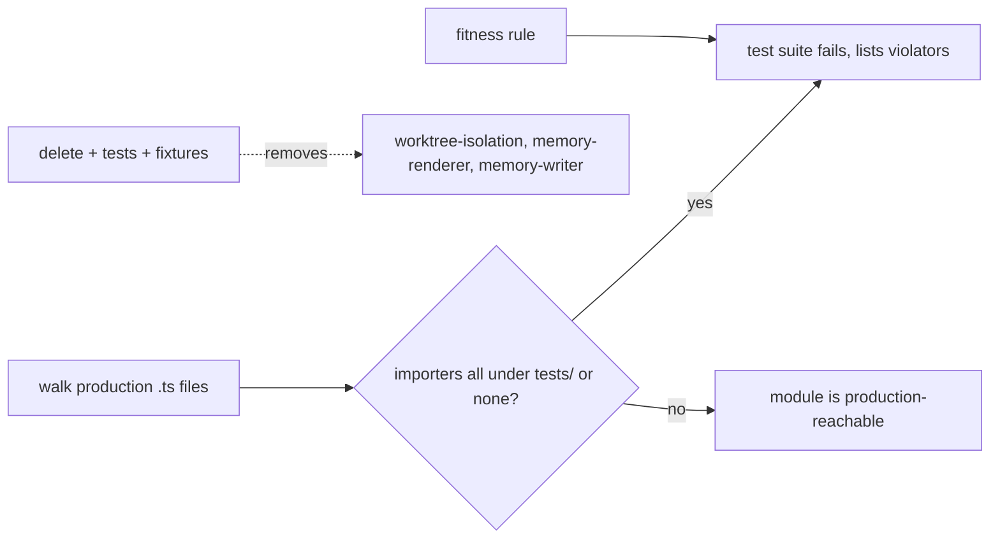

# ADR-054: Test-only production module disposition and no-exemptions fitness rule

## Status

Accepted — 2026-09-01 by llm-council review (4/4 unanimous, thorough profile) plus GM code verification. Implements T-876 Decision B; executes the AGENTS.md no-fitness-exemptions directive.

## Context

A 2026-09-01 repo review found production modules with **zero production importers** that survive because knip's `project` includes `tests/**` — test imports mask dead production code:

| Module | Lines | Built for | Status |
|---|---|---|---|
| `extensions/pi-teams/worktree-isolation.ts` | 265 | T-310 worktree isolation | Never wired; `team-node-runner` uses a subprocess model with no worktree hook point |
| `extensions/pi-panopticon/ui/memory-renderer.ts` | 179 | T-595/596/597 prototypes | Never wired; ADR-022 is design-only and gates implementation behind storage/retention approval that was never granted |
| `extensions/pi-panopticon/ui/memory-writer.ts` | — | T-596 prototype sibling | Zero production importers (verified); coupled to the renderer via `panopticon-memory-writer.test.ts`, not by module import |

Additional facts (GM-verified): fixtures `tests/fixtures/panopticon-memory/{expected-memory.md,synthetic-agent.json}` are referenced only by the two memory tests; `extensions/pi-panopticon/README.md` references `memory-writer`; `tests/architecture/runtime-state-boundaries.ts:123-125` allows `worktree-isolation.ts` as the only pi-teams `node:child_process` import.

Council rejected per-file alternatives: **wire into production now** (no integration point specified; for the memory modules it would violate ADR-022's own gating — YAGNI) and **park behind an ADR note** (structurally impossible: an ADR note cannot make a no-exemptions fitness test pass).

## Decision

1. **Delete** `extensions/pi-teams/worktree-isolation.ts` + `tests/teams/team-worktree-isolation.test.ts`.
2. **Delete** `extensions/pi-panopticon/ui/memory-renderer.ts` and `ui/memory-writer.ts` + `tests/panopticon/panopticon-memory-renderer.test.ts` + `tests/panopticon/panopticon-memory-writer.test.ts` + `tests/fixtures/panopticon-memory/`.
3. **Strengthen the boundary guard:** remove the `worktree-isolation.ts` allowance in `runtime-state-boundaries.ts` — the pi-teams `node:child_process` boundary becomes **zero**.
4. **Update** `extensions/pi-panopticon/README.md` to drop memory-writer/renderer references.
5. **Append a prototype-disposition note to ADR-022:** validated prototypes were built (T-595/596/597), passed tests, and were deleted per this rule; the design remains valid for future implementation once storage-location and retention-policy approvals are secured; code is recoverable from git history.
6. **Land the no-exemptions fitness rule** in `tests/shared/test-quality.test.ts`: a production module under `extensions/` (excluding `*/index.ts` entry files), `lib/`, or `daemon/src/` (excluding entry roots) whose importers are **all test files** — or which has **zero importers** — fails the suite. No allowlists, no exemptions.

## Required evidence

- Red→green: the new rule, run before deletion, flags exactly `worktree-isolation.ts`, `memory-renderer.ts`, `memory-writer.ts`; after deletion it passes with **zero carve-outs**.
- `grep -rn "child_process" extensions/pi-teams` returns empty after the boundary update.
- ADR-022 disposition note present; README updated.
- `npm run check` and `npm test` pass fully.

## Consequences

- ~444 lines of dead production code and their test scaffolding removed; the pi-teams child-process boundary tightens from one allowance to zero.
- The fitness rule makes the blind spot structural: future test-only production modules fail CI immediately.
- Reviving either feature requires a concrete wiring plan and a superseding ADR; git history preserves the code.

## Predicted Impact

- **Expected fixes:** dead-code accumulation (knip blind spot), architecture boundary strictness.
- **At-risk regressions:** false positives from the import-scan heuristic (mitigated by restricting the rule to files with importers-all-tests or zero importers, excluding entry files), accidental deletion of dynamically-imported modules (verified absent for these three via grep).

## Non-goals

- No changes to live production behavior.
- No ADR-022 redesign; the memory-snapshot design stays valid and deferred.
- No exemptions mechanism — the rule is absolute by directive.