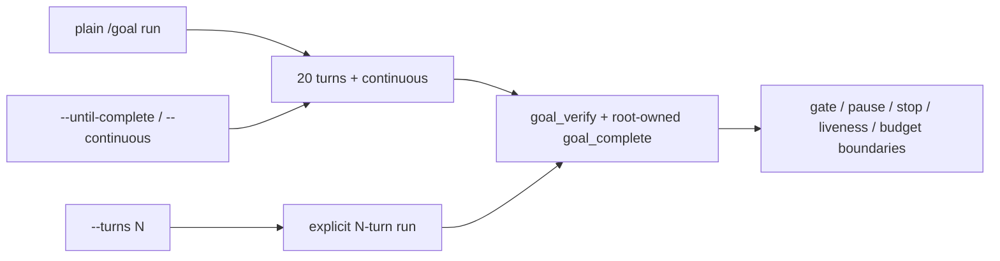

# ADR-055: Default `/goal run` to bounded continuous execution

## Status

Accepted — 2026-09-01 by llm-council review (4/4 unanimous). Amends ADR-049 for the plain `/goal run` command.

## Context

ADR-049 introduced continuous execution but retained manual execution as the default. Consequently, plain `/goal run` starts a three-turn manual run and pauses after each verified non-final milestone, requiring repeated operator commands even when the operator intends to complete the goal.

The existing `--until-complete` mode already provides the desired behavior: a bounded 20-turn run that advances across verified non-final milestones. The request is to make that behavior the default for `/goal run` without making execution unbounded or changing goal creation semantics.

## Decision

Plain `/goal run` (no arguments) starts a **20-turn continuous run**. A pending plan is still implicitly approved by `/goal run`, as before.

Scope is limited to `handleRun`:

- `/goal run` uses `UNTIL_COMPLETE_TURNS` and `runMode: "continuous"`.
- `/goal run --until-complete` and `/goal run --continuous` remain unchanged.
- `/goal run --turns N` remains the explicit escape hatch for a shorter run and preserves the current stored run mode.
- `/goal <text>` and `/goal file <path>` creation behavior remain unchanged.
- The 20-turn budget, verification, gate, liveness, pause, stop, and root-owned `goal_complete` boundaries remain unchanged.
- Continuous mode still never calls `goal_complete` automatically. More than 20 turns requires explicit re-invocation.

## Compatibility and migration

No state migration is required. Existing persisted runs retain their stored mode and budget; the new default only affects the interpretation of a newly invoked plain `/goal run`. Existing scripts that rely on the old three-turn manual behavior should use `/goal run --turns 3` explicitly.

The stop message and help text describe the new default and the explicit shorter-run escape hatch.

## Required evidence

- Tests cover plain `/goal run` → 20 turns + continuous, explicit `--turns N`, explicit continuous flags, combined-flag precedence, plan auto-approval, and unchanged stop/gate behavior.
- `npm run check` and `npm test` pass.

## Consequences

- Completion-oriented goals progress across milestones without repeated `/goal run` commands.
- Each invocation remains bounded to 20 turns; there is no unattended infinite loop.
- Operators retain precise control with `--turns N`, `/goal pause`, `/goal stop`, and trusted completion gates.
- Existing manual-default documentation in ADR-049 is superseded only for plain `/goal run`; goal creation remains manual by default.

## Non-goals

- No unbounded execution or automatic goal completion.
- No changes to `/goal <text>`, `/goal file`, `/goal resume`, `parseTurns`, or persisted goal schemas.
- No changes to root model defaults, schedules, or external transports.
