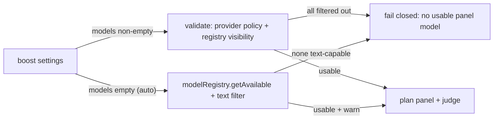

# ADR-056: Boost model selection from the host model registry

## Status

Accepted — 2026-09-02. Refines ADR-052; preserves the single-model/no-judge default and the ADR-050 explicit-fusion protocol.

## Context

`pi-boost` shipped hard-coded provider/model defaults (`DEFAULT_PANEL_MODELS = openai/gpt-5, anthropic/claude-3-7-sonnet, google/gemini-2.5-pro`). These are policy decisions about third-party providers embedded in a host extension:

- They age badly (model IDs drift) and presume providers the operator may not use.
- When the operator configures nothing, boost silently bills models the host may not even have auth for; the planner then warns them out of existence and fails, or the runner spawns doomed subprocesses.
- The host already exposes the canonical selection surface: `ctx.modelRegistry.getAvailable()` filtered to text-capable models (`model.input.includes("text")`), which `runtime-adapter.ts` and `fusion-tool.ts` already use as the visibility filter for planned panels. The registry — not boost — is the authority on which models exist and are authenticated.

ADR-052 fixed the default execution shape (one model, no judge) but kept the hard-coded default panel as the unconfigured model source. The `/boost` settings overlay exposes mode, profile, panel size, and agent caps, but no model selection at all, so an operator cannot align boost with the host without hand-editing `settings.json`.

## Decision

`ctx.modelRegistry` is the canonical model source for boost. Boost production code carries **no provider IDs**.

1. **No hard-coded defaults.** `DEFAULT_PANEL_MODELS` is deleted. Unconfigured boost settings resolve to an **empty model selection** (`models: []`).
2. **Registry fallback (auto mode).** `planCognitiveFusion` treats an empty `configuredPanel` as "auto": it selects from `visibleModels` (the host registry's text-capable models passed by both the `/boost` command adapter and the `boost_fusion` tool), applies provider allow/deny policy and the fast-profile diversity ordering, and caps at the planned panel size. The fallback emits a warning ("no configured panel models; using N host-visible text model(s)"). If no usable model exists (empty selection and an empty/invisible registry), planning **fails closed** with the existing "requires at least one usable panel model" error.
3. **Explicit selections remain validated and never silently substituted.** A non-empty configured list keeps today's semantics: visibility/provider filtering with warnings, and a hard failure when every explicitly configured model is filtered out. Stale explicit selections do **not** fall back to the registry.
4. **ADR-052 semantics preserved.** Single mode remains one model / no judge regardless of how the model is chosen (auto or explicit); `boost_fusion`'s default stays single-model with judge synthesis only via explicit `panelSize`/`mode: "fusion"` (ADR-050).
5. **Selectable model setting.** The `/boost` settings overlay gains a `Models` entry driven by a submenu listing exactly the host's text-capable registry models (`ctx.modelRegistry.getAvailable()` filtered to `input` containing `"text"`). Multi-select capped at `HARD_MAX_PANEL_MODELS` (4); clearing the selection persists an empty list and displays **auto (host registry)**. Persistence flows through the existing scoped settings writer; values are validated by the existing `readModels` schema (`provider/id` shape, dedupe, cap 4). The overlay shows the resolved execution state (auto vs explicit candidates; single mode = 1 model, no judge).
6. **Tests use synthetic provider IDs** (e.g. `a/one`, `judge/final`); real provider strings appear in no production or test fixture.

## Consequences

- Out-of-the-box boost uses models the operator actually has, in host-registry order, instead of three hard-coded vendor IDs.
- Auto mode cost is bounded: single mode leases one registry model; fusion uses the profile/panel-size cap over registry models.
- Operators who pinned specific models keep exactly that behavior, including failing loudly when pins disappear.
- `settings.json` may contain `"models": []`; it reads back as auto, so clear and unconfigured are indistinguishable by design.
- Removing the constant changes `ResolvedBoostSettings.models` default from three IDs to `[]`; downstream consumers must treat empty as auto (all in-repo consumers do).

## Required evidence

- No `DEFAULT_PANEL_MODELS` or provider IDs anywhere under `extensions/pi-boost` production code.
- Deterministic tests: empty-config registry fallback (with warning), fail-closed when no usable model, stale explicit selections never substituted, single mode one model/no judge, fusion opt-in, settings validation/persistence, selector toggle logic (cap, clear, serialization).
- `npm run check` and `npm test` pass fully.

## Non-goals

- No change to the environmental lease path, judge schema, audit format, or ADR-045 lease invariants.
- No new settings file, dependency, or host API surface.
