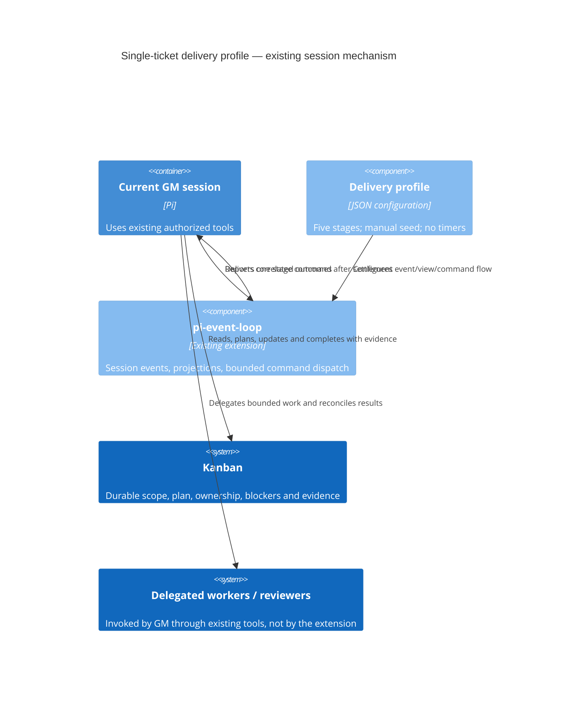

# ADR-058: Manually seeded single-ticket delivery event profile

## Status

Accepted as an evaluation-only decision — council plan review PASS (team-mtniw009-f5d24fda), followed by Principal direction to retain the simpler five-minute CoAS progress schedule as the live driver. Preserve/test the profile and fix reproduced defects, but do not install or activate it without demonstrated added value and separate approval. T-886 was the initial pilot candidate, not an executed run. Future Kaggle evaluation is deferred and separately owned.

## Context

Kanban ticket bodies own scope, plans, ownership and evidence (T-890). The Principal requested a software-development pi-event-loop to help this GM carry authorized tickets through completion, without creating a second backlog. The existing runtime supports this as configuration; a new scheduler or workflow engine is unnecessary.

## Decision

Retain the tracked `examples/event-loop/ticket-delivery.json` as an unactivated exercise, with an explicit operator-only `ticket.selected` seed if a later pilot is approved. Do not install `.pi/event-loop.json` or change the project extension filter now. The proposed profile never auto-selects the next ticket or seeds on install. Five stages: plan, delegate implementation, verify/review, commit/push, evidence-gated Kanban completion. Live CoAS follow-ups remain the simpler mechanism for GM child-agent assessment, canonical ticket checklist updates, tests/docs/review checks and evidence-gated closure; the Principal separately authorized progression through T-886 → T-795 → T-888 after closure.

### Boundaries and failure behavior

- `timers: []` is mandatory; no recurring schedule, cadence, model-default, residency, or process-management change. Existing extension runtime is unchanged.
- One selected ticket per manually seeded run; one pending command, one open item per stage view, eight consecutive automated turns, maximum causal depth twelve. A normal transition closes the current row and opens at most one successor. Final completion opens none.
- Require `ticketId`, `runId` and `correlation` on all events; correlation convention is `<ticketId>:<runId>` with view key `/correlation`. This separates correctly formed keys for different tickets reusing a run label. The runtime compares keys but does NOT verify the compound value against its component fields; the GM must check that correspondence at every stage.
- Required reason/evidence-reference fields are structural presence checks, not proof. Existing Kanban verification gates, tool permissions, trusted command configuration and Principal approvals still govern actions. Events do not authorize work or execute git, tests, workers, or board mutations.
- The GM records a durable plan and validates ownership/WIP/authorization before implementation; absent approval or a competing `/goal`/ticket driver, halt rather than race. No scope expansion through planning.
- Reconcile before every mutation, including retries: inspect actual ticket, existing worker/artifact, reviewed patch, commit and remote state. Push failure prevents completion. `ticket.completed` follows successful `kanban_complete`; it never substitutes for that tool's evidence requirements.
- Blocked, waiting and failed outcomes terminate domain progression with no successor. They do not necessarily set the runtime paused flag. Remediation needs a new manually seeded run ID; `/event-loop retry` only reopens stalled items after a runtime missing-outcome pause.
- Waiting for workers/reviewers is bounded by command guidance, not a runtime timer. The loop does not subscribe to worker completion; a waiting outcome requires operator-mediated restart after reconciliation. Pausing does not cancel an already-running worker or undo mutations.
- Session history is local. Resuming the same Pi session can replay uncertain command delivery (at-least-once); a brand-new session has no such history and must first reconcile Kanban before an explicit new seed. No cross-session locking or exactly-once domain execution claim.

## Council disposition

Council unanimously passed the configuration-only plan. Before activation: retain explicit empty timers, use compound correlation, document terminal-new-run recovery, test one-open-stage sequencing and full chain within depth limits, and inspect the installed config. Reconcile-before-mutate and stable outcome dedupe conventions belong in command messages/runbook. Tests stay under the repo's existing top-level integration-test convention; relocation alone adds no correctness. Subagent tool activity is not itself an event-loop causal hop; profile tests use synthetic delegation evidence, not a live provider benchmark.

The council synthesis overgeneralized run-ID deduplication: operator seeds dedupe on event type plus canonical full payload, not on runId alone. Changed payloads can produce additional events. The runbook must document one seed per run and unique correlation; do not claim a global one-ticket mutex.

## Predicted impact and validation

Hypothesis: a manually seeded ticket reaches the next required stage without repeatedly restating the workflow, while missing outcomes, failures and evidence gaps cannot silently be treated as success by compliant command handling. Validate using production config/parser/projection/automator/ingress tests for success, terminal outcomes, duplicates, cross-ticket/run keys, stage sequencing and causal limits. Any later approved pilot must report real completion, blockers and manual interventions without inferring usability from synthetic tests. No pilot is authorized merely by this evaluation record.

For this exercise: independent Luna artifact review, `npm run check`, `npm test`, and secret-safe scoped diff review. Verify no live configuration or extension-filter change. Before any future approved installation, enable only the project package filter and preserve unrelated settings. Actual live operation requires operator `/reload`, history/status inspection and explicit seed; existing session history may replay commands, so absence of a new seed alone does not prove an idle runtime.

Current value assessment: the profile adds explicit stage contracts, correlated outcomes and replayable observations; it also adds manual re-seeding after waiting/failure and does not enforce truth of tests, approvals or completion evidence. These costs do not yet justify replacing the simple CoAS follow-up schedule for ticket chasing. Retain the exercise for future evidence gathering, not as a second live driver.

## Rollback

Pause first; reconcile in-flight work. Remove the project-only extension filter entry and configuration, then use core `/reload` to unload. Do not reset repository state, rewrite session history, cancel unrelated workers, or emit fake success events.
