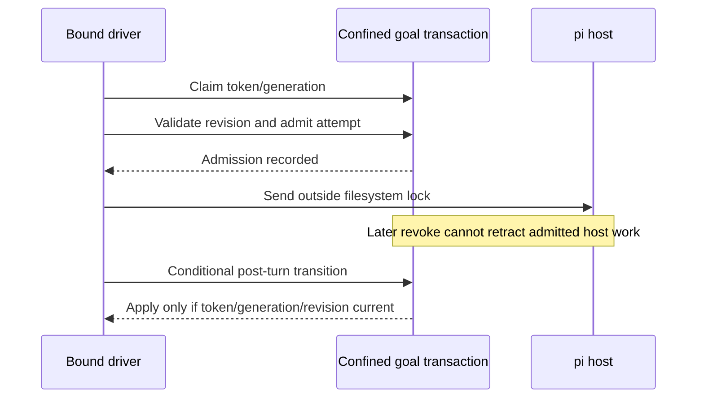

# ADR-059: Per-goal driver ownership and send admission

## Status

Accepted design — both manual Luna council seats passed the reconciled contract on 2026-09-05: `docs/reports/t-886-council-contract.md` and `docs/reports/t-886-council-safety.md`. The safety seat's explicit monotonic-revision condition is incorporated below. GM authorizes bounded T-886 ownership implementation under this contract, not production merge/activation. The Teams run `team-mto4vkmt-e0dc0897` failed every node and supplied no approval. No historical process-death cause is established.

## Decision

Use the existing confined goal instance and short filesystem transactions to exclude competing drivers. No daemon, lease service, dependencies, automatic TTL takeover or new model defaults. Preserve ADR-049 bounded liveness, ADR-051 lineage authorization, and ADR-055 execution defaults.

- **Identity:** canonical confined instance path (resolved project root plus validated goalId). Session binding authorizes access; an opaque driver token and monotonically changing generation identify one logical run. Persist bounded ownership metadata within authoritative instance state under its existing lock; avoid a separately committed sidecar/state pair. Runtime waiters/markers must be associated with that immutable identity, not one unkeyed global resolver.
- **Atomic transitions:** claim, revoke, release, send admission and state changes are lock-protected read/check/write operations. Each authoritative mutation rereads current state and validates expected generation/token and one monotonic authoritative state revision. Every mutating transition increments this revision, including tools, watchdog, cancellation, replacement intent and recovery; stale CAS results are no-ops. No derived snapshot may overwrite a newer pause, edit, verification, completion or replacement after an await. Existing mutating tools must participate in the revision discipline. Projections may be rebuilt from authoritative state; do not claim multi-file filesystem atomicity.
- **Send admission:** under the transaction, require current owner, active run and valid attempt/turn correlation, then record the bounded attempt admission before calling the host outside the lock. Cancellation before admission prevents it. Cancellation after admission cannot retract an already admitted call/turn; it prevents subsequent admissions and stale state writes. SDK void sends provide no delivery acknowledgement or asynchronous error interception. Await replacement-session sends but do not infer that rejection proves no delivery.
- **Cancellation:** authorized pause/stop/edit/clear/replacement-of-goal, terminal outcomes and bounded timeout durably invalidate the relevant generation before settling its waiter/marker. Releases/finalizers are exact-token/generation conditional and cannot affect successors. Settle local waiters even if persistence fails, fail closed locally, and report that authoritative cancellation could not be confirmed. Do not falsely announce recovery.
- **Replacement sessions:** reserve a replacement intent while still owner before newSession. Install ADR-051 binding in setup. Old session_shutdown removes only old local timers/context; a current reserved handoff retains logical ownership. withSession validates reservation, installs fresh context and admits the next send. Cancelled/failed/unknown handoffs become token-conditional interruption/recovery-needed, not immediate uncoordinated retries. Never use stale host/context objects.
- **Watchdog:** owner-associated observer/recovery participant only. No automatic ownership acquisition at an idle threshold. Warning/timeout mutations use the same transaction discipline; a bounded nudge needs current owner, idle host, no queued continuation and send admission. Record attempted nudge, not proven delivery. Lost-owner state is surfaced for explicit recovery rather than silently resuming another driver's goal.
- **Recovery (minimal portable choice):** no automatic dead-owner takeover in this slice. An existing claim blocks new drivers regardless of age; PID metadata is diagnostic only. An explicit authorized operator pause/stop (or clear as already supported) invalidates the generation; a subsequent explicit run/resume may claim a new one after waiting for the recovering host to be idle. This cannot prove a remote host is idle or retract its earlier admitted turn; document that residual and never report global quiescence. Malformed/unverifiable ownership fails closed, with a bounded diagnostic and operator repair guidance, not automatic deletion. Automated process-start-identity recovery is deferred, not partially implemented.
- **Artifacts/confinement:** iteration artifacts belong to admitted attempt identities and cannot reactivate state; stale-attempt artifacts are not completion proof. Validate every ownership/lock/state path with existing no-symlink confinement and regular-file checks; conditional cleanup cannot delete a successor or follow a substituted path. Refuse detected path/inode races. Do not claim kernel-level protection against an adversarial local directory replacement where Node helpers cannot supply it.

## Acceptance and review

Both manual council seats approved the reconciled design; all their implementation conditions remain binding. Any material deviation returns to review. Tests must cover concurrent drivers/processes, pre/post-admission cancellation, stale writes around awaits, token-conditional cleanup, shutdown-before-replacement callback, owner-only watchdog nudge, explicit recovery without age stealing, malformed claims, confinement, persistence/UI failures, host void/promise differences, and existing ADR-049/051/055 behavior. Preserve the failing duplicate-driver test until fixed; no skips or fitness exemptions. Independent implementation review, full checks/tests, C4/docs and scoped secret-safe diff precede commit/push.
