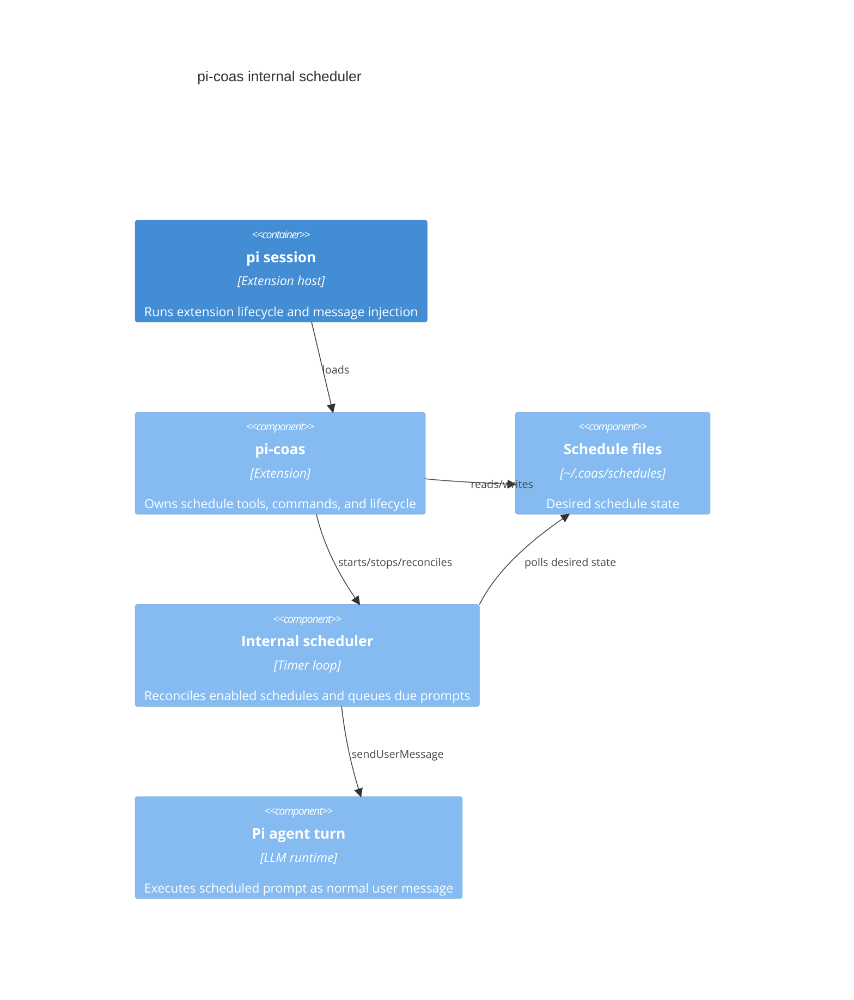

# Architecture Reference

Short reference docs for `pi-tools-and-skills` architecture decisions and extension designs.

---

## F.I.R.E. Review

**Date:** 2026-05-04

Reviewing the codebase against Dan Ward's F.I.R.E. principles (Fast, Inexpensive,
Restrained, Elegant).

### Strengths

- **Fast & Inexpensive:** Local file-backed state (JSON/Markdown) means zero
  infrastructure.
- **Restrained & Elegant:** Extension boundaries are tight. Kanban uses a simple
  append-only log.

### Risk Areas

The main risk is **custom framework growth**:

- `pi-teams`: The DAG executor risks becoming a brittle workflow engine.
  *Mitigation: direct topology handlers replaced generic executor (see Teams
  Platform section).*
- **File Concurrency:** Multiple writers require strict lock discipline.
- `pi-coas`: Must keep its internal scheduler minimal — schedule files plus one
  pi-hosted timer loop, no external crontab reconciliation.
- `matrix`: Justified for human interaction, but too heavy for local agent-to-agent
  comms.

### Recommendations

1. **Constrain `pi-teams`:** Prefer direct coordination functions over a complex
   engine unless dynamic topologies are strictly required. ✅ Done — DAG removed.
2. **Keep Kanban dumb:** Stick to the event-sourced log and deterministic state
   reconstruction. **No SQLite.**
3. **Keep `pi-panopticon` boring:** Only track agent existence and heartbeats.
   No historical metrics.
4. **Limit `pi-coas`:** Run schedules only inside pi with a small timer loop.
5. **Enforce Boundaries:** Prevent extensions from coupling. Add explicit
   "What this does NOT do" to every README.

---

## Kanban Extension

```mermaid
flowchart TD
  User[Human / orchestrator] --> Pi[pi agent session]
  Pi --> Tools[Kanban tool adapters\n10 model-visible tools]
  Pi --> Watcher[board.log watcher]
  Pi --> Overlay[/kanban TUI overlay\nkeyboard navigation + / filter]

  Tools --> Board[board.ts event-sourced board model]
  Watcher --> Board
  Overlay --> Board
  Board --> Log[(kanban/board.log)]
  Board --> Tasks[(kanban/tasks/T-NNN.md)]

  Tools --> Snapshot[snapshot.ts renderers]
  Snapshot --> Compact[Compact summary\nIDs + short status only]
  Snapshot --> TaskDetail[Single-card detail\nrequested by task_id]
  Snapshot --> Full[Full board detail\nrequested by detail=full]
  Snapshot --> SnapshotFile[(kanban/snapshot.md\nfull board)]

  Watcher --> Injection[followUp message\ncompact guidance only]
  Injection --> Pi
  Pi -->|default kanban_snapshot| Compact
  Pi -->|explicit task_id| TaskDetail
  Pi -->|explicit detail=full or /kanban| Full
```

### Context policy

- LLM-visible surface unified around `kanban_claim` (pick/claim/reassign) and
  `kanban_edit` (metadata/notes).
- Watcher injects guidance only; does not inject board contents.
- `kanban_snapshot` defaults to compact output: counts, card IDs, short
  titles/owners, no descriptions or notes.
- Full board and single-card details are explicit on-demand views.

---

## CoAS Internal Scheduler

### Goal
Replace crontab-oriented CoAS scheduling with a pi-hosted internal scheduler.
Schedule files remain the desired state; active in-memory timers become runtime
reality while pi is open.

### Constraints

- Preserve existing schedule file format and model-callable parameters.
- Do not execute schedules outside pi.
- Do not modify user crontab.
- Keep schedule execution explicit: inject a user message into pi when due.
- Keep implementation small and testable.

### Architecture



### Acceptance criteria

- `pi-coas` starts/stops an internal scheduler on session lifecycle.
- Schedule add/remove reconciles in-memory timers.
- `/coas-schedules`, `coas_status`, and `coas_doctor` report internal scheduler
  state instead of crontab state.
- Cron install/uninstall commands replaced by internal scheduler commands/status.
- Tests cover due-time matching and schedule prompt rendering.
