# Architecture Reference

Short reference docs for `pi-tools-and-skills` architecture decisions and extension designs.

---

## F.I.R.E. Review

**Date:** 2026-05-09

Reviewing the codebase against Dan Ward's F.I.R.E. principles (Fast, Inexpensive,
Restrained, Elegant).

### Strengths

- **Fast & Inexpensive:** Local file-backed state (JSON/Markdown) means zero
  infrastructure.
- **Restrained & Elegant:** Extension boundaries are tight. Kanban uses a simple
  append-only log.
- **Restrained Teams extension:** Team execution uses direct protocol handlers inside independently installable `pi-teams`; the generic DAG executor and lowering layers are removed from the baseline.
- **Sparse Panopticon alerts:** Reconciliation follow-ups only interrupt for
  actionable states, reducing idle token cost (ADR 014).

### Risk Areas

The main risk is **custom framework growth**:

- **File Concurrency:** Multiple writers require strict lock discipline.
- `pi-coas`: Must keep its internal scheduler minimal — schedule files plus one
  pi-hosted timer loop, no external crontab reconciliation.
- `pi-matrix`: Justified for human interaction, but too heavy for local
  agent-to-agent comms. Keep local peer routing on IPC-backed channels such as
  `agent_send`, spawned-agent RPC, and shared agent APIs used by `pi-teams` live-agent bindings.

### Recommendations

1. **Keep Teams direct:** Prefer direct coordination functions over a
   complex engine unless dynamic topologies are strictly required. ✅ Baseline —
   DAG removed.
2. **Keep Kanban dumb:** Stick to the event-sourced log and deterministic state
   reconstruction. **No SQLite.**
3. **Keep `pi-panopticon` boring:** Track agent existence, heartbeats, and
   recent operational summaries from existing state only. No long-term metrics
   store. ✅ ADR 014 suppresses idle reconciliation noise.
4. **Keep naming tools canonical:** `set_name` and `get_name` are the only
   naming tools; deprecated alias wrappers are removed.
5. **Limit `pi-coas`:** Run schedules only inside pi with a small timer loop.
6. **Enforce Boundaries:** Prevent extensions from coupling. Add explicit
   "What this does NOT do" to every README.

---

## Current Architecture Map

`pi-tools-and-skills` is a local-first extension workspace for the pi coding agent. This map records current extension ownership, shared library boundaries, state ownership, trust boundaries, active risks, and validation anchors.

```mermaid
flowchart TD
  Pi[pi coding agent runtime] --> Settings[pi settings and package registry]
  Settings --> GlobalExt[User/global extensions]
  Settings --> ProjectExt[Project-local extensions]

  subgraph SharedLib[Shared lib layer]
    Core[Pure contracts and render helpers]
    Runtime[Runtime/session/persistence helpers]
    Governance[CoAS governance classification and routing]
    Transports[Transport adapters]
    Core --> Runtime
    Core --> Transports
  end

  subgraph GlobalExt[User/global extensions]
    Goal[pi-goal]
    Matrix[pi-matrix]
    OllamaModels[pi-ollama-models]
    Panopticon[pi-panopticon]
    Teams[pi-teams]
    Bionic[pi-bionic]
    Doctor[pi-doctor]
  end

  subgraph ProjectExt[Project-local extensions]
    Kanban[pi-kanban]
    FileWatch[pi-file-watch]
    COAS[pi-coas]
  end

  Pi --> Goal
  Pi --> Matrix
  Pi --> OllamaModels
  Pi --> Panopticon
  Pi --> Teams
  Teams --> Swarm[protocol: hierarchical-swarm]
  Swarm --> Managers[manifest-bound orchestrator nodes]
  Managers --> SwarmWorkers[bounded manager or leaf-worker children]
  SwarmWorkers --> RuntimePlane[shared runtime child entities]
  Swarm --> Governance[ADR-035 eligible model routing at each spawn]
  Teams --> RuntimePlane
  Teams --> TeamResults[Private team result root\nuser team root/results]
  TeamResults --> AsyncDelivery[Claim-check async delivery]
  Teams --> TeamChild[one-shot pi --print child]
  TeamChild -->|prompt via stdin; stdout/stderr captured separately| RuntimePlane
  Teams --> TeamProfiles[Shared fast / balanced / thorough profiles]
  TeamProfiles --> Fusion[Fusion bounded panel + judge handler]
  Fusion --> FusionPlanner[Pure model and call-budget planner]
  Fusion --> FusionOutput[Pure prompt and judge-output helpers]
  TeamProfiles --> Navigator[Navigator bounded consult]
  ProfileFixtures[Deterministic profile fixtures and rubric] -. validates contracts .-> TeamProfiles
  LiveHarness[Explicit opt-in live timing harness] -. records redacted durations .-> TeamProfiles
  Pi --> Bionic
  Pi --> Doctor
  Pi --> Kanban
  Pi --> FileWatch
  Pi --> COAS
  COAS --> ConfinedStore[ADR-038 confined filesystem store]
  ConfinedStore --> CoasRoots[validated CoAS, schedule, and workspace roots]

  Goal --> SharedLib
  Matrix --> SharedLib
  OllamaModels --> SharedLib
  Panopticon --> SharedLib
  Teams --> SharedLib
  Bionic --> SharedLib
  Doctor --> SharedLib
  Kanban --> SharedLib
  FileWatch --> SharedLib
  COAS --> SharedLib

  Kanban -. agent assignment/status .-> Panopticon
  Goal -. spawned-worker orchestration .-> Panopticon
  COAS -. task scheduling .-> Kanban
```

### Standalone Teams extension boundary (ADR-048)

`pi-teams` is independently installable and owns team/swarm registration, protocol execution, run state, result claim-checks, bundled configuration, and the consultation skill. `pi-panopticon` remains an independent agent registry, messaging, health, UI, and spawner extension; it does not register or import Teams.

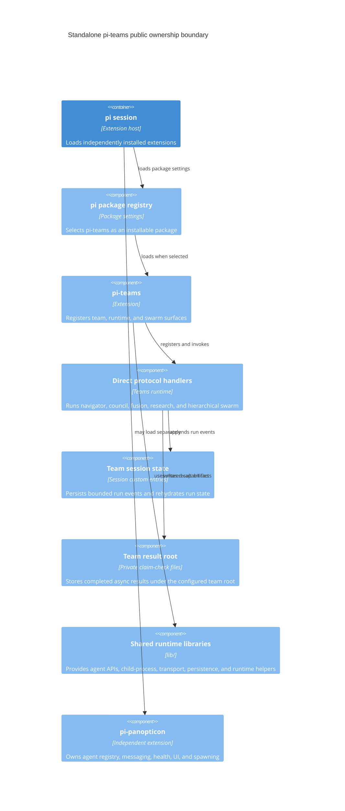

### Declarative discovery boundary (ADR-047)

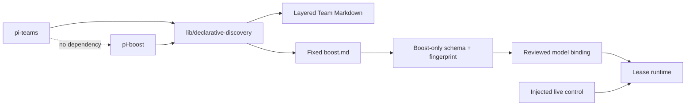

`lib/declarative-discovery.ts` performs lexical root/path discovery only. Teams retain their parsers and registry; Boost selects one highest-layer fixed descriptor before validation, then requires a matching reviewed model and separate live-control gate.

### Extension roles

| Extension | Scope | Primary role | State owner |
| --- | --- | --- | --- |
| `pi-goal` | user/global | Active goal tracking and completion audit workflow | Goal files under the active workspace, including `.pi/goal/` |
| `pi-panopticon` | user/global | Agent registry, heartbeat/status inspection, peer messaging, spawned-agent orchestration, and lifecycle controls | Panopticon registry/session state |
| `pi-teams` | user/global | Standalone declarative team protocols, profiles, hierarchical swarm compatibility, and run controls | Team session events plus private result artifacts under the configured team root |
| `pi-boost` | user/global | Principal-only bounded Boost lease with declarative descriptor, reviewed model binding, and host-injected runtime | Injected WAL state and redacted audit; no Panopticon-owned state |
| `pi-matrix` | user/global | Human-facing Matrix transport integration | Matrix configuration/session state |
| `pi-ollama-models` | user/global | Discovers local Ollama models and updates pi model registry config | `~/.pi/agent/models.json` `ollama` provider entry only |
| `pi-bionic` | user/global | Local-only clean-room bionic-reading text transform | Stateless first slice; no persisted state |
| `pi-doctor` | user/global | Read-only diagnostics for extension manifests, command namespaces, and required package scripts/dependencies | Stateless; reads workspace/package metadata only |
| `pi-kanban` | project-local | Event-sourced project task board | Kanban event log in the owning workspace |
| `pi-file-watch` | project-local | Watches explicitly configured files and wakes the active session with bounded redacted updates | Runtime watchers only; reads `.pi/file-watch.json` and configured files |
| `pi-coas` | project-local | Cooperative agent scheduling over kanban tasks | COAS schedule/runtime files in the owning workspace |

### State ownership summary

| State class | Owner | Expected write pattern |
| --- | --- | --- |
| Append-only task/event logs | Owning extension (`pi-kanban`, similar event sources) | `appendLogLine()` or an owning append API |
| Full-file JSON/Markdown state | Owning extension or shared runtime helper | `writeFileAtomic()` / `updateJsonFile()` where practical |
| Watched files | Owning user/workspace; `pi-file-watch` reads only | Explicit configured file paths, no recursive discovery or writes |
| Session spool/log state | Shared session runtime helpers | Session-spool/session-log APIs |
| Agent registry and spawn state | Panopticon/shared spawn services | Registry/spawn APIs |
| Team run state | `pi-teams` | Session events plus private artifacts under the configured user team root's `results/` directory; profile selection is session-local/input-only |
| Local model registry | `pi-ollama-models` for the `ollama` provider entry | Atomic full-file rewrite of pi `models.json`, preserving other providers |

### Trust boundaries

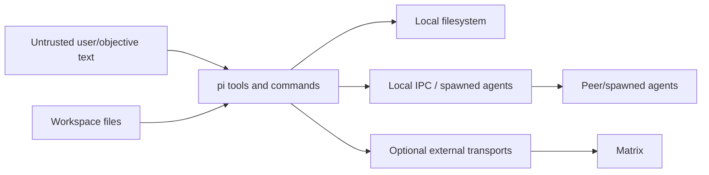

- Treat user objectives, task text, Matrix messages, and agent messages as untrusted input.
- Tool implementations must validate paths and avoid interpreting untrusted text as shell/code.
- Workspace files are the durable authority for local-first state, but extension-private files remain private to their owning extension.
- `pi-file-watch` may observe symlinked or external files only when each configured path explicitly opts into that trust boundary; it does not recursively scan or write watched paths.
- Matrix and other network transports are optional outer-boundary integrations; local agent coordination should prefer IPC-backed mechanisms.
- `pi-ollama-models` executes only an operator-configured absolute `PI_OLLAMA_COMMAND` whose basename is `ollama`, or a fixed standard absolute candidate (`/usr/local/bin/ollama`, `/usr/bin/ollama`). Deprecated public `modelsPath` and `ollamaCommand` fields are accepted but ignored. It never executes caller commands, resolves through PATH, `which`, cwd, or project files, and writes no credentials; other model providers in `models.json` remain outside its ownership.
- Spawned agents and peer messages are coordination channels, not authority to bypass repository validation or completion audits.
- Panopticon local IPC under `~/.pi/agents` is private-local state: registry/Maildir directories are `0700`, registry/message files are `0600`, and symlinked IPC paths fail closed.
- Team result claim-checks are `pi-teams`-owned under the configured user team root (`~/.pi/agent/teams/results` by default). Sync writers and async readers share that resolved root; directories are `0700`, files are `0600`, run IDs are basename-confined, and symlinked roots fail closed. They never use repository-relative `team-results` or CoAS state.

### Completion gate trust boundary

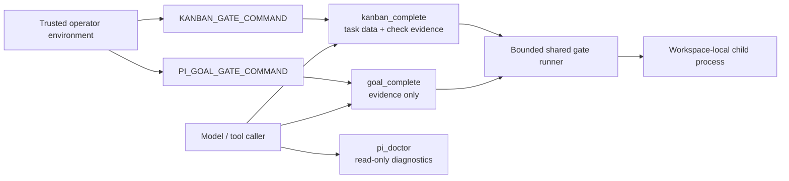

- Public Doctor, Goal completion, and Kanban completion schemas retain their previous gate fields as deprecated, ignored compatibility inputs. Caller values never reach the gate runner and cannot select or override a command.
- `/pi-doctor --gate` remains accepted with a deprecation notice, but `pi-doctor` has no gate path and never spawns a command.
- Goal and Kanban execute a completion gate only when their trusted operator environment variable is configured. These environment variables are operator configuration, not model/tool input. Gate failure blocks completion and reports bounded diagnostics; no configured gate preserves existing completion behavior.
- Structured milestone/task check evidence remains model-visible data and is not treated as proof that the extension executed the reported command.

### Current risks and validation anchors

1. **Concurrency discipline:** Continue moving state writes through `lib/file-persistence.ts` helpers or documented domain-specific transactions.
2. **README contract clarity:** Keep each extension README explicit about stable tools/commands, provisional surfaces, and cross-extension dependencies.
3. **Kanban disclosure boundary:** `pi-kanban` snapshots persist the requested disclosure level: compact by default, explicit full-board/task detail only on request.
4. **Progress UX:** Keep long-running Teams/`pi-goal` work visible with phase, elapsed time, last action, cancellation affordance, and artifact paths.
5. **Transport diagnostics:** Keep `globalThis`/transport registry behavior documented with diagnostics and fallback behavior.

`tests/architecture.test.ts` enforces practical dependency layering, extension runtime-state boundaries, UX/tool policy checks, hotspot budgets, docs hygiene, and persistence-discipline exceptions.

---

## Package Setup Boundary

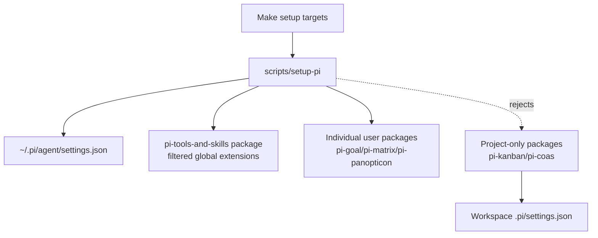

- `make setup` registers the repo package with the global operator extension allowlist.
- `make setup-package PACKAGE=<name>` registers only user-installable extension packages.
- `pi-kanban` and `pi-coas` remain project-only and must be enabled by the workspace that owns their state.

---

## Shared Library Layering


### Context policy

- Core `lib/` files expose contracts and pure formatting/render helpers; they
  must not import Node filesystem, OS, or process-spawning APIs.
  Current core files: `agent-names.ts`, `completion-signal.ts`,
  `message-transport.ts`, `secret-redaction.ts`, `task-brief.ts`,
  `tool-result.ts`, `tui-confirmation.ts`, and `tui-overflow.ts`.
- Shared IO/runtime primitives in `lib/` are imported by multiple callers and
  own generic filesystem, process, settings, session, and registry behavior.
  CoAS-owned modules live in `extensions/pi-coas/lib/`; Panopticon spawn
  modules live in `extensions/pi-panopticon/spawner/`; CLI adapters live in
  `scripts/`. The fitness suite rejects undocumented or single-caller files.
- Pure runtime mappers that do not touch IO may live beside runtime helpers when
  their data shape is runtime-specific; currently `session-journal.ts` is in
  this bucket.
- Transport adapters live under `lib/transports/`; they may perform
  protocol-specific IO but must depend only on lower-level contracts/services,
  not extension runtime modules.
- Runtime/session and transport `lib/` files may perform IO, but must stay below
  extensions and must not import extension runtime code.
- Dependency direction is one-way: extensions may import shared `lib/` primitives;
  `lib/` must not import `extensions/`. Extension-owned public libraries under
  `extensions/*/lib/` may be consumed by another extension when that contract
  is explicitly part of the extension boundary. Core contracts should stay below IO/runtime helpers; any
  exception must be documented rather than hidden.
- Temporal-coupling measurements treat cross-module file relocations as boundary
  migrations, not co-evolution; the migrated source and destination owners are
  excluded for that commit.
- `tests/architecture.test.ts` enforces the currently practical parts of this
  layering policy: all `lib/` TypeScript modules are documented shared
  primitives with multiple callers, core files do not import Node IO modules,
  and `lib/` modules do not import extension runtime code.

---

## Runtime State Boundary

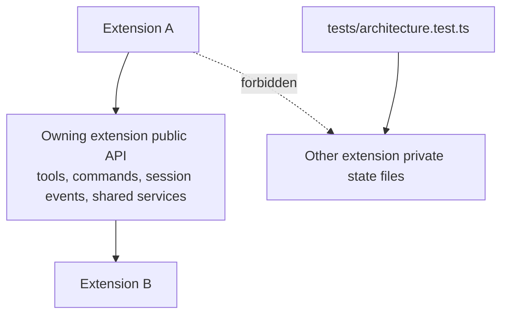

### Context policy

- Static import isolation remains mandatory but is not the whole runtime boundary.
- Extension-owned state files are private; other extensions must not read, write,
  parse, or infer behavior from them.
- Cross-extension cooperation must stay at the owning extension's public runtime
  API: tools, commands, documented session events, or documented shared library
  services.
- Architecture fitness tests enforce that extension runtime code does not
  reference another extension's private state markers.

---

## Persistence Discipline

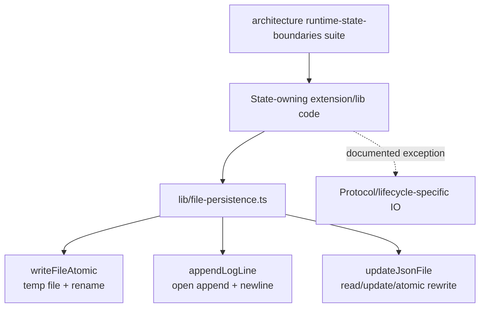

### Context policy

- Common full-file state writes should use `writeFileAtomic()` so readers see a
  complete old or new file, not a partial rewrite.
- Append-only event logs should use `appendLogLine()` for one-line appends with
  consistent directory creation and file mode behavior.
- JSON read/update/write cycles should use `updateJsonFile()` unless the caller
  needs a stronger domain-specific transaction.
- Atomic rename does not serialize competing read/modify/write cycles. Where
  concurrent writers can update the same derived state, use an owning append log,
  an advisory lock, or document why last-writer-wins is acceptable.
- Direct `writeFile`/`appendFile` use in state-writing code must either move
  through the shared helper or appear as an explicit architecture-test exception
  with rationale.

---

## UX and Tool Policy

Detailed TUI consistency, command/tool namespace, confirmation, overflow, and raw-ANSI rules live in [`docs/deep-dives/ux-tools-policy.md`](deep-dives/ux-tools-policy.md). This architecture reference only records the boundary: shared helpers such as `lib/tui-confirmation.ts`, `lib/tui-overflow.ts`, and `lib/tool-result.ts` define reusable primitives, while `tests/architecture.test.ts` enforces the stable policy.

## Kanban Extension

```mermaid
flowchart TD
  User[Human / orchestrator] --> Pi[pi agent session]
  CoAS[pi-coas scheduler\nrecurring operational policy owner] -->|scheduled prompt may call kanban_* tools| Pi
  Pi --> Tools[Kanban tool adapters\n11 model-visible tools]
  Pi --> Watcher[board.log watcher\nevent-driven only]
  Pi --> Overlay[/kanban TUI overlay\nkeyboard navigation + / filter]
  Overlay --> Confirm[Shared destructive confirmation\ny confirm / esc/n cancel]
  Theme[KANBAN_BOARD_THEME\ndefault/focus/mono] --> Overlay

  Tools --> Tx[board-transactions.ts\nread/validate/event batch]
  Overlay --> Tx
  Tx --> Lock[board.log.lock\none advisory lock]
  Lock --> Board[board.ts event-sourced board model]
  Lock --> Log[(pi-kanban/board.log\nauthority)]
  Compaction[compaction.ts\nbackup + atomic replacement] --> Lock
  Watcher --> Board
  Board --> Tasks[(pi-kanban/tasks/T-NNN.md\nderived)]

  Tools --> Snapshot[snapshot.ts renderers]
  Snapshot --> Compact[Compact summary\nIDs + short status only]
  Snapshot --> TaskDetail[Single-card detail\nrequested by task_id]
  Snapshot --> Full[Full board detail\nrequested by detail=full]
  Snapshot --> SnapshotFile[(pi-kanban/snapshot.md\nfull board)]

  Watcher --> Injection[followUp message\ncompact guidance only]
  Injection --> Pi
  Pi -->|default kanban_snapshot| Compact
  Pi -->|explicit task_id| TaskDetail
  Pi -->|explicit detail=full or /kanban| Full
```

### Context policy

- LLM-visible surface unified around `kanban_claim` (pick/claim/reassign) and
  `kanban_edit` (metadata/notes).
- Ordinary appends, read-validation-event transactions, and compaction use the
  same `board.log.lock` advisory lock. Multi-event transitions append one ordered
  batch; compaction holds the lock while reading, backing up, and replacing the
  authoritative log.
- Task Markdown and snapshots are derived state; `board.log` remains authority.
- Watcher injects guidance only; does not inject board contents.
- `/kanban` uses pi's active TUI theme with a restrained `KANBAN_BOARD_THEME` semantic remap (`default`, `focus`, `mono`).
- `kanban_snapshot` defaults to compact output: counts, card IDs, short
  titles/owners, no descriptions or notes.
- Full board and single-card details are explicit on-demand views.
- Recurring schedules, cron-like cadence, morning briefs, state capture, recurring reviews, and CoAS operational policy belong to `pi-coas`, not `pi-kanban`.
- `pi-kanban` watcher follow-ups are event-driven board-change notifications, not a scheduler.

---

## Pi Teams Run Progress Boundary

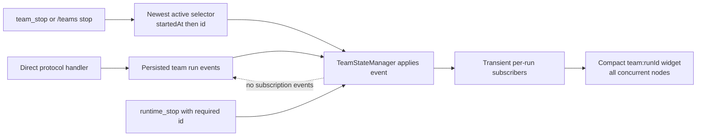

- Run events remain the only persisted team progress state; subscriptions are isolated, in-memory, and removed when each run settles.
- Widgets use per-run keys so concurrent teams do not overwrite each other, and refresh only after state events rather than on a polling interval.
- No-ID cancellation considers only `pending` and `running` records and deterministically chooses greatest `startedAt`, then lexicographically greatest id. `stopping` and terminal runs are excluded; `runtime_stop` remains explicit-id only.

## Pi Teams Browser Render Boundary

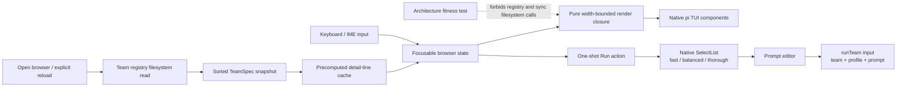

- Registry snapshots and registry-derived detail lines are loaded before the browser render closure runs.
- Browser render closures consume only in-memory state; explicit delete/reload actions refresh both the team snapshot and detail cache.
- The focusable browser propagates focus only while its search input is visible, preserving IME cursor placement.
- The Run action closes the browser before opening a native profile selector and prompt editor; its profile is one-shot input passed directly to `runTeam`, not session-mode state.
- `tests/architecture/tui-render-paths.ts` guards team overlay render closures against synchronous registry/filesystem reads.

## Pi Teams Profile Evaluation Boundary

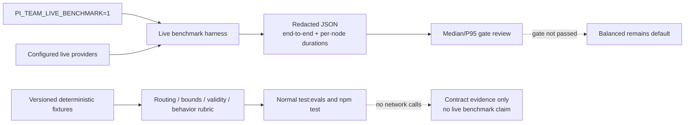

- Deterministic speed-profile fixtures are CI-safe and contain only synthetic public inputs/results.
- The live harness is outside normal CI, requires explicit opt-in, deletes raw session data, and does not retain prompts, outputs, or credentials.
- Live records are local review artifacts rather than runtime telemetry; this introduces no service, scheduler, or durable runtime-state owner.
- Baseline fields and promotion gates are defined in [`tests/evals/team-speed-profile-evaluation.md`](../tests/evals/team-speed-profile-evaluation.md). Balanced remains the default until reviewed Fusion and Navigator live comparisons pass.

## Standalone Host-Injected Boost Runtime Boundary

ADR-046/047 assign Boost to `pi-boost`, not Panopticon or a Team. Normal extension loading supplies no bridge and registers a fail-closed `/boost` denial. A capable host must explicitly call `createBoostExtension` through the reviewed host constructor with the complete bridge, immutable live-control reference, descriptor resolver, and shutdown choice; there is no global, API cast, provider discovery, Team manifest, or configuration fallback.

The default identity boundary requires `PI_PRINCIPAL=1` and rejects sessions carrying the shared parent-agent marker. ADR-047 gives Boost a fixed `boost.md` descriptor discovered through `lib/declarative-discovery.ts`; neither Panopticon nor a descriptor publisher has a write surface inside `pi-boost`. Boost owns validation and runtime policy.

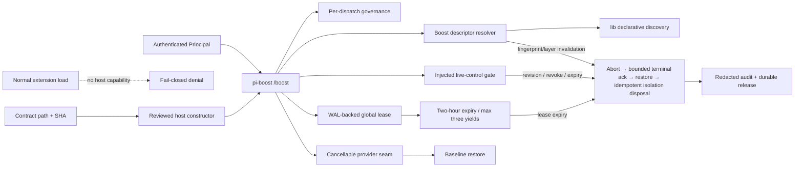

The descriptor permits only its fixed schema: enablement and Principal issuer IDs, enabled state, bounded yields, expiry, revision, and the reviewed `principalBoostLease` model identity. The reviewed resolver must exactly match its provider/id/family; baseline remains `principalBoostBaseline`/`glm-5.2`. The separate injected live-control adapter exposes only `resolve` and `subscribe`, and can only narrow or revoke. Every reservation and dispatch authenticates the Principal and revalidates descriptor, fingerprint, reviewed mapping, live control, and governance.

The production assembly accepts descriptor discovery, injected live control, reviewed model resolver, append-if-sequence WAL, governance classifier, cancellable provider seam, baseline restore, idempotent isolation disposal, and redacted audit. Assembly is cold: it performs no provider call, descriptor write, default-model mutation, schedule change, or background activation.

The store persists `expiresAt = reservation time + 7,200,000 ms`, enforces one global lease and at most three human yields, and rejects stale generations. At the next status, dispatch, or reservation boundary, an expired lease restores baseline, appends redacted audit, and durably releases the slot before replacement. Revision revocation follows `Revoking → abort → terminal acknowledgement → restore → audit → release`.

Restore, isolation disposal, audit, acknowledgement, or cleanup failure writes a durable per-subject `RevertFailed` marker and blocks dispatch for that subject. Principal reset requires fresh descriptor/live-control validation and baseline restoration. Shutdown chooses awaited restoration or a durable recovery block, and no activation survives restart.

## Panopticon Controls

```mermaid
flowchart TD
  Caller[Model / RPC caller] --> GetName[get_name tool]
  Caller --> SetName[set_name tool]
  SetName --> Session[Pi session display name]
  SetName --> Registry[Panopticon registry record]
  Registry --> Display[Agent lists and peer routing]
  Display --> AgentsOverlay[/agents overlay\nstatus, fuzzy filter, detail/list navigation, messaging, stop/kill]
  AgentsOverlay --> Confirm[Shared destructive confirmation\ny confirm / esc/n cancel]
  Confirm --> Signals[Process signals\nSIGTERM / SIGKILL]
  AgentsOverlay --> Maildir[Agent transport\nMaildir channel]
  Maildir --> Peers[Peer / spawned agents]
  Signals --> Peers
  GetName --> Details[Session, registry, and spawn-name metadata]

  Registry --> Reconciler[Reconciliation loop]
  State[Operational workspace state] --> Reconciler
  Reconciler --> Classifier[Actionable vs informational findings]
  Classifier -->|pending / blocked / confirmed stale / silent termination| FollowUp[followUp message]
  Classifier -->|idle healthy peers| Suppress[Suppress idle noise]
```

### External-agent mailbox flow

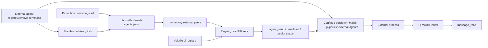

- Startup loads the workspace manifest before pi name selection; register and remove commands refresh the same in-memory external-peer snapshot immediately.
- Manifest updates use an advisory lock, while mailbox paths are absolute, root-confined, and created without following symlinks.
- Removing an external registration does not remove its persistent Maildir contents.

### Context policy

- `set_name` and `get_name` are the only model-visible naming tools.
- Deprecated `set_alias` and `get_alias` wrappers have been removed after their
  deprecation window.
- Registry routing remains based on stable peer IDs; display names are UI labels.
- `/agents` can send direct human-authored messages through the same agent transport as `agent_send`; replies still arrive through normal unread-message handling.
- `/agents` list view supports `/`-activated fuzzy filtering for long visible agent lists without changing registry routing or unread-first sorting.
- `/agents` detail view uses `backspace`/left-arrow to return to the agent list while `esc` closes the overlay.
- `/agents` detail view can stop visible peer agents with SIGTERM or force-kill with SIGKILL after confirmation; it refuses to target the current agent.
- Reconciliation follow-ups are sparse and action-oriented; stale worker alerts
  require a fresh confirmation read, and idle stale-activity checks are
  suppressed when peers are healthy and have no pending messages (ADR 014).

---

## Matrix Outbound Rich Text

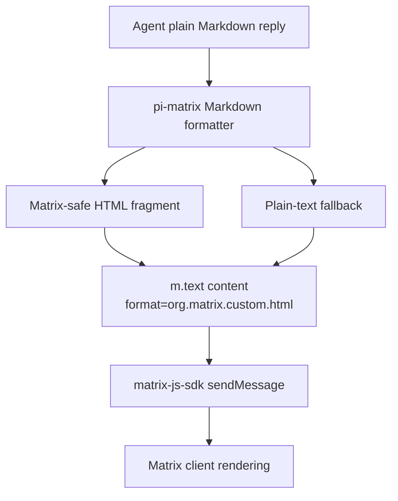

### Context policy

- Outbound formatting is intentionally local and dependency-free.
- Raw HTML is escaped except simple `<u>...</u>` underline tags needed by Matrix rich text.
- Plain-text fallback strips Markdown markers and uses readable Unicode symbols for bullets, quotes, and horizontal rules.

---

## Matrix Attachment Ingestion

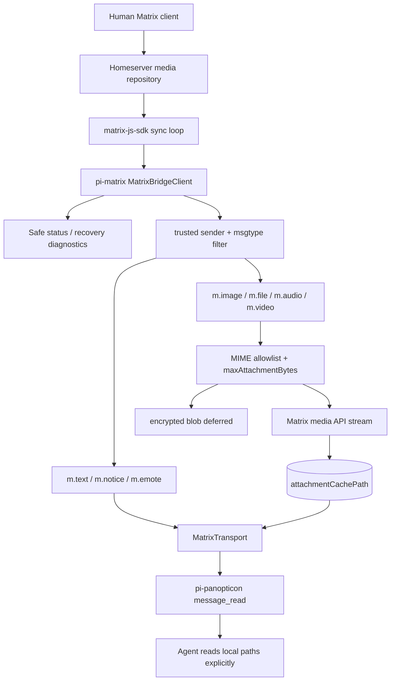

### Context policy

- Matrix attachments are external input and are not executed or parsed automatically.
- `message_read` includes filename, MIME, size, local path, MXC URL, room, and event metadata.
- Workers use built-in `read` on local image/PDF/file paths only when the task requires it.
- Encrypted media blobs are deferred because the SDK decrypt helper does not expose a bounded download path; a visible attachment error is surfaced.
- Matrix diagnostics redact token-like values, expose a recovery action in every mode, and release the client/channel when startup fails or the session reloads.

---

## Research Tool Boundary

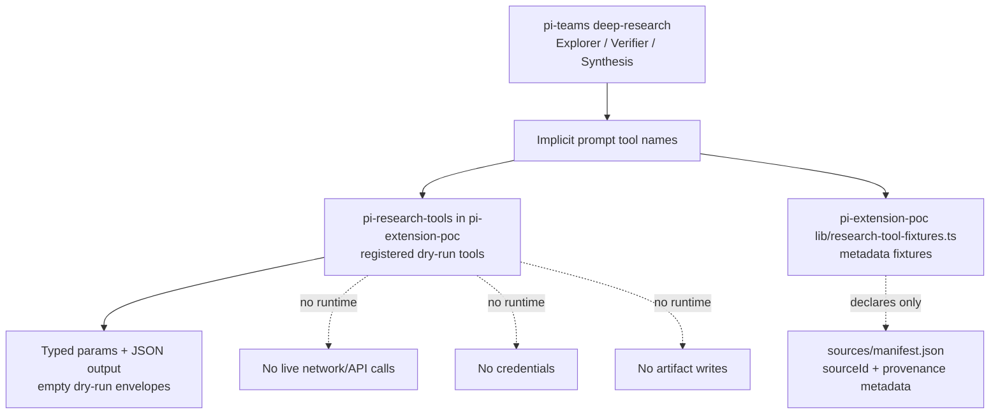

### Context policy

- Research-tool metadata in `/home/jim/git/pi-extension-poc` remains the source for compatibility checks and future provider design.
- `pi-research-tools` exposes a narrow registered-tool slice with typed parameters and JSON dry-run output only; this repo no longer owns its implementation.
- Deep-research workflow policy stays in `extensions/pi-teams` prompts and protocol handlers.
- Source IDs, provenance fields, artifact paths, and result semantics are declared before any provider/runtime promotion.
- Runtime providers, credential handling, extension loading changes, durable artifact persistence, and deletion of old research behavior require separate approval/ADR.

---

## Goal Workflow Extension

```mermaid
flowchart TD
  User[Human / root agent] --> Command[/goal command]
  Agent[Active agent turn] --> Tools[goal_get / goal_complete]
  Command --> State[(.pi/goal/goal.json)]
  Command --> Summary[(.pi/goal/GOAL.md)]
  Command --> Todo[(.pi/goal/TODO.md)]
  Command --> Runner[Bounded run loop]
  Runner --> Fresh[Fresh pi session per turn]
  Fresh --> Agent
  Agent --> Tools
  Tools --> State
  Tools --> Summary
  Agent --> Transcript[(.pi/goal/runs/YYYY/MM/DD/*)]
  State --> Context[before_agent_start goal context]
  Context --> Agent
  State --> UI[status/widget progress]
```

### Context policy

- `.pi/goal/` is project-local runtime state and is automatically added to `.git/info/exclude` when possible.
- `pi-goal` owns `.pi/goal/`; other extensions, including `pi-panopticon`, must not read, parse, write, or infer behavior from those files.
- Cross-extension goal orchestration must use public runtime surfaces: `/goal`, `goal_get`, `goal_complete`, agent messages/tools, or extension host APIs.
- `/goal` bounds autonomous progress by turn budget; `/goal stop` requests graceful stopping at safe turn boundaries.
- `goal_complete` is root-owned and requires concrete evidence after re-reading source requirements and checking validation state.
- Goal text and source files are treated as untrusted input; current repository/filesystem state remains authoritative.

---

## CoAS Confined Filesystem Boundary

```mermaid
flowchart LR
  Consumers[Schedule / status / workspace / approval consumers] --> Paths[store-paths.ts\npure validated paths, IDs, env format]
  Consumers --> Store[ConfinedStore\nconfig or authorized-root bound]
  Paths --> Store
  Store --> Guard[Absolute containment + no symlink components]
  Guard --> Home[(COAS_HOME managed roots)]
  External[Explicit external workspace] --> Metadata[.pi/coas/workspace.env authorization]
  Metadata --> ExternalStore[ConfinedStore bound to validated real root]
  ExternalStore --> ExternalGuard[Absolute containment + no symlink components]
  ExternalGuard --> ExternalRoot[(Authorized external workspace root)]
```

- `store-paths.ts` performs no IO; it owns lexical path construction, ID validation, and schedule/workspace env formatting.
- `ConfinedStore` is the sole CoAS-owned filesystem primitive boundary. It validates the complete absolute path chain, binds an authorized root, rejects symlink components and directory entries, and validates a deletion batch before mutation.
- `COAS_HOME` bootstrap creates one path component at a time without following symlinks. Managed schedule, log, lock, run-state, approval, and workspace IO uses a config-bound store.
- External workspaces remain available only when their validated root contains a non-symlinked `.pi/coas/workspace.env`; context IO stays confined to that root.
- `tests/architecture/coas-confined-io.ts` prevents production consumers from restoring direct state IO or unbound legacy helper exports. Consumer-level regressions exercise schedule, status, workspace, approval, run-state, and log routes.

## CoAS Internal Scheduler

### Goal
Replace crontab-oriented CoAS scheduling with a pi-hosted internal scheduler.
Schedule files remain the desired state; active in-memory timers become runtime
reality while pi is open. CoAS owns recurring operational policy over other
extension surfaces, including scheduled prompts that may use `kanban_*` tools for
WIP pick routines, morning briefs, state capture, and recurring reviews.

### Constraints

- Preserve existing schedule file format and model-callable parameters.
- Do not execute schedules outside pi.
- Do not modify user crontab.
- Keep schedule execution explicit: inject a user message into pi when due.
- Keep implementation small and testable.

### Architecture

```mermaid
C4Component
    title pi-coas internal scheduler
    Container(pi, "pi session", "Extension host", "Runs extension lifecycle and message injection")
    Component(coas, "pi-coas", "Extension", "Owns schedule tools, commands, and lifecycle")
    Component(files, "Schedule files", ".pi/coas/schedules or COAS_HOME/schedules", "Desired schedule state")
    Component(store, "ConfinedStore", "Root-bound filesystem capability", "Rejects path escapes and symlink components")
    Component(scheduler, "Internal scheduler", "Timer loop", "Reconciles enabled schedules and queues due prompts")
    Component(agent, "Pi agent turn", "LLM runtime", "Executes scheduled prompt as normal user message")
    Component(kanban, "pi-kanban tools", "Board surface", "Reusable board state/actions; no recurring schedule ownership")
    Rel(pi, coas, "loads")
    Rel(coas, store, "requests config-bound IO")
    Rel(store, files, "reads/writes after confinement checks")
    Rel(coas, scheduler, "starts/stops/reconciles")
    Rel(scheduler, store, "polls desired state through")
    Rel(scheduler, agent, "sendUserMessage")
    Rel(agent, kanban, "may call kanban_* tools from scheduled prompt")
```

### Acceptance criteria

- `pi-coas` starts/stops an internal scheduler on session lifecycle.
- Schedule add/remove reconciles in-memory timers.
- `/coas-schedules`, `coas_status`, `coas_doctor`, and the compact TUI status field report internal scheduler
  state instead of crontab state.
- Scheduler telemetry is ephemeral and queue-level only: aggregate `queued`/`failed` counters and
  `lastQueuedAt`/`lastFailedAt`/`lastTaskId` surfaced through existing status channels, reset on stop.
  No public telemetry tool, durable metrics store, event bus, or cross-extension import is introduced.
- Cron install/uninstall commands replaced by internal scheduler commands/status.
- Tests cover due-time matching, schedule prompt rendering, and scheduler telemetry accounting.
- CoAS remains the owner for recurring operational policy; `pi-kanban` remains schedule-free.

---

## CoAS Workspace Context

### Goal
Keep `pi-coas` context project-local and gradual-disclosure safe. Active `CONTEXT.md` files are small SPR-style durable memory, not transcript archives.

### Architecture

```mermaid
flowchart TD
  CWD[pi session cwd] --> HOME{COAS_HOME/settings?}
  HOME -- explicit --> ROOT[configured CoAS home]
  HOME -- absent --> LOCAL{nearest .pi/coas workspace root?}
  LOCAL -- yes --> PROJ[project-local .pi/coas/workspace]
  LOCAL -- legacy --> PROJLEG[project-local .pi/coas/workspaces]
  LOCAL -- no --> GLOBAL[user-global .pi/coas]
  READ[coas_workspace_read] --> SUMMARY[default summary: path size headings bounded preview]
  READ -->|mode=section/full| GUARD[hard size guard]
  UPDATE[coas_workspace_update] --> APPEND[append stable non-secret fact]
  APPEND --> THRESH{active CONTEXT.md over threshold?}
  THRESH -- yes --> ARCHIVE[copy previous file to archive/] --> SPR[rewrite compact active SPR memory]
  THRESH -- no --> KEEP[keep active file]
```

### Acceptance criteria

- Project-local `.pi/coas/workspace/<id>` is the standard workspace root when present; existing plural `workspaces/` roots remain readable for migration compatibility.
- `coas_workspace_read` never returns full context by default; full and section modes are explicit and size guarded.
- `coas_workspace_update` archives before compacting oversized active context and preserves private permissions.

---

## CoAS scheduled approval and scheduler split

```mermaid
flowchart LR
  Tick[Scheduler tick] --> Guard[Delivery guard]
  Guard --> Gate[Approval claim-check]
  Gate -->|awaiting| Parked[(One requestId + run-state snapshot)]
  Gate -->|approved| Run[Run-once delivery]
  Parked -->|Principal approval| Resume[Direct resume callback]
  Resume --> Run
  Run --> End[agent_end]
  End --> Terminal[completed / interrupted]
  Remove[removeSchedule] --> Cleanup[Schedule, run-state, approval cleanup]
```

`pi-coas` keeps scheduler orchestration separate from run-once delivery,
approval transitions, recovery, and run-state persistence. A parked approval is
resumed with its original request and run identity; it is not re-triggered as a
new cron delivery. Approval artifacts are bounded private claim-checks with
sanitized content and terminal retention cleanup. The architecture fitness suite
therefore checks module budgets without exemptions while continuation state stays
one bounded snapshot per task.

## Standalone boost boundary

`pi-boost` owns the mutable Principal lease and runtime lifecycle. `pi-panopticon` observes swarm state only and has no boost registration or authority dependency.

```mermaid
flowchart LR
  Principal --> Boost[pi-boost]
  Boost --> Authority[Lease authority]
  Boost --> Audit[Persistence and audit]
  Boost --> Runtime[External config + provider adapter]
  Panopticon[pi-panopticon] --> Swarm[Swarm observation]
```
