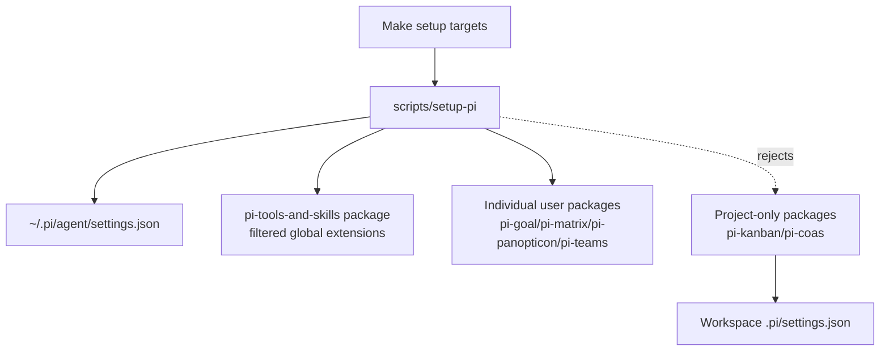
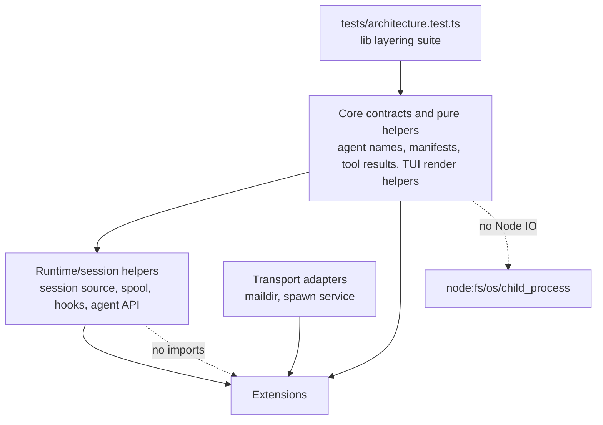
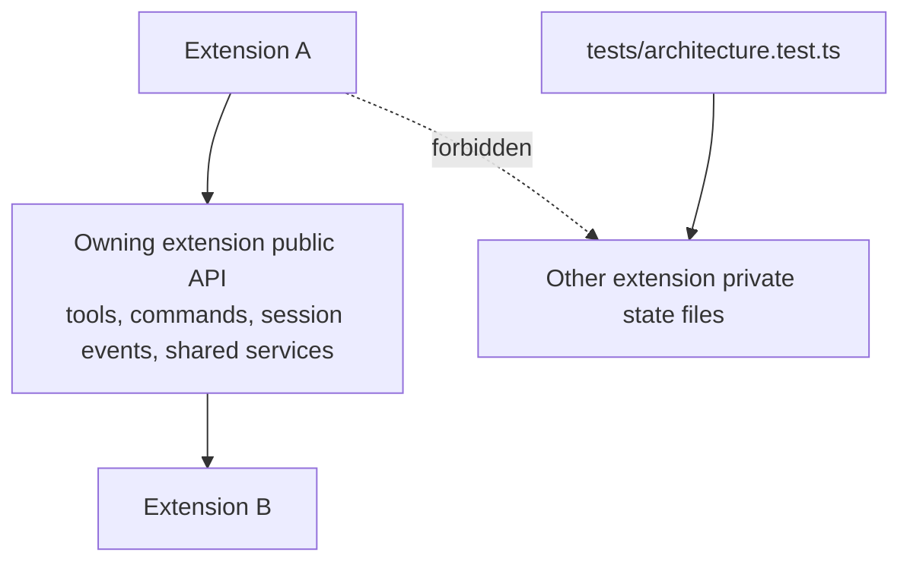
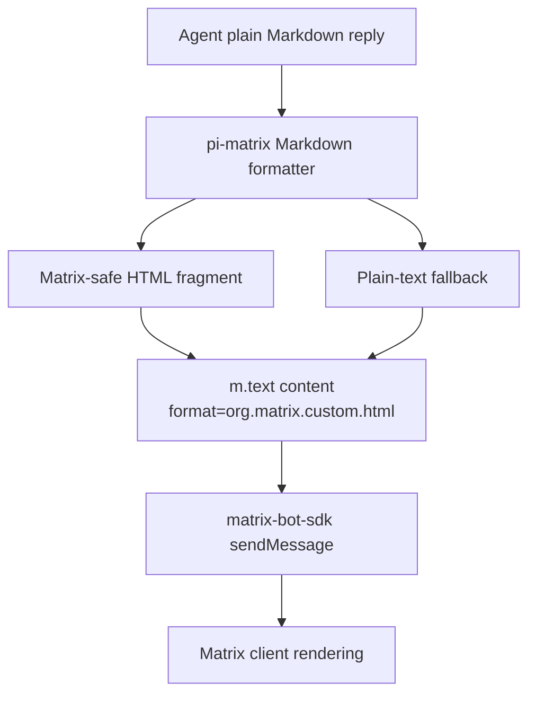
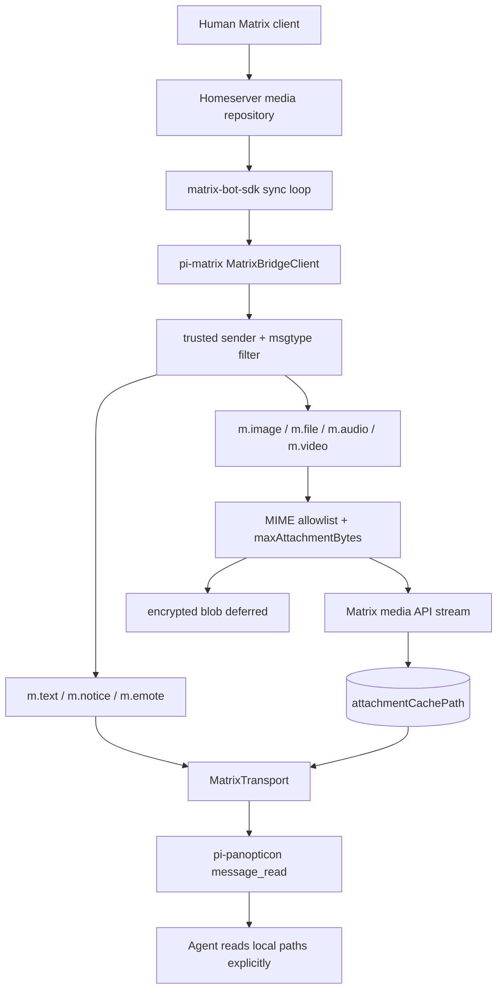
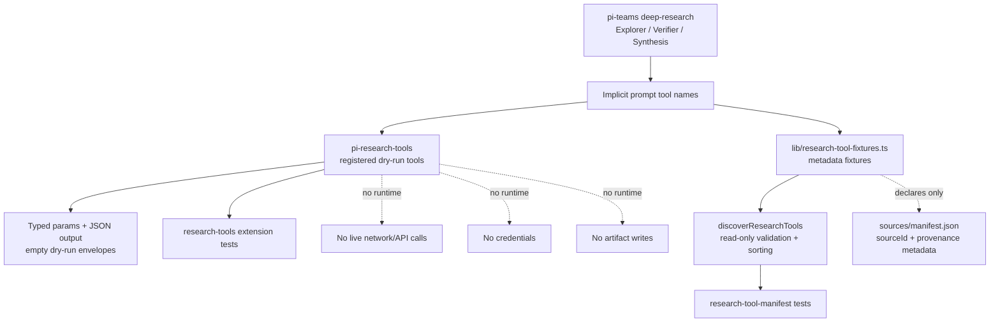
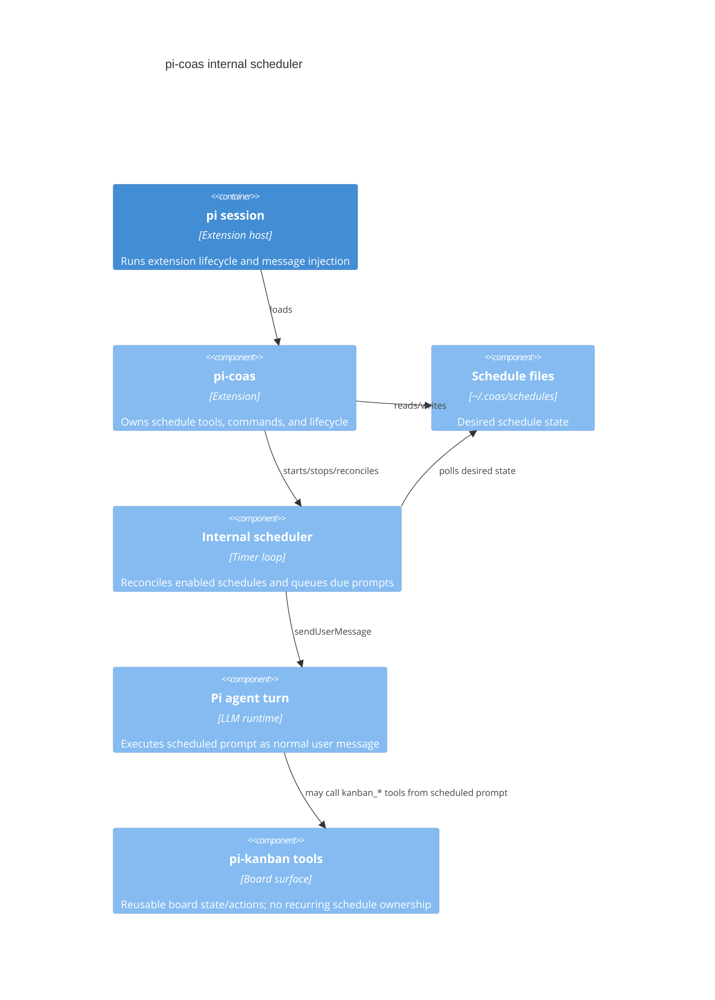

# Architecture Reference

Short reference docs for `pi-tools-and-skills` architecture decisions and extension designs.

---

## F.I.R.E. Review

**Date:** 2026-05-09

Reviewing the codebase against Dan Ward's F.I.R.E. principles (Fast, Inexpensive,
Restrained, Elegant).

### Strengths

- **Fast & Inexpensive:** Local file-backed state (JSON/Markdown) means zero
  infrastructure.
- **Restrained & Elegant:** Extension boundaries are tight. Kanban uses a simple
  append-only log.
- **Restrained `pi-teams`:** Team execution now uses direct protocol handlers;
  the generic DAG executor and lowering layers are removed from the baseline.
- **Sparse Panopticon alerts:** Reconciliation follow-ups only interrupt for
  actionable states, reducing idle token cost (ADR 014).

### Risk Areas

The main risk is **custom framework growth**:

- **File Concurrency:** Multiple writers require strict lock discipline.
- `pi-coas`: Must keep its internal scheduler minimal — schedule files plus one
  pi-hosted timer loop, no external crontab reconciliation.
- `pi-matrix`: Justified for human interaction, but too heavy for local
  agent-to-agent comms. Keep local peer routing on IPC-backed channels such as
  `agent_send`, spawned-agent RPC, and `pi-teams` live-agent bindings.

### Recommendations

1. **Keep `pi-teams` direct:** Prefer direct coordination functions over a
   complex engine unless dynamic topologies are strictly required. ✅ Baseline —
   DAG removed.
2. **Keep Kanban dumb:** Stick to the event-sourced log and deterministic state
   reconstruction. **No SQLite.**
3. **Keep `pi-panopticon` boring:** Track agent existence, heartbeats, and
   recent operational summaries from existing state only. No long-term metrics
   store. ✅ ADR 014 suppresses idle reconciliation noise.
4. **Keep naming tools canonical:** `set_name` and `get_name` are the only
   naming tools; deprecated alias wrappers are removed.
5. **Limit `pi-coas`:** Run schedules only inside pi with a small timer loop.
6. **Enforce Boundaries:** Prevent extensions from coupling. Add explicit
   "What this does NOT do" to every README.

---

## Package Setup Boundary



- `make setup` registers the repo package with the global operator extension allowlist.
- `make setup-package PACKAGE=<name>` registers only user-installable extension packages.
- `pi-kanban` and `pi-coas` remain project-only and must be enabled by the workspace that owns their state.

---

## Shared Library Layering



### Context policy

- Core `lib/` files expose contracts and pure formatting/render helpers; they
  must not import Node filesystem, OS, or process-spawning APIs.
- Runtime/session and transport `lib/` files may perform IO, but must stay below
  extensions and must not import extension runtime code.
- `tests/architecture.test.ts` enforces the currently practical parts of this
  layering policy.

---

## Runtime State Boundary



### Context policy

- Static import isolation remains mandatory but is not the whole runtime boundary.
- Extension-owned state files are private; other extensions must not read, write,
  parse, or infer behavior from them.
- Cross-extension cooperation must stay at the owning extension's public runtime
  API: tools, commands, documented session events, or documented shared library
  services.
- Architecture fitness tests enforce that extension runtime code does not
  reference another extension's private state markers.

---

## Cross-Extension TUI Standards

```mermaid
flowchart TD
  Policy[docs/ux-tools-policy.md] --> Confirm[lib/tui-confirmation.ts\nstandard destructive confirmation]
  Policy --> Overflow[lib/tui-overflow.ts\nstandard scroll/truncation cues]
  Policy --> Tests[tests/architecture.test.ts\nUX and tools policy suite]
  Tests --> Commands[command/tool naming shape]
  Tests --> ToolResults[shared tool-result envelopes]
  Tests --> OverlayOptions[bounded custom overlay options]
  Tests --> NoAnsi[no raw ANSI in runtime TUI code]
  Tests --> Footer[standard destructive footer]
  Confirm --> KanbanDelete[/kanban delete task confirmation]
  Confirm --> PanopticonStop[/agents stop/kill confirmation]
  Confirm --> TeamsDelete[/teams delete/dissolve confirmation]
  Overflow --> TeamsOverlay[/teams compact hidden-count cues]
```

### Context policy

- Destructive confirmations use warning/error borders, explicit target text, and
  the standard `y confirm · esc/n cancel` keys.
- Scroll and hard-truncation cues are formatted through shared helpers to avoid
  extension-specific wording drift.
- `tests/architecture.test.ts` enforces the stable parts of
  `docs/ux-tools-policy.md`: command/tool naming, shared tool-result envelopes,
  custom overlay bounds, no raw ANSI in runtime TUI code, and destructive footer
  wording.

## Kanban Extension

```mermaid
flowchart TD
  User[Human / orchestrator] --> Pi[pi agent session]
  CoAS[pi-coas scheduler\nrecurring operational policy owner] -->|scheduled prompt may call kanban_* tools| Pi
  Pi --> Tools[Kanban tool adapters\n10 model-visible tools]
  Pi --> Watcher[board.log watcher\nevent-driven only]
  Pi --> Overlay[/kanban TUI overlay\nkeyboard navigation + / filter]
  Overlay --> Confirm[Shared destructive confirmation\ny confirm / esc/n cancel]
  Theme[KANBAN_BOARD_THEME\ndefault/focus/mono] --> Overlay

  Tools --> Board[board.ts event-sourced board model]
  Watcher --> Board
  Overlay --> Board
  Board --> Log[(pi-kanban/board.log)]
  Board --> Tasks[(pi-kanban/tasks/T-NNN.md)]

  Tools --> Snapshot[snapshot.ts renderers]
  Snapshot --> Compact[Compact summary\nIDs + short status only]
  Snapshot --> TaskDetail[Single-card detail\nrequested by task_id]
  Snapshot --> Full[Full board detail\nrequested by detail=full]
  Snapshot --> SnapshotFile[(pi-kanban/snapshot.md\nfull board)]

  Watcher --> Injection[followUp message\ncompact guidance only]
  Injection --> Pi
  Pi -->|default kanban_snapshot| Compact
  Pi -->|explicit task_id| TaskDetail
  Pi -->|explicit detail=full or /kanban| Full
```

### Context policy

- LLM-visible surface unified around `kanban_claim` (pick/claim/reassign) and
  `kanban_edit` (metadata/notes).
- Watcher injects guidance only; does not inject board contents.
- `/kanban` uses pi's active TUI theme with a restrained `KANBAN_BOARD_THEME` semantic remap (`default`, `focus`, `mono`).
- `kanban_snapshot` defaults to compact output: counts, card IDs, short
  titles/owners, no descriptions or notes.
- Full board and single-card details are explicit on-demand views.
- Recurring schedules, cron-like cadence, morning briefs, state capture, recurring reviews, and CoAS operational policy belong to `pi-coas`, not `pi-kanban`.
- `pi-kanban` watcher follow-ups are event-driven board-change notifications, not a scheduler.

---

## Panopticon Controls

```mermaid
flowchart TD
  Caller[Model / RPC caller] --> GetName[get_name tool]
  Caller --> SetName[set_name tool]
  SetName --> Session[Pi session display name]
  SetName --> Registry[Panopticon registry record]
  Registry --> Display[Agent lists and peer routing]
  Display --> AgentsOverlay[/agents overlay\nstatus, fuzzy filter, detail/list navigation, messaging, stop/kill]
  AgentsOverlay --> Confirm[Shared destructive confirmation\ny confirm / esc/n cancel]
  Confirm --> Signals[Process signals\nSIGTERM / SIGKILL]
  AgentsOverlay --> Maildir[Agent transport\nMaildir channel]
  Maildir --> Peers[Peer / spawned agents]
  Signals --> Peers
  GetName --> Details[Session, registry, and spawn-name metadata]

  Registry --> Reconciler[Reconciliation loop]
  State[Operational workspace state] --> Reconciler
  Reconciler --> Classifier[Actionable vs informational findings]
  Classifier -->|pending / blocked / confirmed stale / silent termination| FollowUp[followUp message]
  Classifier -->|idle healthy peers| Suppress[Suppress idle noise]
```

### Context policy

- `set_name` and `get_name` are the only model-visible naming tools.
- Deprecated `set_alias` and `get_alias` wrappers have been removed after their
  deprecation window.
- Registry routing remains based on stable peer IDs; display names are UI labels.
- `/agents` can send direct human-authored messages through the same agent transport as `agent_send`; replies still arrive through normal unread-message handling.
- `/agents` list view supports `/`-activated fuzzy filtering for long visible agent lists without changing registry routing or unread-first sorting.
- `/agents` detail view uses `backspace`/left-arrow to return to the agent list while `esc` closes the overlay.
- `/agents` detail view can stop visible peer agents with SIGTERM or force-kill with SIGKILL after confirmation; it refuses to target the current agent.
- Reconciliation follow-ups are sparse and action-oriented; stale worker alerts
  require a fresh confirmation read, and idle stale-activity checks are
  suppressed when peers are healthy and have no pending messages (ADR 014).

---

## Matrix Outbound Rich Text



### Context policy

- Outbound formatting is intentionally local and dependency-free.
- Raw HTML is escaped except simple `<u>...</u>` underline tags needed by Matrix rich text.
- Plain-text fallback strips Markdown markers and uses readable Unicode symbols for bullets, quotes, and horizontal rules.

---

## Matrix Attachment Ingestion



### Context policy

- Matrix attachments are external input and are not executed or parsed automatically.
- `message_read` includes filename, MIME, size, local path, MXC URL, room, and event metadata.
- Workers use built-in `read` on local image/PDF/file paths only when the task requires it.
- Encrypted media blobs are deferred because the SDK decrypt helper does not expose a bounded download path; a visible attachment error is surfaced.

---

## Research Tool Boundary



### Context policy

- Research-tool metadata remains the source for compatibility checks and future provider design.
- `pi-research-tools` exposes a narrow registered-tool slice with typed parameters and JSON dry-run output only.
- Deep-research workflow policy stays in `pi-teams` prompts and protocol handlers.
- Source IDs, provenance fields, artifact paths, and result semantics are declared before any provider/runtime promotion.
- Runtime providers, credential handling, extension loading changes, durable artifact persistence, and deletion of old research behavior require separate approval/ADR.

---

## Goal Workflow Extension

```mermaid
flowchart TD
  User[Human / root agent] --> Command[/goal command]
  Agent[Active agent turn] --> Tools[goal_get / goal_complete]
  Command --> State[(.pi-goal/goal.json)]
  Command --> Summary[(.pi-goal/GOAL.md)]
  Command --> Todo[(.pi-goal/TODO.md)]
  Command --> Runner[Bounded run loop]
  Runner --> Fresh[Fresh pi session per turn]
  Fresh --> Agent
  Agent --> Tools
  Tools --> State
  Tools --> Summary
  Agent --> Transcript[(.pi-goal/runs/YYYY/MM/DD/*)]
  State --> Context[before_agent_start goal context]
  Context --> Agent
  State --> UI[status/widget progress]
```

### Context policy

- `.pi-goal/` is project-local runtime state and is automatically added to `.git/info/exclude` when possible.
- `/goal` bounds autonomous progress by turn budget; `/goal stop` requests graceful stopping at safe turn boundaries.
- `goal_complete` is root-owned and requires concrete evidence after re-reading source requirements and checking validation state.
- Goal text and source files are treated as untrusted input; current repository/filesystem state remains authoritative.

---

## CoAS Internal Scheduler

### Goal
Replace crontab-oriented CoAS scheduling with a pi-hosted internal scheduler.
Schedule files remain the desired state; active in-memory timers become runtime
reality while pi is open. CoAS owns recurring operational policy over other
extension surfaces, including scheduled prompts that may use `kanban_*` tools for
WIP pick routines, morning briefs, state capture, and recurring reviews.

### Constraints

- Preserve existing schedule file format and model-callable parameters.
- Do not execute schedules outside pi.
- Do not modify user crontab.
- Keep schedule execution explicit: inject a user message into pi when due.
- Keep implementation small and testable.

### Architecture



### Acceptance criteria

- `pi-coas` starts/stops an internal scheduler on session lifecycle.
- Schedule add/remove reconciles in-memory timers.
- `/coas-schedules`, `coas_status`, `coas_doctor`, and the compact TUI status field report internal scheduler
  state instead of crontab state.
- Cron install/uninstall commands replaced by internal scheduler commands/status.
- Tests cover due-time matching and schedule prompt rendering.
- CoAS remains the owner for recurring operational policy; `pi-kanban` remains schedule-free.
