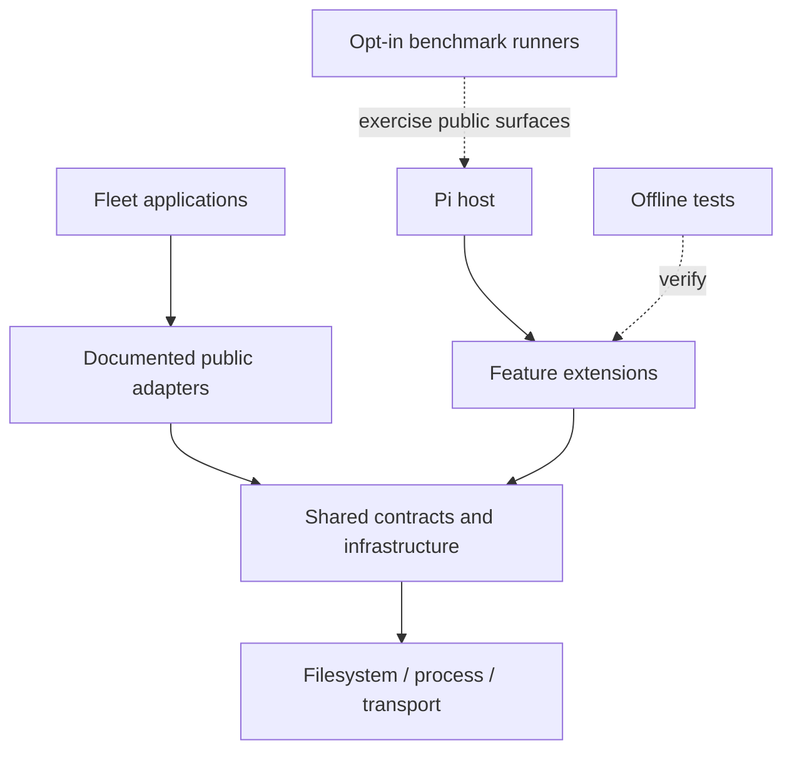

# Architecture boundaries

This document owns cross-cutting boundaries, not command catalogs or historical
implementation reports. Package READMEs own usage; [ADRs](adr/README.md) record
decisions. Superseded diagrams and completed reviews remain in Git history.

## Responsibility and state ownership

| Owner | Authority | Boundary |
| --- | --- | --- |
| [Agent Hub](../extensions/pi-agent-hub/README.md) | Agent registry, health, spawner lifecycle and Maildir transport | Messaging is coordination, not authorization |
| [Team Workflows](../extensions/pi-team-workflows/README.md) | `TeamStateManager`, session run events and private result artifacts | Direct bounded protocols; no parallel lifecycle registry |
| [Goal](../extensions/pi-goal/README.md) | Session-bound `goal.json`, driver token/generation/revision | `GOAL.md` is a projection; source files and native sessions remain intact |
| [Automations](../extensions/pi-automations/README.md) | Schedule files, slot admission, approval and workspace context | Runs inside Pi; no independent background scheduler |
| [Kanban](../extensions/pi-kanban/README.md) | Append-only `board.log` | Task Markdown is derived; live views and JSON export are read-only |
| [Boost](../extensions/pi-boost/README.md) | In-session lease and model restoration | Failed restoration blocks further dispatch; no fusion engine |
| [Matrix](../extensions/pi-matrix/README.md) | Human-facing transport and attachment cache | Trusted-sender filtering and bounded media handling; input remains untrusted |
| [File Watch](../extensions/pi-file-watch/README.md) | Explicit watcher configuration and runtime subscriptions | Validated path/symlink policy; no implicit workspace sweep |
| [Ollama Models](../extensions/pi-ollama-models/README.md) | Only the Ollama entry in Pi's model registry | Operator-selected executable; caller command/path overrides are inert |
| [Fleet MCP](../fleet-mcp/README.md) | MCP receipts and external-client state | Gateway authorization; backend adapts existing registrar/transport |
| [Fleet overview](../fleet-overview/README.md) | Derived browser views and gated control requests | Observes existing registry and policy, not a replacement authority |

Project agents work directly with Jim. Kanban remains Gravitas's optional human
overview, not an execution prerequisite. Deployment, secrets, residency and
operational scheduling defaults are operator-owned.

## Dependencies and public boundaries

```mermaid
flowchart TD
  Pi[Pi host] --> Extensions[Feature extensions]
  Applications[Fleet applications] --> Public[Documented public adapters]
  Public --> Infrastructure[Shared contracts and infrastructure]
  Extensions --> Infrastructure
  Infrastructure --> Host[Filesystem / process / transport]
  Tests[Offline tests] -. verify .-> Extensions
  Benchmarks[Opt-in benchmark runners] -. exercise public surfaces .-> Pi
```

- `lib/` provides shared contracts and infrastructure, not extension orchestration.
  [Its consumer inventory](../lib/README.md) explains retained single-consumer
  primitives. Tests do not count as production consumers.
- Extension-private helpers stay beside their owner. Team Workflows live-agent
  instrumentation lives in Team Workflows; it is not an Agent Hub control plane.
- Shared libraries never import extension runtime or tests. Extensions do not
  import another extension's internals; explicitly public `extensions/*/lib/`
  contracts are the permitted cross-extension seam.
- No shipping code imports benchmark implementations. Offline tests may import
  pure benchmark helpers; live provider calls require explicit opt-in.
- Cross-extension state access uses documented APIs, tools or session events,
  not parsing another extension's private state files.

## Persistence and confinement

Atomic replacement (`lib/file-persistence.ts`) protects readers from partial
files; it does **not** serialize concurrent read/modify/write. Use an advisory
lock or the owning transaction where writers compete. Event appends and Kanban
compaction share the board lock. Preserve history, backups, ownership checks,
and partial-success reporting.

`ConfinedStore` validates authorized roots, path components and regular-file
requirements; it rejects symlinks and validates deletion batches before mutation.
External Automations workspaces require explicit authorized-root metadata.
These are check/use defenses, not kernel-level race-free filesystem guarantees.
Private registry/Maildir/result state retains its permission and confinement
checks. Team result artifacts use the configured team root, never an arbitrary
repository-relative output path.

## Execution and completion

- **Goal:** one locally owned driver; admission and replacement are revision/
  token checked. No implicit TTL/PID takeover. Stop, edits and cancellation
  invalidate stale verification. Completion executes the local hook in
  `.pi/goal/settings.json`; only exit zero completes. TUI/authorized agents may
  amend it locally; it is validation, not independent operator approval.
  Completion-hook execution is bounded; ordinary failures leave the goal open
  for local repair/configuration. A genuine blocker pauses rather than completes.
  Liveness elapsed time alone does not stop productive work.
- **Kanban:** completion uses its locked, revalidating domain operation and the
  operator-configured gate when present. Caller-supplied gate commands remain
  ignored. Ordinary views never compact; compaction is explicit and retains backups. Markdown snapshots/export have been removed.
- **Automations:** slot admission and approval share durable identity. Reserved,
  admitted and uncertain deliveries block automatic duplicates. A void host
  send is not proof of provider delivery; explicit approval remains required.
- **Team Workflows:** one run/status/stop authority; terminal stops do not rewrite history.
  Results and cancellation retain their bounded, private claim-check semantics.
- **Boost:** restore on settlement rather than interrupting live work. Settings
  and model/profile defaults are not altered by repository refactors.

See Goal's [source intent](../extensions/pi-goal/src/md/README.md), ADRs
[051](adr/051-pi-goal-session-lineage-isolation.md),
[059](adr/059-goal-driver-ownership.md) and
[060](adr/060-automations-scheduler-slot-admission.md) for the detailed contracts.

## Validation by purpose

| Check | Protects |
| --- | --- |
| `npm run check` | Namespace/template safety, types, lint, unused code and type coverage |
| `tests/architecture/api-contracts.ts` | Dependency direction, extension isolation and cycles |
| `tests/architecture/lib-layering.ts` | Production consumers, pure core and inward dependencies |
| State, confinement, Goal, Kanban and tool-contract suites | Permissions, authority, transactions, truthful outcomes |
| `tests/architecture/tui-render-paths.ts` and UX policy suites | Render purity, confirmation and bounded UI output |
| `tests/evals/` | Offline fixture, fake-RPC and evaluation-contract regressions |
| [`benchmarks/`](../benchmarks/README.md) | Explicit live experiments; not CI proof or operational completion |

Line count, approximate complexity, parameter count, cohesion and historical
co-change are inspection aids—not pass/fail architecture contracts. Removing
those quotas does not remove dependency, persistence, permission or verification
gates. New checks should fail on a concrete forbidden behavior, not require
artificial file splits or an unrelated reduction whenever a hotspot changes.
