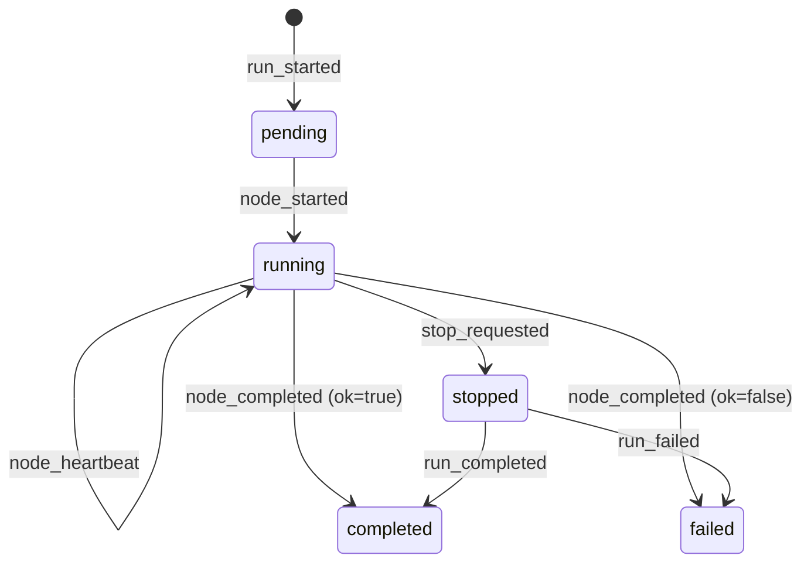
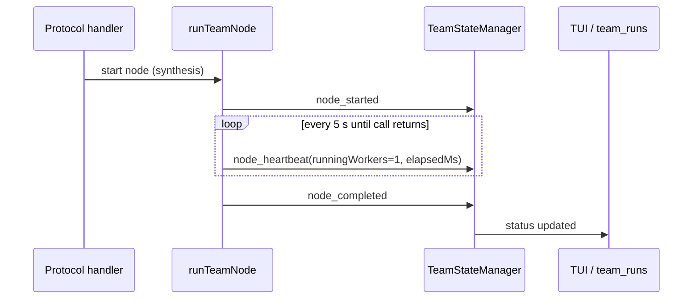

# T-739: Team-run live progress, heartbeat, and stuck-node controls — design spec

**Status:** DESIGN/SPEC slice (no implementation in this change).  
**Parking condition:** ADR 026 (built-in team projection) shipped.  
**Artifact owner:** `pi-tools-and-skills` General Manager.  
**Target implementation ticket:** T-739 implementation phases (gated).

---

## 1. Problem statement

During run `team-mqm4dr9m` the council reached a stuck state:

- 5 member/generation nodes completed.
- The `glm-5.2` synthesis node sat for 10+ minutes.
- Runtime surface showed **zero running workers** for the run.
- No per-node progress was visible to the agent or TUI beyond aggregate `nodes=5`.
- The only recovery was a blunt `/team stop <runId>`, with no signal to distinguish *slow-but-alive* from *hung*.

This design spec defines how to surface live phase/node counts, detect stalls, and expose actionable peek/stop controls while changing no code in this slice.

## 2. Goals and non-goals

### Goals

1. Surface per-run **phase and node counts** to `team_runs` / `runtime_status` and the TUI.
2. Distinguish **progress vs hang** for long-running nodes (especially synthesis after parallel members finish).
3. Provide a **heartbeat/stall detector** with concrete thresholds.
4. Make **peek and stop controls actionable** for stuck nodes.

### Non-goals (this slice)

- No implementation, runtime changes, public-contract changes, default-behavior changes, new persistence stores, or provider/live-agent work.
- No per-node *abort* control in v1 (whole-run stop remains the immediate recovery path).
- No new prompt/template changes.

## 3. Current state audit

### 3.1 Existing data model (`extensions/pi-panopticon/teams/state.ts`)

`TeamRunRecord` carries:

- `status`: `pending | running | stopping | stopped | completed | failed`
- `phases`: list of phase ids (append-only)
- `nodes`: `TeamRunNodeRecord[]` — recorded only on **completion**
- `details`: `TeamRunDetailRecord[]` — trace/handoff/fallback/artifact/error events
- `startedAt`, `completedAt`, `error`, `stopReason`

`TeamRunNodeRecord` carries:

- `phaseId`, `nodeId`, `role`, `model`, `ok`, `durationMs`, `output`, `error`
- **No** `status`, `startedAt`, `updatedAt`, or worker-count fields.

Events emitted today:

| Event | When |
|-------|------|
| `run_started` | run begins |
| `phase_started` | handler starts a phase |
| `node_completed` | `runTeamNode` finishes (ok or not) |
| `run_detail` | trace / handoff / fallback / artifact / error |
| `stop_requested` | user/system asks to stop |
| `run_stopped` / `run_completed` / `run_failed` / `run_tombstoned` | terminal states |

**Gap:** there is no `node_started` or in-flight `node_heartbeat` event. A node that is running but not completing is invisible until it either completes or the whole run fails/times out.

### 3.2 Existing tool surfaces (`extensions/pi-panopticon/teams/team-runtime.ts`)

- `team_runs`: returns one line per run with `phases=N nodes=M details=K`. No per-node detail, no current node, no stall flag.
- `runtime_status`: inspects `RuntimeControlPlane` entities. Each entity snapshot has `status`, `children` (refs only), and `updatedAt`. It does **not** expose team-run nodes or node status.
- `team_stop` / `runtime_stop`: both call `requestTeamRunStop`, which sets the run-level `AbortController` and records `stop_requested`. There is no per-node stop.

### 3.3 Existing TUI surface (`refreshTeamWidget`)

Current widget shows:

```
team: <id> (<protocol>)
phase: <last phase | status>
time: <elapsed>
action: <nodes> nodes, <details> details
artifacts: ...
cancel: /team stop <runId>
```

It does not list which nodes are running, stalled, or completed, nor the model of the current node.

### 3.4 Existing handler execution

- **Debate** (`team-handler-debate.ts`): `Promise.all(generation)` → `Promise.all(critiques)` → sequential `synthesis`. The stuck-synthesis case is exactly the hand-off between parallel members and the single synthesis node.
- **Research** (`team-handler-research.ts`): sequential explorer → verifier loops, then synthesis.
- **Fusion** (`team-handler-fusion.ts`): `Promise.all(panel)` → judge → synthesis, with optional fallback chain.
- **Consult** (`team-handler-consult.ts`): single navigator node.

`runTeamNode` (`team-node-runner.ts`) supports `timeoutMs` and an `AbortSignal`, but emits no in-flight events.

## 4. Target design

### 4.1 Additive event schema (proposal)

Introduce two new event kinds using the existing `appendEntry` session-persistence path. All new fields are optional so that older records remain valid.

```ts
interface TeamRunNodeStartedEvent extends TeamRunEventBase {
  kind: "node_started";
  phaseId: string;
  nodeId: string;
  role: string;
  model: string;
}

interface TeamRunNodeHeartbeatEvent extends TeamRunEventBase {
  kind: "node_heartbeat";
  phaseId: string;
  nodeId: string;
  role: string;
  model: string;
  elapsedMs: number;
  runningWorkers: number; // 0 = orchestrator idle, 1+ = underlying call/agent alive
}
```

`TeamRunNodeRecord` is extended with optional, derived fields:

```ts
interface TeamRunNodeRecord {
  // ... existing fields ...
  status?: "pending" | "running" | "completed" | "failed" | "stopped";
  startedAt?: number;
  updatedAt?: number;
  runningWorkers?: number;
}
```

The state reducer (`applyEvent`) transitions a node record as follows:



### 4.2 Heartbeat and stall-detection semantics

Heartbeat is emitted from inside `runTeamNode` every **5 seconds** (`NODE_HEARTBEAT_INTERVAL_MS = 5000`) while the node is in flight.



For **live-agent** nodes, `runningWorkers` is derived from `agent_status` (alive = 1, stalled/terminated = 0). For **model-member** nodes, `runningWorkers` is 1 while the underlying `runMember` call is active.

Stall classification:

| Signal | Threshold | Meaning |
|--------|-----------|---------|
| `no_heartbeat` | > 30 s since last `node_heartbeat` | Node call is not reporting progress (provider hang, agent deadlock). |
| `idle_stall` | node `running` but `runningWorkers === 0` for > 60 s | Orchestrator thinks a node is running but nothing is executing — the `team-mqm4dr9m` pattern. |
| `node_timeout` | node elapsed > `team.limits.timeoutMs` (or default) | Existing timeout path; should be surfaced as a node failure reason. |
| `orphan_run` | orchestrator PID dead | Existing `findOrphans()` path; unchanged. |

A node is marked **stalled** if any of the above signals fire. The stall flag is computed on read (tools/TUI) from the live in-memory node state; it is **not** a persisted event by itself.

```ts
function computeNodeStall(node: TeamRunNodeRecord, now: number): { stalled: false } | { stalled: true; reason: string } {
  if (node.status !== "running") return { stalled: false };
  const sinceLastHeartbeat = now - (node.updatedAt ?? node.startedAt ?? now);
  if (sinceLastHeartbeat > NO_HEARTBEAT_THRESHOLD_MS) {
    return { stalled: true, reason: "no_heartbeat" };
  }
  if (node.runningWorkers === 0 && sinceLastHeartbeat > IDLE_STALL_THRESHOLD_MS) {
    return { stalled: true, reason: "idle_stall" };
  }
  return { stalled: false };
}
```

Notes:

- `node_timeout` is enforced internally by `runTeamNode` (it aborts and records `node_completed` with `error: "timeout"`), so it does not need a separate stall-read path.
- `NO_HEARTBEAT_THRESHOLD_MS = 30000` and `IDLE_STALL_THRESHOLD_MS = 60000`.

### 4.3 Tool output enhancements

`team_runs` line format:

```
team_run <id> <team> <protocol> <status> phases=P nodes=N (running=R stalled=S done=D) details=K current=<phase>/<node>
```

`runtime_status` returns, per run:

- entity snapshot (`id`, `status`, `updatedAt`)
- `phases` count
- `nodes` array with `nodeId`, `role`, `model`, `status`, `elapsedMs`, `runningWorkers`, `stalled`
- `current` node id and phase

`team_stop` / `runtime_stop` behavior remains run-level. Their response should include the list of running/stalled nodes so the user knows what is being cancelled:

```
Team run <runId> stopping: <reason>
Running nodes: synthesis (glm-5.2) 10m 12s, stalled
```

### 4.4 TUI widget enhancements

`refreshTeamWidget` should render:

```
team: <id> (<protocol>)
phase: <phase>
time: <elapsed>
nodes: <total> (running=<R> stalled=<S> done=<D>)
current: <role> (<model>) <elapsed>
artifacts: ...
cancel: /team stop <runId>
```

If a node is stalled, the `current` line is suffixed with `⚠ STALLED` using the warning theme color.

## 5. Implementation phases and gates

| Phase | Scope | Owner / reviewer | Deliverables | Gates |
|-------|-------|------------------|--------------|-------|
| **0** | Spec approval (this artifact) | General Manager + Navigator | Approved design doc | Navigator review PASS; council input for public-contract change; ADR draft created. |
| **1** | Event/schema extension | Delegated worker (Jules or spawn) | `node_started`, `node_heartbeat` events; optional node `status`/`startedAt`/`updatedAt`; reducer tests | `npm run check`; targeted reducer tests green; no tool/TUI changes yet. |
| **2** | Heartbeat emission | Worker | `runTeamNode` emits heartbeat; `runningWorkers` populated; `TeamStateManager` exposes `getNodeStatus`, `listStalledNodes` | Tests with fake timers; no default threshold changes. |
| **3** | Tool/TUI observability | Worker | Enhanced `team_runs`, `runtime_status`, `team_stop` output; widget update | `npm run check`; vitest team-runtime tests; manual stall scenario. |
| **4** | Stall detector background loop | Worker (v1.1 or same if small) | Periodic stall check tied to widget refresh interval; emit `run_detail(kind=error)` on stall | Tests; manual hang reproduction. |
| **5** | Per-node stop (v1.1) | Worker | Optional `nodeId` param on `team_stop`; per-node `AbortController` | Council review; larger surface change. |

**Approval gate before implementation:**

1. Navigator review of this spec → PASS.
2. Council review (runtime/public-contract change) → consensus.
3. ADR created for the event-schema and tool-output changes.
4. Implementation phases assigned with owners and WIP limits.

## 6. ADR / no-ADR rationale

This change touches the public team-run event schema and the output shape of `team_runs` / `runtime_status`. That is an architecture decision. This spec itself is **not** an ADR; it is the design input. An ADR must be created in **Phase 1** before any runtime code is merged, because:

- The event kind additions (`node_started`, `node_heartbeat`) are a persisted contract.
- The optional node-record fields affect how downstream tools and TUI render runs.
- Tool output format changes may be consumed by scripts/agents.

Until the ADR is approved, **no implementation follow-up ticket is started**.

## 7. Risks and mitigations

| Risk | Mitigation |
|------|------------|
| Session log bloat from heartbeats | Heartbeat only while node is `running`; 5 s interval; stops immediately on completion. |
| `runningWorkers` is inaccurate for opaque `runMember` calls | v1 uses a simple heuristic (1 while call in-flight, 0 after return). v1.1 can integrate with runtime child-process tracking if needed. |
| False-positive stall alerts on very slow but healthy nodes | Thresholds are read-side only; user sees a stall marker, not an auto-stop. Auto-stop remains a future opt-in. |
| Live-agent heartbeats require agent-status polling | v1 treats live-agent node as `runningWorkers=1` while agent status is alive; v1.1 can subscribe to agent heartbeats. |

## 8. Open questions and recommended resolutions

1. **Fixed-interval vs progress-based heartbeat?** *Recommended:* fixed 5 s interval for v1. Provider token streaming is not exposed today; a simple interval gives an actionable stall signal with minimal complexity.
2. **Event schema version bump?** *Recommended:* keep `TEAM_RUN_EVENT_SCHEMA_VERSION` at 1 because the new event kinds are additive and unknown kinds are ignored by older code. Document the new kinds in the ADR. If a later phase makes node fields non-optional, bump the *record* version then.
3. **Stall-detection cadence?** *Recommended:* compute stalls on read (tools) and inside the existing 1 s `refreshTeamWidget` interval. No separate background loop is needed for v1; this keeps the change small and gives immediate TUI feedback.
4. **Per-node stop in v1?** *Recommended:* defer to v1.1. v1 focuses on observability and whole-run stop. Per-node abort requires per-node `AbortController` plumbing and is a larger public-contract change.

---

**Next step:** route this spec to Navigator review; then, if approved, schedule council review and ADR drafting before any implementation phase begins.
