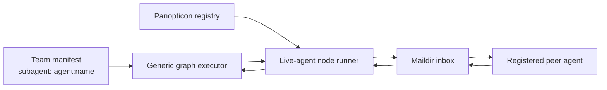
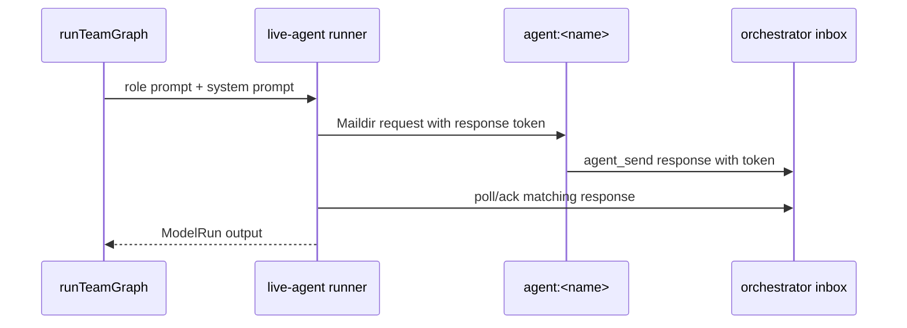

# P8 live-agent team members spec

## Goal

Allow a team role binding to target an already registered Pi peer with an explicit `agent:<name>` reference. The binding stays visible in the team file, validates against Panopticon registry state, and executes as an ordinary graph node.

## Scope

- Binding syntax: `subagent: "agent:<registered-name>"` in v2 team manifests.
- `team_form` accepts `agent:<name>` entries in `agents[]` and does not create subagent stub files for them.
- `team_describe` and `team_list` show live-agent refs as bindings, not hidden runtime substitutions.
- `team_run` graph execution routes live bindings through a generic node runner.

## Non-goals

- No distributed chat room or multi-turn protocol.
- No implicit conversion of invalid subagent ids into live agents.
- No compatibility for old invalid agent names.
- No secrets or hidden execution config sent to the live peer.

## Execution design

The graph executor remains the only scheduling/timeout layer. A live node receives the same rendered prompt package that a one-shot model node would receive. The peer must answer with one message beginning with `TEAM_NODE_RESPONSE <request-id>`.

Live-agent retries are side-effectful because they send messages to an external peer. Ambient team-level retry defaults therefore do not apply to live-agent refs; retrying a live node requires an explicit runtime or binding-level retry override.

## Response lifecycle

- The orchestrator creates a high-entropy request id for each live-node attempt.
- The runner polls only this orchestrator's inbox and accepts only replies from the target agent with the matching token.
- Fresh wrong-token or wrong-sender messages are left unread so another active request can consume them.
- Stale protocol replies (`TEAM_NODE_RESPONSE ...`) older than the retention window are archived with normal Maildir ack semantics on subsequent live-node polling.
- Cancellation and timeout come from the graph node `AbortSignal`; the live runner does not own a second timeout system.

## Validation

- `agent:<name>` is valid only in `subagent`/`agents[]` fields.
- Missing, terminated, self, blocked, stalled, or otherwise unavailable agents produce actionable errors listing available live peers.
- Live refs do not require file-backed subagent manifests or model ids; the current registry model is used for inspection/state.

## Tests

- Registry accepts a live ref without requiring a subagent file and reports missing refs.
- Team form writes live refs and skips stub generation.
- Team graph validation accepts live refs without model fields.
- Live runner sends only prompt/system package, captures matching responses, rejects unavailable/self/blocked peers, and honors cancellation.
