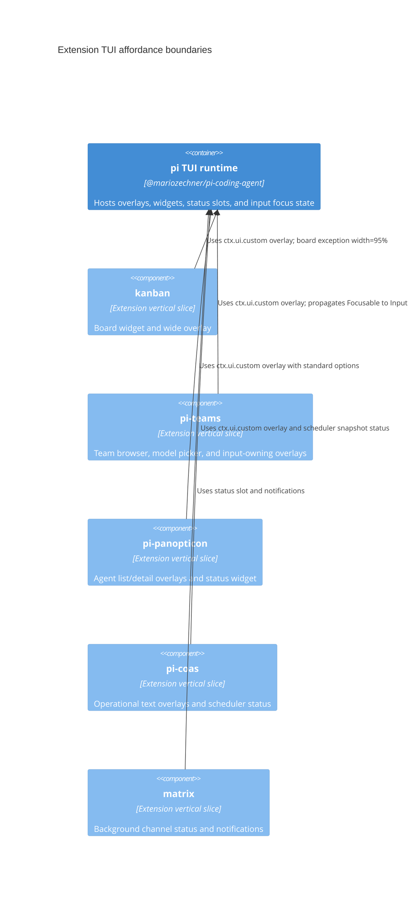

# TUI affordance review

Date: 2026-05-06

Scope: review terminal UI surfaces across extensions for coherent interaction patterns and terminal UX best practice. Review only; no production UI changes were made in this documentation pass.

Co-pilot: `gravitas` reviewed the direction and recommended using `termwright` captures as evidence for status slots, long overlays, Panopticon layout, and Teams selection/filter affordances.

## Validation and UX checks

Initial validation run during review:

```bash
npm test -- tests/architecture.test.ts tests/kanban-snapshot-render.test.ts tests/pi-coas-format.test.ts
```

Initial result: 3 files passed, 42 tests passed.

Termwright smoke checks run at 80x24 and 60x20 against a pi session with these extensions loaded:

```text
kanban, matrix, pi-coas, pi-panopticon, pi-teams
```

Captured surfaces:

- startup/status bar
- `/coas-status` at 80x24 and 60x20
- `/coas-doctor`
- `/teams` browser, filter mode, and detail view
- `/agents` / Panopticon list and detail view
- `/agent-list-mode`
- `/kanban` unavailable warning when no board path is configured

Termwright evidence confirmed the UI is generally cohesive, but also exposed narrow-width wrapping and slash-command ambiguity details that are harder to see in static code review.

## Current status

The extension TUIs are mostly cohesive. Shared strengths are accent titles, bordered overlays, dim help text, keyboard-only operation, `esc` close/cancel behavior, theme colors, and non-color state markers. Kanban remains the strongest render-quality reference because it has pure render functions and explicit width tests.

Findings 1–3 from the original review have been addressed in the implementation follow-up:

1. CoAS slash commands now pass scheduler snapshots.
2. Teams input-owning overlays now propagate `Focusable` state to child `Input` controls.
3. Panopticon list/detail UIs now use true overlay mode with standard overlay options.

Remaining gaps are smaller but still user-visible: mixed status-slot language, inconsistent long-content truncation/scroll affordances, help-text wording drift, and a command-selection ambiguity around `/agents` observed under termwright.

## Current surface inventory

| Extension       | TUI surfaces                                                                                               | Assessment                                                                 |
| --------------- | ---------------------------------------------------------------------------------------------------------- | -------------------------------------------------------------------------- |
| `kanban`        | Persistent widget, status slot, board overlay, detail/delete/move modal states                             | Strong reference implementation. Width behavior tested. Live board not captured without `KANBAN_DIR`. |
| `pi-teams`      | Browser overlay, detail overlay, model picker, target picker, status slot, prompts via editor/select/input | Good. Filter and selection affordances are clear; narrow-width help wraps awkwardly. |
| `pi-panopticon` | Agent widget below editor, status slot, agent overlay/detail, list-mode picker, `/send` notifications      | Good data presentation. Overlay mode now aligns with other extensions.     |
| `pi-coas`       | Text overlays for status/doctor/workspaces/schedules/scheduler, status slot                                | Simple and coherent. Command/tool scheduler state now aligns.              |
| `matrix`        | Status slot, notifications, `/matrix` notification                                                         | Minimal and appropriate for a background channel.                          |

## Coherent affordances already present

- **Borders and titles:** Most overlays use `DynamicBorder` plus accent/bold titles.
- **Help text:** Most overlays use dim, concise key hints.
- **Selection marker:** `>` is standardized in Kanban and Teams; Panopticon normalizes `SelectList`'s arrow to `>`.
- **Close/cancel:** `esc` is consistently supported.
- **Theme colors:** Extensions use theme colors instead of raw ANSI.
- **Render-path safety:** Architecture tests guard Panopticon render closures against sync `readAllPeers()` calls.
- **Width discipline:** Kanban has explicit 80-column render tests; termwright smoke checks show other overlays remain usable at 60 columns, with some help wrapping.
- **Keyboard-only operation:** All reviewed overlays can be operated without mouse input.

## Termwright observations

### Status bar cohesion

Startup captured this mixed convention:

```text
agents: active:1 idle:1 CoAS ✓ matrix: off
```

This is readable, but not fully standardized. `agents:` and `matrix:` use `<extension>: <state>`, while CoAS uses `CoAS ✓`. The inconsistency is cosmetic, but status slots are high-frequency UI and should converge incrementally.

### CoAS overlays

`/coas-status` and `/coas-doctor` render as centered overlays at both 80x24 and 60x20. The status output now includes internal scheduler state, matching callable tools.

At 60x20, the overlay remains usable, but the underlying screen bleeds through at the left edge because overlays render over existing content rather than clearing the area. That is acceptable for pi overlay mode, but reinforces the need for short labels and bounded lines.

### Teams browser and filter

The Teams browser is cohesive with the target pattern:

- `>` marks selected rows independent of color.
- `/` enters filter mode.
- filter input remains visible.
- `esc` first exits filter mode, then closes the overlay.

At 60 columns, the help text wraps:

```text
↑/↓ navigate · enter details · f form · m models · d
delete · / filter · esc close
```

This is still understandable, but future narrow-width tests should assert help wrapping intentionally.

### Panopticon overlays

`/agents ` with an explicit trailing space opens the Agent Panopticon overlay in standard overlay mode. The overlay now matches the cross-extension pattern: bordered panel, accent title, dim help, `>` selection marker, and `esc close`.

Agent detail also follows the same pattern, but long recent-activity content has no explicit scroll affordance. Current truncation to recent entries keeps it usable in normal cases.

### Slash-command ambiguity

Termwright exposed a command-selection ambiguity: typing `/agents` without a trailing space opened the Agent List Mode overlay in the tested session, while `/agents ` opened Agent Panopticon. This is likely slash-command completion/matching behavior around related commands (`/agents`, `/agents-mode`, `/agent-list-mode`).

Recommendation: treat this as a follow-up UX issue. Commands with shared prefixes should either resolve predictably on exact match or expose clearer command descriptions/completion ordering.

### Kanban live overlay

`/kanban` showed a clear warning when no board path was available:

```text
Warning: Kanban board not available — set KANBAN_DIR or create a 'kanban' directory
```

The unavailable-state affordance is good. The full live board was not captured in this termwright pass because no kanban board directory was configured; existing render tests remain the evidence for board width behavior.

## Findings

### 1. CoAS slash commands omitted scheduler snapshot — resolved

File:

```text
extensions/pi-coas/commands.ts
```

Original issue: CoAS tools passed scheduler state to `coasStatus()` and `coasDoctor()`, while slash commands did not. That could make `/coas-status` and `/coas-doctor` less accurate than model-callable tools.

Current status: resolved. Slash commands now pass `scheduler.snapshot()`.

### 2. Teams overlays with `Input` needed `Focusable` propagation — resolved

Files:

```text
extensions/pi-teams/team-picker.ts
extensions/pi-teams/team-overlay.ts
extensions/pi-teams/team-models.ts
```

Current status: resolved/verified. Input-owning custom components now implement `Component & Focusable` and propagate focus to child `Input` controls for IME cursor placement.

### 3. Panopticon overlays did not use overlay mode — resolved

Files:

```text
extensions/pi-panopticon/agent-overlay.ts
extensions/pi-panopticon/list-mode-command.ts
```

Current status: resolved. Panopticon now uses the standard overlay options:

```ts
{
  overlay: true,
  overlayOptions: {
    width: "70%",
    minWidth: 60,
    maxHeight: "80%",
    anchor: "center",
    margin: 2,
  },
}
```

Kanban remains the exception with wider board layout needs.

### 4. Status slot language is not fully standardized

Current examples:

```text
matrix: off
CoAS ✓
agents: active:1 idle:1
teams: ready
```

Recommended convention:

```text
<extension>: <state> [count/details]
```

Examples:

```text
coas: on ✓
matrix: on msg:2
agents: active:1 idle:1
teams: ready
```

Permit suffix symbols where they improve scanability. Treat status text changes as user-visible: avoid changing strings that scripts or tests may consume without a migration note.

### 5. Long read-only overlays vary in truncation/scroll behavior

`pi-coas` truncates command output through `widgetLines(text, 20)` and shows `...` when needed.

Teams and Panopticon detail overlays render bounded current content in common cases, but do not present explicit scroll affordances for potentially long free-form content. Future long read-only overlays should either:

- truncate explicitly with `...`, or
- support scrolling with `↑/↓ scroll · esc close`.

### 6. Key hint wording varies

Observed variants:

```text
esc close
esc cancel
esc back
backspace list
enter detail
enter details
```

Recommended phrasing:

```text
↑/↓ navigate · enter select/detail · esc close
type to filter · ↑/↓ navigate · enter choose · esc close
y confirm · n cancel · esc close
```

Use `esc close` for overlays that close, `esc cancel` for destructive/confirmation flows, and `esc back` only when returning to a prior view without closing.

### 7. Slash-command exact-match ambiguity

Termwright observed `/agents` opening the list-mode chooser unless entered as `/agents `.

Recommendation: add a focused slash-command completion test or manual regression note for related command prefixes:

```text
/agents
/agents-mode
/agent-list-mode
```

Exact command names should win over prefix/fuzzy matches when the user presses enter.

## Target affordance pattern

Use this pattern for most custom overlays:

```text
╭────────────────────────────╮
  <Accent Bold Title> — optional count/state
  <optional search/input>
  <content/list/detail>
  <dim help text>
╰────────────────────────────╯
```

Standard interaction rules:

- `esc` closes or cancels.
- `↑/↓` navigates lists.
- `enter` selects or opens detail.
- `/` starts filtering in list browsers.
- `>` marks selection independent of color.
- Use theme colors only; avoid raw ANSI.
- Never rely on color alone for semantic state.
- Ensure rendered lines do not exceed the provided width.

Standard overlay options:

```ts
{
  overlay: true,
  overlayOptions: {
    width: "70%",
    minWidth: 60,
    maxHeight: "80%",
    anchor: "center",
    margin: 2,
  },
}
```

Exceptions:

- Kanban board: `width: "95%"` for multi-column layout.
- Tiny status-only commands: `ctx.ui.notify(...)` is sufficient.

## Priority recommendations

1. ✅ Pass scheduler snapshots into `/coas-status` and `/coas-doctor`.
2. ✅ Add or verify `Focusable` propagation in Teams overlays that own an `Input`.
3. ✅ Make Panopticon list/detail UIs true overlays, with layout regression review.
4. ✅ Add narrow-width/snapshot render tests for non-Kanban overlays, starting with Teams and Panopticon.
5. ✅ Standardize status slot language incrementally.
6. ✅ Add a lightweight TUI affordance checklist to future overlay PRs.
7. ✅ Add a slash-command exact-match regression check for `/agents` vs `/agents-mode` / `/agent-list-mode`.

## Completed work

All priority recommendations were implemented and reviewed by `gravitas` in commit `11436c9` (2026-05-07):

| # | Item | Status |
|---|------|--------|
| 1 | Pass scheduler snapshots into `/coas-status` and `/coas-doctor` | ✅ |
| 2 | Add or verify `Focusable` propagation in Teams overlays | ✅ |
| 3 | Make Panopticon list/detail UIs true overlays | ✅ |
| 4 | Add narrow-width render tests for Teams/Panopticon | ✅ |
| 5 | Standardize status slot language incrementally | ✅ |
| 6 | Add TUI affordance checklist to future overlay PRs | ✅ |
| 7 | Slash-command exact-match regression check | ✅ |

> Historical implementation notes: each todo item cycled through `[~]` → `[R]` → `[x]` with dated validation logs. These details have been removed to keep the review focused on living guidance. See git history (`git log --oneline --grep="11436c9"`) for full traceability.

> **Note:** This document was active during the implementation pass. The kanban/coas UX reviews contain additional concrete findings not all reflected here; see `docs/archive/` for those originals.

## PR checklist for future overlays

- `esc` closes or cancels.
- Inputs propagate `Focusable` state for IME cursor placement.
- State has non-color markers (`>`, `✓`, `!`, labels, or counts), not color alone.
- Render output is width-bounded and tested at narrow widths.
- Long content either truncates explicitly or scrolls with visible hints.
- Help text uses standard wording.
- Error states are shown in warning/error theme colors with readable text.
- No raw ANSI in render paths unless there is a documented terminal-control reason.
- Multiple interactive controls have a clear focus order.
- Related slash commands have predictable exact-match behavior.

## Architecture note

This review supports the existing architecture direction: keep each extension as an isolated vertical slice, but converge on shared UI conventions. Do not introduce a heavy cross-extension UI framework unless repeated implementation work becomes a measurable problem.



Canonical TUI guidance lives in [`skills/tui-design/SKILL.md`](../skills/tui-design/SKILL.md); use that skill before designing or changing terminal UI surfaces.
