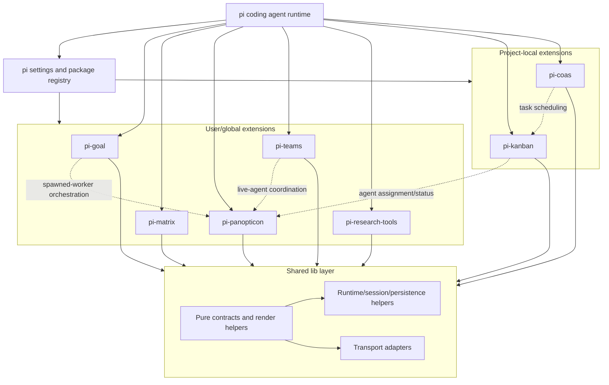
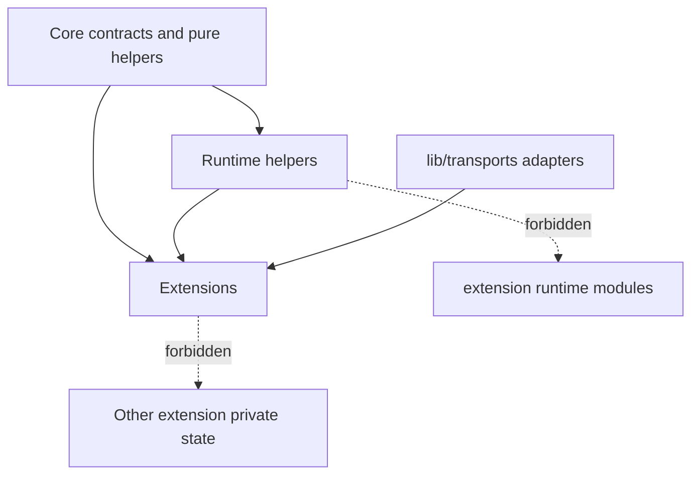
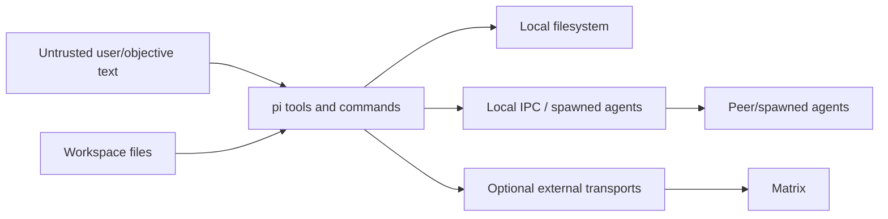

# Current Architecture

`pi-tools-and-skills` is a local-first extension workspace for the pi coding agent. This document records the current architecture map, state ownership, trust boundaries, and active risks. Broader design rationale remains in `docs/architecture.md` and ADRs under `docs/adr/`.

## Architecture map

## Extension roles

| Extension | Scope | Primary role | State owner |
| --- | --- | --- | --- |
| `pi-goal` | user/global | Active goal tracking and completion audit workflow | Goal files under the active workspace, including `.pi-goal/` |
| `pi-panopticon` | user/global | Agent registry, heartbeat/status inspection, peer messaging, spawned-agent orchestration | Panopticon registry/session state |
| `pi-teams` | user/global | Declarative team workflows such as council, navigator, and research | Team definitions and team run session state |
| `pi-matrix` | user/global | Human-facing Matrix transport integration | Matrix configuration/session state |
| `pi-research-tools` | user/global | Research helper tools and fixtures | Research tool configuration/fixtures |
| `pi-kanban` | project-local | Event-sourced project task board | Kanban event log in the owning workspace |
| `pi-coas` | project-local | Cooperative agent scheduling over kanban tasks | COAS schedule/runtime files in the owning workspace |

## Shared library boundaries

- Core `lib/` modules provide pure contracts and formatting helpers and must not import Node filesystem, OS, or process-spawning APIs.
- Runtime `lib/` modules own shared filesystem, settings, session, spawn, and registry behavior.
- Transport adapters live under `lib/transports/` and depend on lower-level contracts/services rather than extension runtime modules.
- Extensions may import shared `lib/` services. Shared `lib/` code must not import extension runtime code.
- Cross-extension cooperation must use documented public surfaces: tools, commands, session events, or shared library services.

## State ownership and persistence

| State class | Owner | Expected write pattern |
| --- | --- | --- |
| Append-only task/event logs | Owning extension (`pi-kanban`, similar event sources) | `appendLogLine()` or an owning append API |
| Full-file JSON/Markdown state | Owning extension or shared runtime helper | `writeFileAtomic()` / `updateJsonFile()` where practical |
| Session spool/log state | Shared session runtime helpers | Session-spool/session-log APIs |
| Agent registry and spawn state | Panopticon/shared spawn services | Registry/spawn APIs |
| Team run state | `pi-teams` | Team run APIs and documented result paths |

Atomic rename prevents partial reads but does not serialize competing read/modify/write cycles. Concurrent writers must use an append-only owner, an advisory lock/domain transaction, or a documented last-writer-wins exception.

## Trust boundaries

- Treat user objectives, task text, Matrix messages, and agent messages as untrusted input.
- Tool implementations must validate paths and avoid interpreting untrusted text as shell/code.
- Workspace files are the durable authority for local-first state, but extension-private files remain private to their owning extension.
- Matrix and other network transports are optional outer-boundary integrations; local agent coordination should prefer IPC-backed mechanisms.
- Spawned agents and peer messages are coordination channels, not authority to bypass repository validation or completion audits.

## Current risks and follow-up work

1. **Concurrency discipline:** Continue moving state writes through `lib/file-persistence.ts` helpers or documented domain-specific transactions.
2. **README contract clarity:** Keep each extension README explicit about stable tools/commands, provisional surfaces, and cross-extension dependencies.
3. **Progress UX:** Keep long-running `pi-teams`/`pi-goal` work visible with phase, elapsed time, last action, cancellation affordance, and artifact paths.
4. **Transport diagnostics:** Keep `globalThis`/transport registry behavior documented with diagnostics and fallback behavior.

## Validation anchors

- `tests/architecture.test.ts` enforces practical dependency layering, extension runtime-state boundaries, UX/tool policy checks, and persistence-discipline exceptions.
- `docs/architecture.md` is the detailed reference for package setup boundaries, shared library layering, runtime state boundaries, persistence discipline, and TUI standards.
