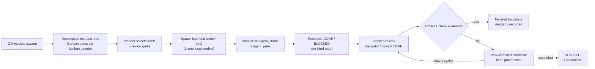

# /swarm mode — pi-panopticon feature design

- Date: 2026-07-23
- Status: Design draft for council review and Principal sign-off
- Owner: gm-pi-tools-and-skills (pi-panopticon package)
- Dependencies:
  - Action A (T-793): pi-coas workload-governance/model-routing consumer (`coas_governance_resolve` advisory tool + `maybeGovernanceRoute` actuation helper). `/swarm` will be the first concrete caller of `maybeGovernanceRoute` for cheap-worker model selection.
  - Action B (T-791): CoAS schedule delivery targeting guard (CoAS ADR-0008 in `coas/docs/adrs/0008-schedule-delivery-targeting-guard.md` — distinct from pi-tools ADR 008 `008-browser-toggle-search.md`).

## What /swarm is

A pi-panopticon feature (tool + command) that lets a General Manager invoke a deterministic, bounded, repo-local worker-pool orchestration for a large, decomposable task. It codifies the orchestration as code, not as an LLM-read skill or emergent topology.

## What /swarm is not

- Not a CoAS skill.
- Not a new agent runtime, custom VCS, or emergent/dynamic topology.
- Not a replacement for kanban/STATE authority (Gravitas remains single-writer).
- Not a swarm-scale failure-mode engine (split-brain/merge-conflict/megafile fixes are for ~1000 commits/sec; we are at human tempo).

## High-level flow



## Placement

`/swarm` lives in the standalone `extensions/pi-teams/` package alongside the Teams protocol handlers.

Reasoning:
- It is not a team protocol (`teams/` protocols are review/debate/research patterns with a fixed panel/judge shape).
- It is not a skill (skills are prompt/procedure guidance; /swarm is deterministic orchestration code).
- It is a higher-level primitive built on the existing panopticon surface: `spawn_agent`, `rpc_send`, `agent_status`, `agent_peek`, `kill_agent`, `team_run`, and the kanban board API.

Proposed files:
- `extensions/pi-teams/swarm/swarm-types.ts`
- `extensions/pi-teams/swarm/swarm-planner.ts` (task-tree decomposition + brief generation)
- `extensions/pi-teams/swarm/swarm-runner.ts` (worker pool lifecycle + monitoring)
- `extensions/pi-teams/swarm/swarm-reconciler.ts` (DONE/BLOCKED reconciliation)
- `extensions/pi-teams/swarm/swarm-gates.ts` (artifact evidence + stacked review invocation)
- `extensions/pi-teams/swarm/swarm-commands.ts` (`/swarm` command)
- `extensions/pi-teams/swarm/swarm-tools.ts` (`swarm_run` tool registration)
- `extensions/pi-teams/swarm/index.ts` (exports)
- Wire into `extensions/pi-panopticon/index.ts`.

## API / invocation surface

### Command

```text
/swarm <goal> [--profile fast|balanced|thorough] [--wip N] [--dry-run]
```

### Tool

```text
swarm_run goal="..." profile="balanced" wip=3 dry_run=true async=false
```

Parameters:
- `goal`: high-level outcome statement.
- `profile`: `fast` (minimal workers, no council unless high-stakes), `balanced` (navigator + council for architecture), `thorough` (full stacked review).
- `wip`: max in-progress **swarm-claimed** workers (default 3, hard cap 3). The global kanban WIP limit defaults to 3 (`KANBAN_WIP_LIMIT` in `extensions/pi-kanban/board.ts`), so `/swarm` will use a per-swarm claim budget that counts only cards tagged with this `swarmId` toward its cap, without raising the global limit for non-swarm kanban users.
- `dry_run`: default `true`. Return the planned task tree and worker briefs without spawning. Spawning workers is opt-in (`dry_run=false` or `--execute`).
- `async`: default `false`. If `true`, return immediately with `swarmId` and deliver progress/completion as follow-up messages, matching the `team_run` pattern.

Returns:
- `swarmId`
- `kanbanBoard`: created/moved cards
- `workers`: spawned agent names and briefs
- `reviews`: review results per gate
- `status`: `running | done | blocked`

## Reuse of existing wiring

| Existing surface | How /swarm uses it |
|---|---|
| `spawn_agent` / `rpc_send` | Spawn cheap workers with scoped briefs. |
| `agent_status` / `agent_peek` | Stall detection and progress monitoring. |
| `kill_agent` | Replace non-responsive workers. |
| `team_run` (navigator, llm-council, FIRE) | Stacked review gates. |
| `kanban_*` tools | Task tree state, WIP limit, DONE/BLOCKED tracking. |
| `coas_governance_resolve` / `maybeGovernanceRoute` (Action A) | Resolve cheap local models for worker prompts; `/swarm` is the first concrete caller of `maybeGovernanceRoute`. |
| CoAS ADR-0008 delivery guard (Action B / T-791) | Ensure OODA schedules don't hijack task-scoped swarm workers. |
| `pi-agent-orchestration` skill | Brief template, DONE/BLOCKED format, stall-nudge rules. |

## Bounds and gates

- **WIP-limited**: default 3, hard cap 3, enforced by a per-swarm kanban claim budget. The global kanban WIP limit remains at its default (3); swarm cards are tagged `swarm:<swarmId>` and the runner refuses to claim more than its budget regardless of global availability.
- **Controlled topology**: planner decomposes once into a dependency-ordered task tree (edges implicit in decomposition order); no dynamic re-decomposition mid-run. Workers never communicate peer-to-peer; all state flows through the orchestrator.
- **No blind retry**: a failed worker produces a `BLOCKED` card; a material successor is only started after review and fresh provenance. Max 3 repair cycles per task; exceeded cycles move the card to `BLOCKED` and notify the GM.
- **Artifact/check evidence**: each DONE worker must produce a verifiable artifact (file, test result, diff) plus checkable evidence (automated test/lint/diff check). `team_run` review (navigator/council/FIRE) inspects evidence, not just prose.
- **Parallel write isolation**: code-writing tasks are sequential or isolated by worktree/file; parallel workers are restricted to read-only/scanning tasks to avoid clobbering the shared cwd.
- **Schedule-safe**: relies on CoAS ADR-0008 (T-791) so workspace schedules don't deliver into task-scoped swarm workers.
- **Model economics**: workers use cheap local models via Action A; planner/review uses frontier only when justified.
- **Swarm-level ceiling**: a wall-clock TTL (default 60 minutes for `fast`, 120 for `balanced`, 240 for `thorough`) plus a total-worker-minutes soft cap. On ceiling breach, move in-progress cards to `BLOCKED`, record partial-progress evidence, and transition swarm to `blocked`.
- **Abort/teardown**: on GM cancellation, session shutdown, or unrecoverable error: call `kill_agent` for each worker, move in-progress cards to `BLOCKED`, emit `aborted` status. `session_shutdown` already calls `spawner.shutdownAll()`, so swarm-level cleanup focuses on kanban transitions + status record.
- **Planner decomposition guard**: if the planner cannot decompose the goal, the swarm returns `blocked` with a reason rather than spinning.

### Lifecycle management commands

- `/swarm status <swarmId>` or `swarm_status(swarmId)` — show running/completed/blocked workers, kanban cards, and review results.
- `/swarm list` or `swarm_list()` — list active/recent swarms.
- `/swarm cancel <swarmId>` or `swarm_stop(swarmId)` — abort a swarm (kill workers, block in-progress cards, record status).

These can also be exposed as runtime entities so existing `runtime_status` / `runtime_stop` apply.

### Kanban provenance

Each swarm card carries a `swarm:<swarmId>` tag. Worker briefs are stored in `pi-kanban/tasks/T-NNN.md` task files for provenance. The GM remains the sole kanban writer — all `kanban_*` calls flow through the GM's session, avoiding concurrent-write conflicts with Gravitas.

## Council / ADR path

1. This design doc → `llm-council` review. **Completed 2026-07-23 — APPROVE-WITH-CHANGES resolved.**
2. Address council findings → update design. **Done in this revision.**
3. Write ADR-036: `/swarm — pi-panopticon bounded worker-pool orchestration`.
4. Principal sign-off.
5. Implement in `extensions/pi-teams/swarm/`.
6. Validation: `npm run check`, `npm test`, swarm-specific tests covering WIP enforcement, artifact-gate failure, timeout/cleanup, abort/teardown, and kanban state transitions.

## Open questions (documented, not blockers for v1)

1. Should the planner be a deterministic function over the goal, or should it invoke a single frontier planner model call? **Decision:** deterministic decomposition first, optional planner model for ambiguous goals.
2. Should `/swarm` mutate kanban directly, or should it return a plan and let the GM confirm? **Decision:** `dry_run=true` by default; explicit opt-in (`dry_run=false` / `--execute`) to spawn workers.
3. Should worker briefs be stored as task files (`pi-kanban/tasks/T-NNN.md`) or as transient RPC payloads? **Decision:** task files for provenance, tagged `swarm:<swarmId>`.
4. `swarm_resume` for interrupted recovery: scan kanban for `swarm:<swarmId>` cards and reconstruct state. **Deferred to v2.**
5. Concurrent swarm semantics: multiple swarms running simultaneously would need namespaced task IDs and separate claim budgets. **Deferred to v2; v1 runs one swarm at a time per GM session.**
6. Per-worker or total swarm cost/token budget ceiling. **Deferred to v2; TTL and worker-minutes cap cover v1.**
