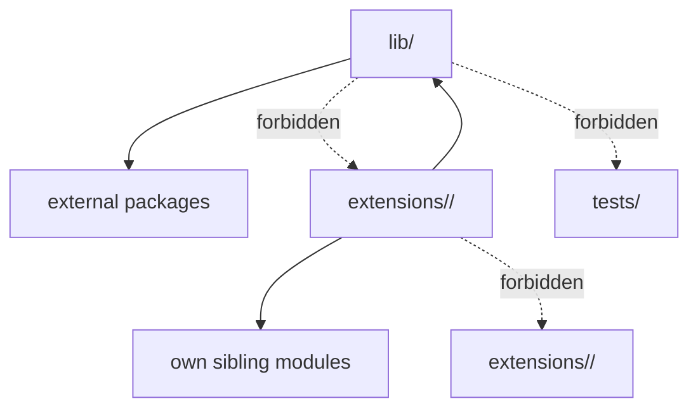
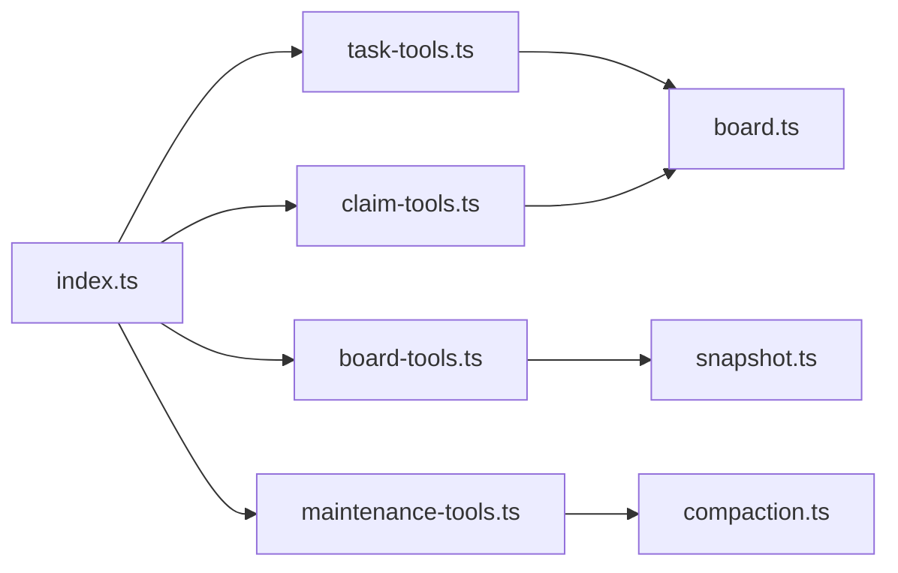
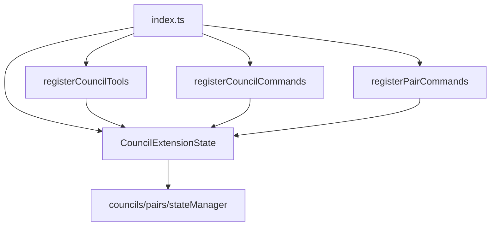

# Extension Refactor Plan

## Status

Planned only. No runtime code changes yet.

Reviewed with Alice and Mawhrin-Skel on 2026-04-25. Both recommended narrowing the first PR to guardrails only.

## Problem

The extension codebase is healthy but unevenly factored:

| Extension | Files | Lines | Main pressure |
| --- | ---: | ---: | --- |
| `pi-llm-council` | 19 | ~3540 | `index.ts` owns too much session/tool/command wiring |
| `pi-panopticon` | 13 | ~2973 | `ui.ts`, `spawner.ts`, `health.ts` are broad modules |
| `kanban` | 8 | ~2170 | `index.ts` contains 14 inline tool definitions |
| `pi-cheatsheets` | 8 | ~869 | Mostly fine |
| `matrix` | 6 | ~488 | Mostly fine |

`tests/architecture.test.ts` also still has pi-panopticon-era assumptions:

- Duplicate `lib/ must not import from extensions/` test.
- Cross-extension and cycle checks target only `pi-panopticon`.
- JSDoc module-comment rule targets only `pi-panopticon`.
- Kanban has a blanket parameter-count exemption.

## Guardrails

Rules for all refactor PRs:

1. No behavior changes unless explicitly called out.
2. No persistence migration.
3. No model/default/secret setup reshuffle.
4. Preserve extension isolation; move shared code toward `lib/`, never sideways between extensions.
5. Preserve explicit activation order in each `index.ts`; no import-time registration side effects.
6. Pass the same state object to extracted registrars; do not introduce module-level singletons.

Rules 1-4 are covered by PR 1 fitness tests. Rules 5-6 are extraction-review invariants: keep them explicit in the PR checklist for each split because static enforcement would be brittle and misleading.

## PR Sequence

### PR 1 — Architecture guardrails only

Scope:

- Remove duplicate architecture test.
- Generalize cross-extension isolation to all `extensions/*`.
- Generalize cycle checks to all extension folders.
- Generalize JSDoc module-comment rule to all extension `.ts` files, or document any current failures before enforcing.
- Audit/remove the kanban blanket parameter-count exemption if current code allows; otherwise replace it with narrow exceptions.
- Add registration smoke tests: activating each extension should register the expected tools/commands.

Non-scope:

- No extension module splits.
- No helper abstractions.
- No pair/council command or persistence-key renames.

### PR 2 — Kanban mechanical split

Start here because it is the safest: tool behavior is concentrated in board helpers and `index.ts` is mostly adapter boilerplate.

Target shape:

Goals:

- Keep `index.ts` as bootstrapping only.
- Keep each tool contract close to its execute adapter.
- Avoid a generic `registerTools()` helper unless duplication remains painful after extraction.

### PR 3 — Panopticon UI/tool split

Medium risk. Preserve timers and lifecycle order.

Likely splits:

- `ui.ts` → status widget, agents overlay, alias command/list-mode command helpers.
- `spawner.ts` → tool registration adapters vs spawn orchestration.
- `health.ts` → status/nudge core vs tool adapters.

Critical invariant: keep the render-path safety rule with whichever files render UI; no `readAllPeers()` in paint/render closures.

### PR 4 — Pi LLM Council registration split

Highest risk. Do after the mechanical patterns are proven.

Target shape:

Goals:

- Pass one explicit `CouncilExtensionState` object into all registrars.
- Keep `session_start` slot initialization in a single visible location.
- Preserve `refreshCouncilStatus(ctx, councils, pairs)` calls after every mutation.
- Avoid renaming `pair-command.ts` / `pair-commands.ts` in this PR.

### Later — optional cleanups

Only after the above PRs land cleanly:

- Rename confusing pair files with a focused compatibility-aware PR.
- Consider shared registration helpers if at least two extensions have converged on the same adapter shape.
- Consider shared picker/search primitives only after another extension needs them.

## Live Smoke Checklist

Before merging each extraction PR:

- `/council-form`, `/council-list`, `ask_council` debate.
- `/pair-form`, `pair_consult`, `ask_council` with `mode: "PAIR"`.
- Kanban create → claim/pick → note/block/unblock → complete → snapshot.
- Panopticon `/agents`, `/alias`, `agent_status`, `agent_send`, spawn/list/kill loop.

## Agent Feedback Incorporated

Alice:

- First PR should be guardrails only.
- Council is highest risk due to closure-captured session state.
- Add extension activation/registration smoke tests.

Mawhrin-Skel:

- Cut shared helpers and pair renames from the initial effort.
- Kanban first after guardrails; council last.
- Watch panopticon render-path and timer behavior.
- Do not rely on import side effects; preserve state identity explicitly.
