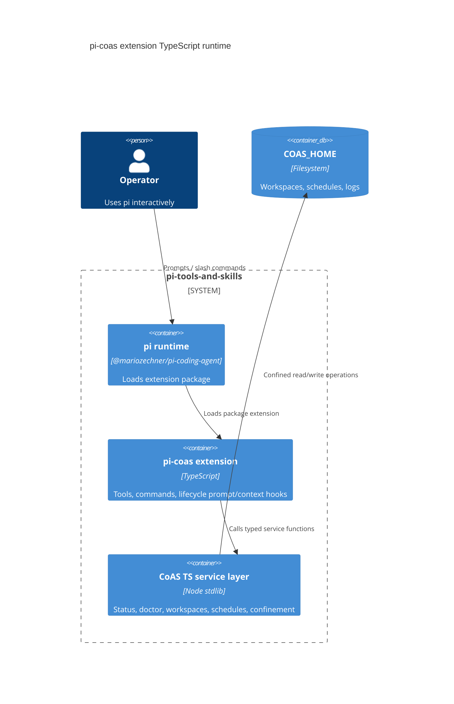
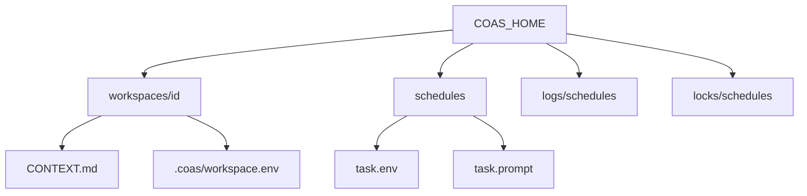

# Pi CoAS Extension Architecture

## Purpose

`extensions/pi-coas` is the in-pi TypeScript control surface for local CoAS
state. It manages diagnostics, workspaces, and file-backed schedules under
`${COAS_HOME:-~/.coas}` without depending on a sibling `~/git/coas` checkout or
shell scripts.

## C4 container view



## Tool/command split

```mermaid
flowchart TD
  Agent[LLM agent] --> Tools[Typed tools]
  Operator[Human operator] --> Commands[Slash commands]

  Tools --> Status[coas_status]
  Tools --> Doctor[coas_doctor]
  Tools --> Workspaces[workspace list/read/update/create]
  Tools --> Schedules[schedule list/add/run/remove]

  Commands --> StatusCmd[/coas-status]
  Commands --> DoctorCmd[/coas-doctor]
  Commands --> WorkspaceCmd[/coas-workspaces]
  Commands --> ScheduleCmd[/coas-schedules]
  Commands --> CronCmd[/coas-cron-install + /coas-cron-uninstall]

  CronCmd --> Disabled[Disabled until standalone runner is reviewed]
```

## Storage contract



The extension preserves the existing workspace and schedule file shapes so data
created by the earlier CoAS scripts remains readable.

## Safety notes

- There is no `COAS_DIR` and no default `~/git/coas` dependency.
- Non-cron behavior uses Node stdlib filesystem APIs, not shell scripts.
- Cron install/uninstall commands currently report disabled because there is no standalone TypeScript runner for cron to invoke safely.
- `coas_schedule_run` defaults to dry-run and refuses non-dry-run execution.
- `coas_workspace_update` uses pi's file mutation queue, rejects symlinked context files, and confines path selectors.
- Matrix room bootstrap is intentionally deferred.
