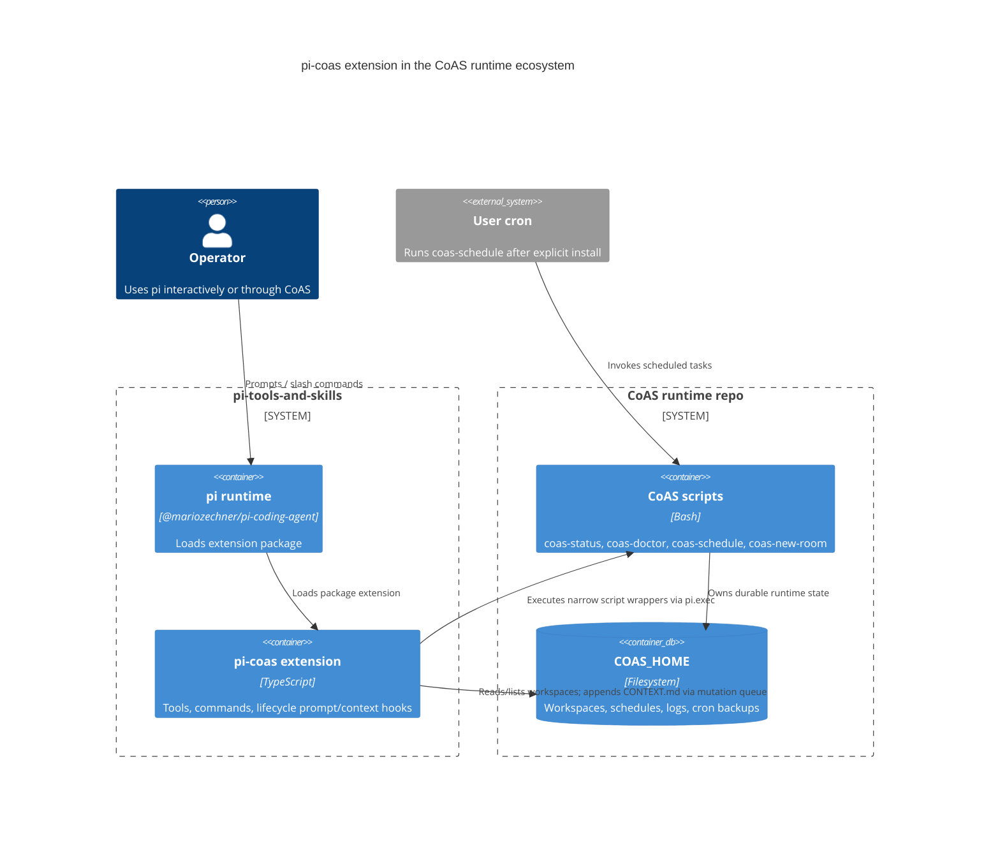

# Pi CoAS Extension Architecture

## Purpose

`extensions/pi-coas` is the in-pi control surface for the CoAS runtime repo. It
wraps `~/git/coas/scripts/*` with typed tools and confirmed slash commands so
agents do not need to improvise raw shell for diagnostics, workspace memory, or
file-backed schedules.

## C4 container view



## Tool/command split

```mermaid
flowchart TD
  Agent[LLM agent] --> Tools[Typed tools]
  Operator[Human operator] --> Commands[Slash commands]

  Tools --> Status[coas_status]
  Tools --> Doctor[coas_doctor]
  Tools --> Workspaces[workspace list/read/update/create]
  Tools --> Schedules[schedule list/add/run/remove]

  Commands --> StatusCmd[/coas-status]
  Commands --> DoctorCmd[/coas-doctor]
  Commands --> WorkspaceCmd[/coas-workspaces]
  Commands --> ScheduleCmd[/coas-schedules]
  Commands --> CronCmd[/coas-cron-install + /coas-cron-uninstall]

  CronCmd --> Confirm{UI confirm}
  Confirm -->|yes| Script[coas-schedule install/uninstall-cron]
  Confirm -->|no| Cancel[No mutation]
```

## Safety notes

- Cron install/uninstall is deliberately command-only and requires UI confirmation.
- `coas_schedule_run` defaults to dry-run.
- `coas_workspace_update` uses pi's file mutation queue and appends only.
- Script output is truncated before it enters model context.
- If `~/git/coas` is absent, the extension hides its status indicator and tools fail with explicit script-not-found errors.
