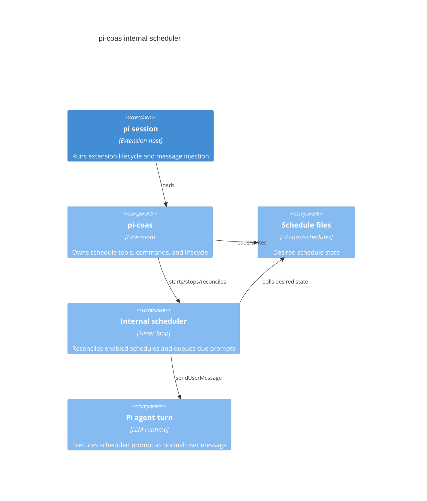

# Pi CoAS internal scheduler plan

## Goal
Replace crontab-oriented CoAS scheduling with a pi-hosted internal scheduler. Schedule files remain the desired state; active in-memory timers become runtime reality while pi is open.

## Constraints
- Preserve existing schedule file format and model-callable `coas_schedule_add` parameters for compatibility.
- Do not execute schedules outside pi.
- Do not modify user crontab.
- Keep schedule execution explicit: inject a user message into pi when a schedule is due.
- Keep implementation small and testable with pure helpers for time matching.

## Architecture

## Acceptance criteria
- `pi-coas` starts/stops an internal scheduler on session lifecycle.
- Schedule add/remove reconciles in-memory timers.
- `/coas-schedules`, `coas_status`, and `coas_doctor` report internal scheduler state instead of crontab state.
- Cron install/uninstall commands are replaced by internal scheduler commands/status.
- Tests cover due-time matching and schedule prompt rendering.
