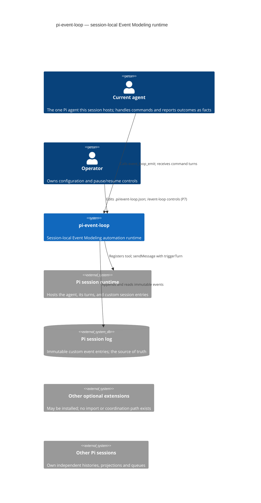
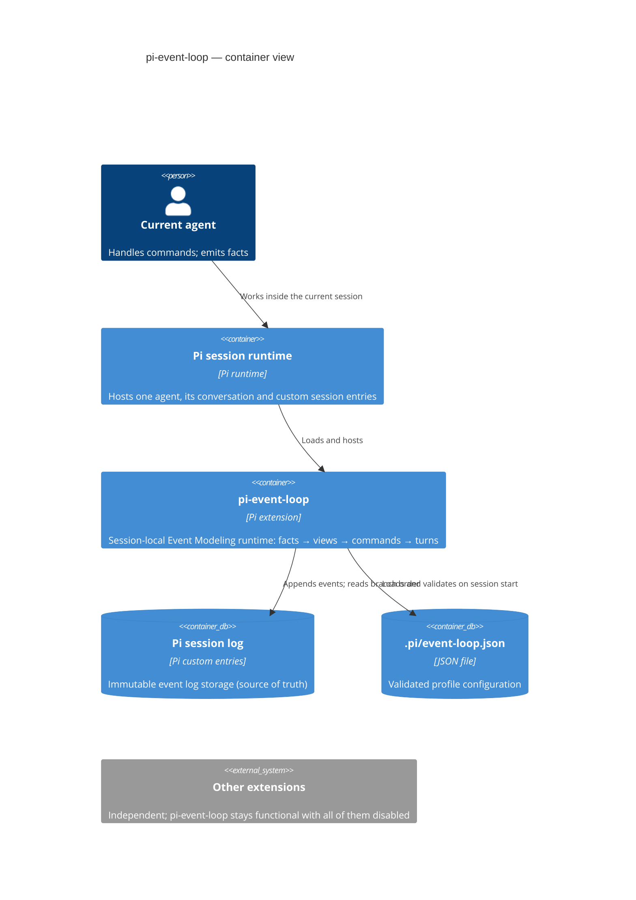
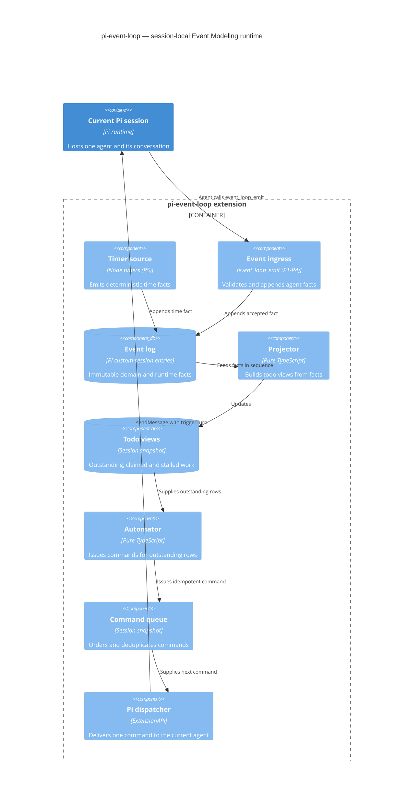

# pi-event-loop — C4 architecture, isolation audit, and AC coverage

**Scope:** P1-P4 modules (config, event log, ingress, projections, automator, command queue,
dispatcher) at commit `7da1b6b` on `t887/pi-event-loop-docs`.
**Source of truth:** [`extensions/pi-event-loop/SPEC.md`](../extensions/pi-event-loop/SPEC.md)
(§4-§5 diagrams, §20 acceptance criteria AC-1..26, §21 definition of done).

P5+ (session-state, timers, lifecycle hooks, loop-protection enforcement, operator controls,
retraction slices) is owned by sibling workers and marked BLOCKED-P* in the audit table below;
this doc records coverage, not implementation.

## 1. System context (C4)

pi-event-loop is a session-local automation runtime for exactly one Pi agent. There are no
relationships to other extensions or other Pi sessions — isolation is a design constraint
(SPEC §2), audited in §4 of this document.



Non-relationships (deliberate, SPEC §2): no Rel to `otherExt` or `otherSession` exists — no
imports, messaging, event sharing or agent routing between them.

## 2. Containers



## 3. Components

Port of SPEC §4; runtime wiring of dispatcher/queue/ingress into Pi lifecycle hooks is P5.



Mandatory separation (SPEC §9, AC-9): projectors never issue commands and automators never
interpret events. Enforced by `tests/architecture/pi-event-loop-isolation.ts` (import direction).

### Runtime cycle

Port of SPEC §5; `agent_settled` wiring is P5.

```mermaid
sequenceDiagram
  participant A as Current agent
  participant I as Event ingress
  participant L as Event log
  participant P as Projector
  participant V as ReviewsDue view
  participant M as Automator
  participant Q as Command queue
  participant Pi as Pi runtime

  A->>I: event_loop_emit(WorkCompleted)
  I->>L: Append immutable fact
  L->>P: Apply next event
  P->>V: Open todo work-42
  V->>M: Outstanding row
  M->>Q: Queue ReviewWork(work-42)
  I-->>A: Accepted; command queued
  A-->>Pi: Current turn settles
  Pi->>Q: agent_settled
  Q->>Pi: sendMessage(ReviewWork, nextTurn)
  Pi->>A: Start command turn
  A->>I: event_loop_emit(ReviewAccepted)
  I->>L: Append outcome with causation metadata
  L->>P: Apply next event
  P->>V: Complete todo work-42
```

## 4. Isolation audit (SPEC §2; AC-23, AC-24, AC-25)

Evidence collected at `7da1b6b`; guards live in `tests/architecture/pi-event-loop-isolation.ts`.

**External import inventory** (`grep -rhn 'from "' extensions/pi-event-loop/*.ts | grep -o 'from "[^"]*"' | sort | uniq -c`):
only intra-extension relative imports (`./…`), node builtins (`node:path`, `node:crypto`,
`node:fs`, `node:fs/promises`), the Pi host API (`@earendil-works/pi-coding-agent`), the tool
schema library (`@sinclair/typebox`), and shared extension-neutral helpers
(`../../lib/tool-result.js`). Nothing else.

**Zero imports from other extension directories** — `grep -rnE "import .*(extensions/|pi-goal|pi-teams|pi-kanban|pi-coas|panopticon|pi-matrix|pi-boost|pi-doctor|pi-bionic|file-watch)" extensions/pi-event-loop/*.ts` → no matches. The only textual `pi-boost` occurrence is a comment in `dispatcher.ts:120` crediting a polling pattern; it imports nothing.

**No OODA / Panopticon / CoAS / cross-session logic** — `grep -rniE "\b(ooda|panopticon|coas|agent_send|mailbox|intersession|crosssession)\b" extensions/pi-event-loop/*.ts` → no matches. The automator performs no domain reasoning (SPEC §10); no experiment/review/panopticon semantics exist in any module.

**Two-session independence (AC-23):** all mutable state lives in one `EventLoopRuntime` instance created per extension instance (`createEventLoopRuntime()`); the event log is stored as Pi custom session entries scoped to the session branch; two sessions reading the same `.pi/event-loop.json` share nothing. Guard test: `tests/pi-event-loop-ac-coverage.test.ts` ("two sessions keep independent projections, queues and deliveries").

**Runs with every other extension disabled (AC-24):** module-level dependencies are the pi host
API, node builtins, `@sinclair/typebox`, and `lib/tool-result.js` — all present without any
optional extension. Enforced by the import-allowlist guard test.

## 5. Example Event Model profile

Condensed `.pi/event-loop.json` profile (SPEC §6) plus a compensation slice (SPEC §13, AC-22):
retraction is expressed as configured facts, views and commands — history is never rewritten.

```json
{
  "version": 1,
  "activeProfile": "default",
  "profiles": {
    "default": {
      "emissionPolicy": "command-contract",
      "events": {
        "work.requested": { "description": "A unit of work is ready.", "allowAgentEmit": false, "requiredPayload": ["workId"] },
        "work.completed": { "description": "The requested work completed.", "allowAgentEmit": true, "requiredPayload": ["workId", "resultPath"] },
        "review.accepted": { "description": "The review accepted the work.", "allowAgentEmit": true, "requiredPayload": ["workId"] },
        "review.acceptance-retracted": {
          "description": "A previously accepted review is retracted.",
          "allowAgentEmit": true,
          "allowWithoutCommand": true,
          "requiredPayload": ["workId", "correctsEventId", "reason"]
        }
      },
      "commands": {
        "review-work": { "message": "Review the completed work.", "expectedEvents": ["review.accepted", "review.rejected"] },
        "correct-review": { "message": "Correct the retracted review.", "expectedEvents": ["review.accepted", "review.rejected"] }
      },
      "views": {
        "reviews-due": {
          "type": "todo",
          "openOn": [{ "event": "work.completed", "keyFrom": "/workId" }],
          "closeOn": [{ "event": "review.accepted", "keyFrom": "/workId" }, { "event": "review.rejected", "keyFrom": "/workId" }]
        },
        "corrections-due": {
          "type": "todo",
          "openOn": [{ "event": "review.acceptance-retracted", "keyFrom": "/workId" }],
          "closeOn": [{ "event": "review.accepted", "keyFrom": "/workId" }, { "event": "review.rejected", "keyFrom": "/workId" }]
        }
      },
      "automations": [
        { "id": "review-completed-work", "view": "reviews-due", "issue": "review-work" },
        { "id": "correct-retracted-review", "view": "corrections-due", "issue": "correct-review" }
      ],
      "timers": []
    }
  },
  "limits": {
    "maxPendingCommands": 20, "maxOpenItemsPerView": 100, "maxPayloadBytes": 16384,
    "maxChainDepth": 12, "maxConsecutiveTurns": 8, "maxRecentEvents": 1000
  }
}
```

## 6. Acceptance-criteria coverage audit (SPEC §20, AC-1..26)

Statuses: **COVERED** = automated test evidence exists; **PARTIAL** = P1-P4-verifiable part
covered, remainder needs a later phase; **BLOCKED-P*** = needs the owning module (P5
session-state/timers/lifecycle, P6 loop protection, P7 operator controls, P8 retraction).

| AC | Requirement (abridged) | Status | Evidence |
| --- | --- | --- | --- |
| 1 | Allowed agent call appends one immutable event with stable ID | COVERED | `event-ingress-tool.test.ts` "appends the event before pipeline effects…"; `event-ingress.test.ts` "produces identical event ids…"; `event-log.test.ts` |
| 2 | Duplicate emission returns prior result; no double projection | COVERED | `event-ingress-tool.test.ts` "skips append and pipeline for duplicate submissions"; `event-ingress.test.ts` "flags duplicate dedupe keys…"; `automator.test.ts` "emits no new effects when the same event is applied twice" |
| 3 | Invalid/out-of-contract event rejected before append | COVERED | `event-ingress-tool.test.ts` "rejects invalid events before append"; `event-ingress.test.ts` rejection suite |
| 4 | Valid event with no projection retained, no command | COVERED | `projector.test.ts` "a fact that maps to no view is retained history with no effects (AC-4)" |
| 5 | Opening event creates exactly one deterministic item | COVERED | `projector.test.ts` "creates exactly one deterministic item per opening event (AC-5)" |
| 6 | Closing event completes matching items without fabricating | COVERED | `projector.test.ts` "closes matching open rows without fabricating items (AC-6)" |
| 7 | Replay of same history is byte-equivalent | COVERED | `projector.test.ts` "replaying the same history is byte-equivalent (AC-7)"; "incremental applyEvent matches full replay" |
| 8 | Automator issues one deterministic command per outstanding item | COVERED | `automator.test.ts` "issues one command per outstanding row in row sequence"; "command id depends only on profile, automation and work item" |
| 9 | Projectors never issue commands; automators never interpret events | COVERED | `tests/architecture/pi-event-loop-isolation.ts` layer-boundary guards (new) |
| 10 | Command message identifies command, work item, expected events | COVERED | `dispatcher.test.ts` "carries the self-describing contract as structured details (SPEC §10)" |
| 11 | Dynamic emit tool exposes active command's permitted outcomes | COVERED | `tests/pi-event-loop-ac-coverage.test.ts` emit-tool description contract (new); live per-turn contract reporting is the command message (AC-10) + `event_loop_context` (P7) |
| 12 | Command from an active turn waits for `agent_settled` | PARTIAL | `dispatcher.test.ts` "delivers the next queued command with nextTurn delivery options"; `waitForSettled` tests; hook wiring BLOCKED-P5 |
| 13 | Multiple commands delivered sequentially, one active | COVERED | `command-queue.test.ts` FIFO/one-active; `dispatcher.test.ts` "refuses delivery when a command is already active"; `tests/pi-event-loop-ac-coverage.test.ts` sequential two-command cycle (new) |
| 14 | Settlement without expected event stalls item, pauses delivery | COVERED | `dispatcher.test.ts` "without an expected outcome event: stalls the item and pauses delivery"; `tests/pi-event-loop-runtime.test.ts` stall test |
| 15 | Accepted closing event, not settlement, completes item | COVERED | `tests/pi-event-loop-runtime.test.ts` full-cycle test; `projector.test.ts` AC-6; `dispatcher.test.ts` "settles cleanly and clears the active command" |
| 16 | Timer occurrence appends deterministic event before commands | BLOCKED-P5 | `timers.ts` not yet implemented; timer config validation covered by `config-timers-limits.test.ts` |
| 17 | Timer catch-up appends at most one event per timer | BLOCKED-P5 | `timers.ts` catch-up not yet implemented |
| 18 | Restart replays only events after latest checkpoint | BLOCKED-P5 | `session-state.ts` not yet implemented; projection replay itself covered (AC-7, `event-log.test.ts`) |
| 19 | Config change causes deterministic full projection rebuild | PARTIAL | fingerprint determinism covered by `tests/pi-event-loop-ac-coverage.test.ts` (new, `config.ts`); rebuild-on-fingerprint-change BLOCKED-P5 |
| 20 | Uncertain active delivery repeats only with same command ID | PARTIAL | stable command IDs covered (`command-queue.test.ts` "is deterministic…", `automator.test.ts`); redelivery-on-resume BLOCKED-P5 |
| 21 | Chain, item and queue limits pause, not unbounded turns | PARTIAL | queue bound pause covered (`automator.test.ts` "pauses with an operator-visible reason…", `command-queue.test.ts`); chain-depth/consecutive-turn/per-view-open enforcement BLOCKED-P6 |
| 22 | Compensation as configured facts, views, commands | PARTIAL | runtime mechanic covered (`command-queue.test.ts` "cancels only queued commands whose work item is completed"); retraction slice example above; `correctsEventId` acceptance path BLOCKED-P8 |
| 23 | Two sessions keep independent histories, projections, queues | COVERED | `tests/pi-event-loop-ac-coverage.test.ts` instance-independence test (new); §4 design evidence |
| 24 | Works with every other optional extension disabled | COVERED | import-allowlist guard + inventory in §4 (new) |
| 25 | No OODA/experiment/Panopticon/cross-session logic | COVERED | forbidden-logic guard + grep evidence in §4 (new) |
| 26 | Repo check, test and security gates pass without exceptions | PARTIAL | `npx tsc --noEmit`, biome, `npm run check` (knip clean, type-coverage 99.21%) and touched-test vitest run green at `7da1b6b`; one pre-existing failure: `tests/shared/test-quality.test.ts` flags `dispatcher.ts` as test-only-imported until P5 wires it into `index.ts` (fails identically at HEAD without this work; see findings note) |

Test evidence paths are relative to `extensions/pi-event-loop/tests/` unless prefixed `tests/`.

## 7. Validation at audit time

- `npx vitest run tests/pi-event-loop-ac-coverage.test.ts tests/architecture.test.ts` — 71 passed.
- `npx vitest run extensions/pi-event-loop tests/pi-event-loop-runtime.test.ts` — 84 pre-existing P1-P4 tests passed (unchanged by this work).
- `npx tsc --noEmit` — clean; biome format/lint — clean on all touched files; `npm run check` — passes (knip clean, type-coverage 99.21%).
- Full `npx vitest run`: 1413/1414 passed. The single failure is **pre-existing at `7da1b6b`** (verified on a clean HEAD worktree): `tests/shared/test-quality.test.ts` flags `extensions/pi-event-loop/dispatcher.ts` as having only test importers, because P5 lifecycle wiring (the `index.ts` hooks that will call the dispatcher) is a sibling lane. It resolves when P5 lands; adding a fitness-test exception is explicitly not allowed.
- File budgets: `tests/pi-event-loop-ac-coverage.test.ts` 162 lines, `tests/architecture/pi-event-loop-isolation.ts` 140 lines (< 300 default).